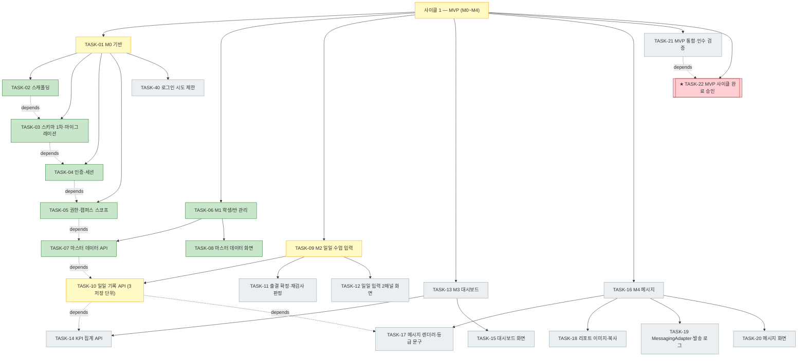
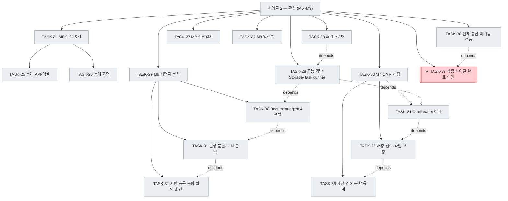

# PLAN-mathdesk: 구현 계획

> 문서 유형: `plan`
> 작업 ID: `20260922-mathdesk-baseline`
> 상태: `in-progress`
> 기준선: `v1`
> 작성일: `2026-09-22`
> 최종 갱신: `2026-09-22`
> 관련 문서: [REQ-mathdesk: 요구사항](./requirements.md), [DESIGN-mathdesk: 설계](./design.md), [결정 등록부](./decisions.md), [WORK-20260922-mathdesk-baseline: 작업 기록](./work/20260922-mathdesk-baseline/work-log.md)

## 요약

- 목적: 승인된 기준선 `v1`(요구사항 FR-01~39 / 설계 DES-01~22)을 구현 작업으로 번역하고 검증·통합 경로를 고정한다.
- 현재 결론 또는 상태: 작업 40건 중 TASK-02~TASK-08(TASK-06 포함)을 완료했다. TASK-01은 TASK-40(로그인 시도 제한)만 남아 있다.
- 다음 행동: [TASK-10 일일 기록 API (3 저장 단위)](#task-10-일일-기록-api-3-저장-단위)를 시작한다. TASK-40은 임계값 확정 후 착수한다.

## 문서 연결

| 방향 | 관계 | 대상 문서 | 대상 항목 | 비고 |
|---|---|---|---|---|
| input | baseline | [REQ-mathdesk: 요구사항](./requirements.md) | FR-01~FR-39, NFR-01~NFR-16, AC-01~AC-27 | 승인된 요구사항 기준선 v1 |
| input | baseline | [DESIGN-mathdesk: 설계](./design.md) | DES-01~DES-22 | 승인된 설계 기준선 v1 |
| input | decision | [결정 등록부](./decisions.md) | ADR-001~ADR-007 | 적용되는 설계 결정 |
| output | implementation | [WORK-20260922-mathdesk-baseline: 작업 기록](./work/20260922-mathdesk-baseline/work-log.md) | document | 이 계획의 수행·검증 기록 |

## 기준선

- 관련 요구사항: [REQ-mathdesk](./requirements.md) 기준선 `v1` (2026-09-22 승인)
- 관련 설계: [DESIGN-mathdesk](./design.md) 기준선 `v1` (2026-09-22 승인)
- 관련 ADR·DCR: [ADR-001~ADR-007](./decisions.md#등록부) (`approved`), DCR 없음

## 작업 정의

- 목표: 기준선 `v1`의 M0~M9를 구현하고 인수 조건 AC-01~AC-27을 검증 가능한 상태로 통합한다.
- 범위: [REQ-mathdesk 범위 · 포함](./requirements.md#포함)과 동일. 사이클 1(M0~M4)을 선행하고 사이클 2(M5~M9)를 후행한다.
- 범위 밖: [REQ-mathdesk 범위 · 제외](./requirements.md#제외)와 동일. 추가로 Phase B 배포, 설치 패키지 제작, `.hwp` 시각 검수 렌더링은 이 계획에서 수행하지 않는다.
- 가정
  - 저장소에 제품 코드가 없는 신규 구현이다(현재 `prototype/`과 `assets/`만 존재).
  - [prototype/omr](../prototype/omr/)의 판독기·템플릿·합성 테스트를 제품 코드로 이식해 재사용한다. 이식 전까지는 참조 구현이며 제품 코드가 아니다.
  - 로컬에 Docker가 설치되어 있고 컨테이너를 기동할 수 있다.
- 위험
  - [RISK-07](./requirements.md#위험) 범위 과대 — 사이클 분할과 TASK-22 릴리스 관문으로 MVP를 먼저 완결시킨다.
  - [Q-02·Q-03·Q-08](./requirements.md#가정과-미해결-질문) 미해소 — TASK-19·TASK-37·TASK-34의 검증이 테스트 모드·합성 데이터까지로 제한된다. 제한을 검증 결과에 명시한다.
  - [Q-09·Q-10](./design.md#가정과-미해결-질문) — TaskRunner 방식과 리포트 이미지 렌더 방식은 TASK-28·TASK-18에서 실측 후 확정하며, 설계를 벗어나면 DCR로 반환한다.

## 계획 트리

<!-- generated -->

```text
mathdesk 구현 (기준선 v1, 작업 20260922-mathdesk-baseline)     in-progress (7/40)
│
├─ 사이클 1 — MVP (M0~M4) ........................... in-progress (7/23)
│  ├─ [▶] TASK-01 M0 기반 (분해 5, 4/5)
│  │   ├─ [✓] TASK-02 모노레포 스캐폴딩과 실행 환경 ... 2026-09-22 09:58
│  │   ├─ [✓] TASK-03 스키마 1차·마이그레이션·시드 .... 2026-09-22 10:26
│  │   ├─ [✓] TASK-04 인증과 세션 .................... 2026-09-22 10:53
│  │   ├─ [✓] TASK-05 권한·캠퍼스 스코프 강제 ........ 2026-09-22 11:14
│  │   └─ [ ] TASK-40 로그인 시도 제한 ............... depends: TASK-04
│  ├─ [✓] TASK-06 M1 학생/반 관리 (분해 2, 2/2) ...... 2026-09-22 12:34
│  │   ├─ [✓] TASK-07 마스터 데이터 API .............. 2026-09-22 11:36
│  │   └─ [✓] TASK-08 마스터 데이터 화면 ............. 2026-09-22 12:34
│  ├─ [▶] TASK-09 M2 일일 수업 입력 (분해 3) ......... depends: TASK-07
│  │   ├─ [▶] TASK-10 일일 기록 API (3 저장 단위)
│  │   ├─ [ ] TASK-11 출결 확정·재검사 판정 .......... depends: TASK-10
│  │   └─ [ ] TASK-12 일일 입력 2패널 화면 ........... depends: TASK-10, TASK-11
│  ├─ [ ] TASK-13 M3 대시보드 (분해 2) ............... depends: TASK-10
│  │   ├─ [ ] TASK-14 KPI 집계 API
│  │   └─ [ ] TASK-15 대시보드 화면 .................. depends: TASK-14
│  ├─ [ ] TASK-16 M4 메시지 (분해 4) ................. depends: TASK-10
│  │   ├─ [ ] TASK-17 메시지 렌더러와 등급 문구
│  │   ├─ [ ] TASK-18 리포트 이미지와 복사 ........... depends: TASK-17
│  │   ├─ [ ] TASK-19 MessagingAdapter·발송 로그 ..... depends: TASK-03
│  │   └─ [ ] TASK-20 메시지 화면 .................... depends: TASK-17~19
│  ├─ [ ] TASK-21 MVP 통합·인수 검증 ................. depends: TASK-08, 12, 15, 20
│  └─ [ ] TASK-22 ★ MVP 사이클 완료 승인 ............. depends: TASK-21
│
└─ 사이클 2 — 확장 (M5~M9) .......................... pending (0/17)
   ├─ [ ] TASK-23 스키마 2차 (시험·OMR·상담·파일) .... depends: TASK-03
   ├─ [ ] TASK-24 M5 성적 통계 (분해 2) .............. depends: TASK-23
   │   ├─ [ ] TASK-25 통계 집계 API와 엑셀 내보내기
   │   └─ [ ] TASK-26 통계 화면 ...................... depends: TASK-25
   ├─ [ ] TASK-27 M9 상담일지 ........................ depends: TASK-23
   ├─ [ ] TASK-28 공통 기반 — Storage·업로드·TaskRunner  depends: TASK-23
   ├─ [ ] TASK-29 M6 시험지 분석 (분해 3) ............ depends: TASK-28
   │   ├─ [ ] TASK-30 DocumentIngest 4포맷 정규화
   │   ├─ [ ] TASK-31 문항 분할·LlmAdapter·분석 ...... depends: TASK-30
   │   └─ [ ] TASK-32 시험 등록·문항 확인 화면 ....... depends: TASK-31
   ├─ [ ] TASK-33 M7 OMR 채점 (분해 3) ............... depends: TASK-28
   │   ├─ [ ] TASK-34 OmrReader 제품 이식
   │   ├─ [ ] TASK-35 학생 매칭·검수·라벨 교정 ....... depends: TASK-34
   │   └─ [ ] TASK-36 채점 엔진과 문항별 통계 ........ depends: TASK-35, TASK-32
   ├─ [ ] TASK-37 M8 카카오 알림톡 ................... depends: TASK-19
   ├─ [ ] TASK-38 전체 통합·비기능 검증 .............. depends: TASK-26, 27, 32, 36, 37
   └─ [ ] TASK-39 ★ 최종 사이클 완료 승인 ............ depends: TASK-38
```

사이클 1 (노드 23)



사이클 2 (노드 18)



## 작업 목록

### 사이클 1 — MVP (M0~M4)

### TASK-01: M0 기반

- 상태: in-progress
- 상위: 없음
- 목표: 애플리케이션이 기동하고 로그인·권한 검사가 동작하는 최소 골격을 만든다.
- 관련 요구사항과 설계: [FR-01~FR-04](./requirements.md#기능-요구사항), [DES-01~DES-03](./design.md#컴포넌트와-책임), [DES-21](./design.md#컴포넌트와-책임)
- 변경 대상: 저장소 전역 골격
- 의존성: 없음
- 위험: 스캐폴딩 선택이 이후 전 작업에 영향을 준다
- 검증 방법: 자식 작업의 검증 통과 + `docker compose up` 후 로그인하여 빈 대시보드 진입
- 완료 조건: TASK-02~TASK-05와 TASK-40이 모두 `completed`이고 [AC-01~AC-03](./requirements.md#인수-조건)이 통과한다

### TASK-02: 모노레포 스캐폴딩과 실행 환경

- 상태: completed
- 완료: 2026-09-22 09:58
- 상위: TASK-01
- 목표: `apps/api`(FastAPI) + `apps/web`(React·Vite·TS) + `docker compose`(api·web·postgres) 골격과 테스트 하네스를 만든다.
- 관련 요구사항과 설계: [NFR-08](./requirements.md#비기능-요구사항), [NFR-12](./requirements.md#비기능-요구사항), [DES-01·DES-02](./design.md#컴포넌트와-책임), [ADR-001](./work/20260922-mathdesk-baseline/ADR-001-기술-스택과-실행-형태.md)
- 변경 대상: `compose.yaml`, `apps/api/`(pyproject·앱 엔트리·설정), `apps/web/`(package.json·vite 설정), 테스트 러너 설정
- 의존성: 없음
- 위험: 의존성 과다 도입. 결정 사다리에 따라 기준선이 요구하는 패키지만 추가한다
- 검증 방법: 선행 테스트 — API 헬스 엔드포인트 호출이 200을 반환하는 통합 테스트 1건을 먼저 작성(Red)
- 완료 조건: `docker compose up`으로 3개 컨테이너가 기동하고, API 테스트와 웹 빌드가 각각 1회 성공한다

### TASK-03: 스키마 1차·마이그레이션·시드

- 상태: completed
- 완료: 2026-09-22 10:26
- 상위: TASK-01
- 목표: M0~M4 범위 테이블(캠퍼스·사용자·학생·보호자·반·시간표·수강·수업 세션·진도·학생 일일 기록·등급 문구·메시지 템플릿·발송 로그·연동 설정·감사 로그)을 Alembic 리비전으로 만든다.
- 관련 요구사항과 설계: [NFR-09](./requirements.md#비기능-요구사항), [DES-21](./design.md#컴포넌트와-책임), [데이터 모델](./design.md#데이터-모델), [ADR-002](./work/20260922-mathdesk-baseline/ADR-002-PostgreSQL-단일-저장소.md)
- 변경 대상: `apps/api/models/`, `apps/api/alembic/versions/`, 시드 스크립트
- 의존성: TASK-02
- 위험: 전환 작업이므로 롤백 준비가 필수다
- 검증 방법: 선행 테스트 — 빈 DB에서 `alembic upgrade head` → `downgrade base` 왕복이 성공하는 테스트를 먼저 작성(Red). 각 리비전에 `downgrade` 포함
- 완료 조건: 왕복 마이그레이션 테스트 통과, 시드 스크립트로 반 4개·학생 47명 투입 성공

### TASK-04: 인증과 세션

- 상태: completed
- 완료: 2026-09-22 10:53
- 상위: TASK-01
- 목표: 로그인·로그아웃·현재 사용자 조회와 서버 세션, Argon2id 비밀번호 해시, 초기 원장 계정 1회 생성을 구현한다.
- 관련 요구사항과 설계: [FR-01](./requirements.md#기능-요구사항), [NFR-05·NFR-06](./requirements.md#비기능-요구사항), [DES-03](./design.md#des-03-상세), [ADR-007](./work/20260922-mathdesk-baseline/ADR-007-인증-권한-모델.md)
- 변경 대상: `apps/api/auth/`, 세션 미들웨어, 로그인 화면
- 의존성: TASK-03
- 위험: 신뢰 경계이므로 입력 검증과 오류 처리를 최소화 대상에서 제외한다
- 검증 방법: 선행 테스트 — [AC-01](./requirements.md#인수-조건)을 인수 테스트로 전환(유효 자격 증명 로그인 성공, 로그아웃 후 보호 경로 접근 시 인증 실패)
- 완료 조건: AC-01 통과, 비밀번호 평문이 DB·로그·응답 어디에도 남지 않음을 테스트로 확인

### TASK-05: 권한·캠퍼스 스코프 강제

- 상태: completed
- 완료: 2026-09-22 11:14
- 상위: TASK-01
- 목표: `CurrentScope` 의존성과 `campus_id` 필터를 요구하는 리포지토리 기반 클래스를 만들어 역할·캠퍼스 검사를 두 지점에 고정한다.
- 관련 요구사항과 설계: [FR-02·FR-03](./requirements.md#fr-03-상세), [NFR-07](./requirements.md#비기능-요구사항), [DES-03](./design.md#des-03-상세), [RISK-08](./design.md#위험)
- 변경 대상: `apps/api/core/scope.py`, 리포지토리 기반 클래스, 사용자·캠퍼스 API
- 의존성: TASK-04
- 위험: 검사 누락이 한 곳이라도 생기면 격리가 깨진다
- 검증 방법: 선행 테스트 — [AC-02·AC-03](./requirements.md#인수-조건)을 인수 테스트로 전환하고, 등록된 엔드포인트 목록을 순회하며 스코프 의존성 누락을 탐지하는 회귀 테스트를 추가
- 완료 조건: AC-03 통과, AC-02의 역할 기반 거부 통과(반 소유권 부분은 학생 기록 API가 생기는 TASK-07·TASK-10에서 재검증), 엔드포인트 순회 테스트가 누락 0건을 보고

### TASK-40: 로그인 시도 제한

- 상태: pending
- 상위: TASK-01
- 목표: 설계 [보안과 품질 속성](./design.md#보안과-품질-속성)의 "로그인 실패 지연·시도 제한" 중 시도 제한을 구현한다. TASK-04에서 실패 지연(계정 유무와 무관한 동일 검증 비용)만 구현했다.
- 관련 요구사항과 설계: [NFR-06](./requirements.md#비기능-요구사항), [DES-03](./design.md#des-03-상세)
- 변경 대상: `apps/api/src/mathdesk/auth.py`, 시도 기록 저장소
- 의존성: TASK-04
- 위험: 임계값·잠금 시간이 기준선에 명시되지 않았다. 사용자 확인 없이 정하면 실사용자가 잠길 수 있다
- 검증 방법: 선행 테스트 — 임계 횟수 연속 실패 후 올바른 비밀번호도 잠금 기간 동안 거부되는 통합 테스트
- 완료 조건: 임계값·잠금 시간을 사용자와 확정하고 설정값으로 노출, 잠금·해제가 감사 로그에 기록됨

### TASK-06: M1 학생/반 관리

- 상태: completed
- 완료: 2026-09-22 12:34
- 상위: 없음
- 목표: 학생·보호자·반·시간표·수강 등록을 등록·조회·수정할 수 있게 한다.
- 관련 요구사항과 설계: [FR-05~FR-08](./requirements.md#fr-05-상세), [DES-04](./design.md#컴포넌트와-책임)
- 변경 대상: 마스터 데이터 모듈 전반
- 의존성: TASK-05
- 위험: 수강 등록 기간 이력을 빠뜨리면 과거 수업일 재현이 불가능해진다
- 검증 방법: 자식 작업의 검증 통과
- 완료 조건: TASK-07·TASK-08이 `completed`이고 [AC-04·AC-05](./requirements.md#인수-조건)가 통과한다

### TASK-07: 마스터 데이터 API

- 상태: completed
- 완료: 2026-09-22 11:36
- 상위: TASK-06
- 목표: 학생·보호자·반·시간표·수강 등록 CRUD API와 무결성 규칙(수험번호 자리별 범위, 캠퍼스 내 유일성, 재원 상태)을 구현한다.
- 관련 요구사항과 설계: [FR-05~FR-08](./requirements.md#fr-05-상세), [DES-04](./design.md#컴포넌트와-책임), [REST 계약](./design.md#rest-계약)
- 변경 대상: `apps/api/masterdata/`
- 의존성: TASK-05
- 위험: 없음(내부 CRUD)
- 검증 방법: 선행 테스트 — [AC-04](./requirements.md#인수-조건)를 단위 테스트로 전환(`90000001` 허용, `00000001`·`18600001` 거부)
- 완료 조건: AC-04 통과, 수강 등록 기간으로 특정 날짜의 소속 반을 조회하는 테스트 통과

### TASK-08: 마스터 데이터 화면

- 상태: completed
- 완료: 2026-09-22 12:34
- 상위: TASK-06
- 목표: 학생·반 목록과 등록·수정 화면(`/students`, `/classes`)을 구현한다.
- 관련 요구사항과 설계: [FR-05~FR-08](./requirements.md#fr-05-상세), [DES-01](./design.md#컴포넌트와-책임), [NFR-13](./requirements.md#비기능-요구사항)
- 변경 대상: `apps/web/src/pages/students/`, `apps/web/src/pages/classes/`
- 의존성: TASK-07
- 위험: 없음
- 검증 방법: 선행 테스트 — 학생 등록 폼이 수험번호 범위 위반 시 서버 오류를 사용자 메시지로 표시하는 컴포넌트 테스트
- 완료 조건: [AC-05](./requirements.md#인수-조건) 시나리오(반 4개·학생 47명)가 화면 목록에 반영됨을 컴포넌트 테스트로 확인. 실제 브라우저 육안 확인은 자동화 대상이 아니며 사용자 확인으로 남긴다

### TASK-09: M2 일일 수업 입력

- 상태: in-progress
- 상위: 없음
- 목표: 화면 ②의 일일 입력을 저장 단위 3종 분리 규칙대로 동작시킨다.
- 관련 요구사항과 설계: [FR-09~FR-14](./requirements.md#fr-09-상세), [DES-05](./design.md#des-05-상세)
- 변경 대상: 일일 기록 모듈 전반
- 의존성: TASK-07
- 위험: 저장 단위가 서로의 미저장 편집을 덮어쓰면 실사용에서 데이터가 사라진다
- 검증 방법: 자식 작업의 검증 통과
- 완료 조건: TASK-10~TASK-12가 `completed`이고 [AC-06~AC-12](./requirements.md#인수-조건)가 통과한다

### TASK-10: 일일 기록 API (3 저장 단위)

- 상태: in-progress
- 상위: TASK-09
- 목표: `GET /daily`와 표 일괄 저장·재검사 즉시 저장·메모 저장 3개 엔드포인트를 서로 독립적인 부분 갱신으로 구현한다.
- 관련 요구사항과 설계: [FR-09~FR-14](./requirements.md#fr-14-상세), [DES-05](./design.md#des-05-상세), [REST 계약](./design.md#rest-계약)
- 변경 대상: `apps/api/daily/`
- 의존성: TASK-07
- 위험: 부분 갱신 범위를 넘어 다른 필드를 덮어쓸 위험
- 검증 방법: 선행 테스트 — [AC-11](./requirements.md#인수-조건)(저장 단위 독립)을 인수 테스트로 전환하고, [AC-12](./requirements.md#인수-조건) 반 평균 계산을 단위 테스트로 전환
- 완료 조건: AC-11·AC-12 통과, 각 엔드포인트가 자신의 필드만 변경함을 테스트로 확인

### TASK-11: 출결 확정·재검사 판정

- 상태: pending
- 상위: TASK-09
- 목표: 출결 토글·해제, 확정·편집 2단계 잠금, 직전 세션 기반 재검사 대상 조회 시 계산을 구현한다.
- 관련 요구사항과 설계: [FR-09·FR-12](./requirements.md#fr-12-상세), [DES-05](./design.md#des-05-상세)
- 변경 대상: `apps/api/daily/service.py`, 감사 로그
- 의존성: TASK-10
- 위험: 기준 등급이 설정값이므로 판정을 저장하면 설정 변경 시 낡는다
- 검증 방법: 선행 테스트 — [AC-06·AC-09·AC-10](./requirements.md#인수-조건)을 인수 테스트로 전환(토글 해제, B 등급 재검사 대상 표시, 즉시 저장 유지)
- 완료 조건: AC-06·AC-09·AC-10 통과, 확정 상태에서 출결 변경 요청이 409로 거부되고 확정·해제가 감사 로그에 남음

### TASK-12: 일일 입력 2패널 화면

- 상태: pending
- 상위: TASK-09
- 목표: 좌측 명단 그리드(출결·재검사·과제 등급·테스트)와 우측 상세 패널(진도·과제·영상·첨언)을 저장 단위별 뮤테이션으로 구현한다.
- 관련 요구사항과 설계: [FR-09~FR-14](./requirements.md#fr-14-상세), [DES-01](./design.md#컴포넌트와-책임), [NFR-13](./requirements.md#비기능-요구사항)
- 변경 대상: `apps/web/src/pages/daily/`
- 의존성: TASK-10, TASK-11
- 위험: 미저장 상태에서 반·날짜 전환 시 입력 유실
- 검증 방법: 선행 테스트 — 메모 편집 중 표 일괄 저장이 메모 입력값을 유지하는 컴포넌트 테스트([AC-11](./requirements.md#인수-조건) UI 측면)
- 완료 조건: [AC-07·AC-08](./requirements.md#인수-조건) 통과, 미저장 전환 시 경고 표시

### TASK-13: M3 대시보드

- 상태: pending
- 상위: 없음
- 목표: 화면 ①의 KPI 4종·출결 위젯·지난 수업 요약을 집계 뷰로 제공한다.
- 관련 요구사항과 설계: [FR-15~FR-17](./requirements.md#fr-15-상세), [DES-06](./design.md#컴포넌트와-책임)
- 변경 대상: 집계 모듈과 대시보드 화면
- 의존성: TASK-10
- 위험: 집계 쿼리 성능([NFR-01](./requirements.md#비기능-요구사항))
- 검증 방법: 자식 작업의 검증 통과
- 완료 조건: TASK-14·TASK-15가 `completed`이고 [AC-07·AC-13](./requirements.md#인수-조건)이 통과한다

### TASK-14: KPI 집계 API

- 상태: pending
- 상위: TASK-13
- 목표: 재원생·활성 반, 선택 반 등원 현황, 금주 과제 완수율과 전주 대비 증감, 주간 테스트 평균(N·MAX·MIN)을 집계 쿼리로 계산한다.
- 관련 요구사항과 설계: [FR-15](./requirements.md#fr-15-상세), [DES-06](./design.md#컴포넌트와-책임), [NFR-01](./requirements.md#비기능-요구사항)
- 변경 대상: `apps/api/stats/aggregate.py`, 인덱스 마이그레이션
- 의존성: TASK-10
- 위험: 집계 테이블을 만들지 않기로 했으므로 인덱스 설계가 성능을 좌우한다
- 검증 방법: 선행 테스트 — 고정 시드 데이터에 대해 [AC-07·AC-13](./requirements.md#인수-조건)의 기대값을 검증하는 단위 테스트
- 완료 조건: AC-07·AC-13 통과, 표본 없음 입력에서 `—` 표현 값이 반환됨

### TASK-15: 대시보드 화면

- 상태: pending
- 상위: TASK-13
- 목표: KPI 카드 4개, 반별 출결 체크 위젯, 지난 수업 진도·과제 요약을 표시한다.
- 관련 요구사항과 설계: [FR-15~FR-17](./requirements.md#fr-15-상세), [DES-01](./design.md#컴포넌트와-책임)
- 변경 대상: `apps/web/src/pages/dashboard/`
- 의존성: TASK-14
- 위험: 없음
- 검증 방법: 선행 테스트 — 출결 위젯에서 확정 후 읽기 전용이 되고 편집으로 해제되는 컴포넌트 테스트
- 완료 조건: 화면 ① 구성 요소가 모두 표시되고 [AC-07](./requirements.md#인수-조건)이 화면에서 재현됨

### TASK-16: M4 메시지

- 상태: pending
- 상위: 없음
- 목표: 화면 ③의 미리보기·복사·리포트 이미지·발송을 제공한다.
- 관련 요구사항과 설계: [FR-18~FR-23](./requirements.md#fr-18-상세), [DES-07~DES-09](./design.md#컴포넌트와-책임), [DES-19](./design.md#컴포넌트와-책임)
- 변경 대상: 메시지 모듈 전반
- 의존성: TASK-10
- 위험: [Q-02](./requirements.md#가정과-미해결-질문) 미해소 시 실발송 검증 불가
- 검증 방법: 자식 작업의 검증 통과
- 완료 조건: TASK-17~TASK-20이 `completed`이고 [AC-14~AC-18](./requirements.md#인수-조건)이 통과한다

### TASK-17: 메시지 렌더러와 등급 문구

- 상태: pending
- 상위: TASK-16
- 목표: 세션·학생 기록·등급 문구·템플릿을 병합해 7개 구획 본문을 만드는 순수 함수와 등급 문구 설정 API를 구현한다. 본문은 저장하지 않는다.
- 관련 요구사항과 설계: [FR-18·FR-19](./requirements.md#fr-18-상세), [DES-07](./design.md#컴포넌트와-책임)
- 변경 대상: `apps/api/messaging/renderer.py`, 등급 문구 API
- 의존성: TASK-10
- 위험: 없음
- 검증 방법: 선행 테스트 — [AC-14·AC-15](./requirements.md#인수-조건)를 렌더러 단위 테스트로 전환(7구획 포함, 테스트 없으면 구획 생략, 등급 문구 수정 반영)
- 완료 조건: AC-14·AC-15 통과

### TASK-18: 리포트 이미지와 복사

- 상태: pending
- 상위: TASK-16
- 목표: 본문을 카드형 리포트 이미지로 렌더하고 텍스트·이미지 클립보드 복사를 제공한다.
- 관련 요구사항과 설계: [FR-20~FR-22](./requirements.md#기능-요구사항), [DES-08](./design.md#컴포넌트와-책임), [Q-10](./design.md#가정과-미해결-질문)
- 변경 대상: 리포트 렌더러, 웹 클립보드 유틸. [prototype/notice-generator.html](../prototype/notice-generator.html)의 카드 마크업을 출발점으로 재사용
- 의존성: TASK-17
- 위험: 서버 렌더가 헤드리스 브라우저 의존을 유발하면 이미지 크기가 커진다([RISK-10](./design.md#위험)). 설계를 벗어나는 방식 변경이 필요하면 DCR로 반환
- 검증 방법: 선행 테스트 — [AC-16](./requirements.md#인수-조건)을 통합 테스트로 전환(이미지 파일 생성과 본문 텍스트 포함 확인)
- 완료 조건: AC-16 통과, 채택한 렌더 방식과 근거를 작업 기록에 남김

### TASK-19: MessagingAdapter·발송 로그

- 상태: pending
- 상위: TASK-16
- 목표: 단일 발송 계약과 알리고 구현·테스트 모드 구현, 발송 로그 스냅샷, 잔여 발송 가능량 조회를 구현한다. 기본값은 테스트 모드다.
- 관련 요구사항과 설계: [FR-23](./requirements.md#fr-23-상세), [DES-09·DES-19](./design.md#컴포넌트와-책임), [ADR-005](./work/20260922-mathdesk-baseline/ADR-005-메시징-어댑터-단일화.md)
- 변경 대상: `apps/api/messaging/adapter.py`, 발송 로그 모델·API
- 의존성: TASK-03
- 위험: [Q-02](./requirements.md#가정과-미해결-질문) 미해소 시 실발송 경로는 미검증으로 남는다
- 검증 방법: 선행 테스트 — [AC-17·AC-18](./requirements.md#인수-조건)을 가짜 어댑터 통합 테스트로 전환(테스트 모드에서 외부 호출 0회, 스냅샷 불변)
- 완료 조건: AC-17·AC-18 통과, 실발송 미검증 사실을 검증 결과에 명시

### TASK-20: 메시지 화면

- 상태: pending
- 상위: TASK-16
- 목표: 문자 보기·리포트 보기 탭, 수신 대상 체크박스, 복사·저장·발송 액션과 발송 내역 화면을 구현한다.
- 관련 요구사항과 설계: [FR-18~FR-23](./requirements.md#fr-18-상세), [DES-01](./design.md#컴포넌트와-책임)
- 변경 대상: `apps/web/src/pages/messages/`
- 의존성: TASK-17, TASK-18, TASK-19
- 위험: 없음
- 검증 방법: 선행 테스트 — 수신 대상 미선택 시 발송 버튼이 비활성화되는 컴포넌트 테스트
- 완료 조건: 화면 ③ 구성 요소가 모두 표시되고 테스트 모드 발송이 발송 내역에 기록됨

### TASK-21: MVP 통합·인수 검증

- 상태: pending
- 상위: 없음
- 목표: 사이클 1 전체를 통합하고 AC-01~AC-18과 NFR-01·NFR-02를 측정한다.
- 관련 요구사항과 설계: [AC-01~AC-18](./requirements.md#인수-조건), [NFR-01·NFR-02](./requirements.md#비기능-요구사항), [검증 전략](./design.md#검증-전략)
- 변경 대상: 통합 테스트, 시드 데이터, 실행 문서
- 의존성: TASK-08, TASK-12, TASK-15, TASK-20
- 위험: 개별 작업에서 통과한 검증이 통합 상태에서 깨질 수 있다
- 검증 방법: 전체 테스트 실행 + 시드 데이터 규모에서 응답 시간 측정 스크립트
- 완료 조건: AC-01~AC-18 전항 결과가 [작업 기록](./work/20260922-mathdesk-baseline/work-log.md)에 기록되고, 실패·미수행 항목이 명시됨

### TASK-22: ★ MVP 사이클 완료 승인

- 상태: pending
- 상위: 없음
- 목표: 사이클 1(MVP)의 완료를 사용자에게 확인받고 사이클 2 착수 여부를 결정한다.
- 관련 요구사항과 설계: [AC-01~AC-18](./requirements.md#인수-조건) 검증 결과
- 변경 대상: 없음(승인 관문)
- 의존성: TASK-21
- 위험: 미검증 항목이 남은 채로 사이클 2에 들어가면 회귀를 늦게 발견한다
- 검증 방법: TASK-21 검증 결과와 미수행 항목을 사용자에게 제시하고 응답을 기록
- 완료 조건: 사용자 승인과 시점을 작업 기록에 남김. 일상적인 커밋·push는 사용자 지시(2026-09-22)에 따라 TASK 단위로 수행하며 이 관문의 대상이 아니다

### 사이클 2 — 확장 (M5~M9)

사이클 2의 작업은 사이클 1 완료 시점에 변경 대상 파일 수준까지 구체화한다. 아래 목표·의존성·완료 조건은 기준선에서 직접 도출한 확정 내용이다.

### TASK-23: 스키마 2차 (시험·OMR·상담·파일)

- 상태: pending
- 상위: 없음
- 목표: 시험·문항·응시·답안·OMR 스캔·라벨 교정·저장 파일·LLM 호출 로그·상담일지 테이블을 Alembic 리비전으로 추가한다.
- 관련 요구사항과 설계: [데이터 모델](./design.md#데이터-모델), [NFR-09](./requirements.md#비기능-요구사항)
- 변경 대상: `apps/api/models/`, `apps/api/alembic/versions/`
- 의존성: TASK-03
- 위험: 전환 작업이므로 롤백 준비가 필수다
- 검증 방법: 선행 테스트 — 왕복 마이그레이션 테스트 확장(Red)
- 완료 조건: `upgrade head` → `downgrade base` 왕복 통과

### TASK-24: M5 성적 통계

- 상태: pending
- 상위: 없음
- 목표: 학생·반 시계열과 분포, 기간 비교, 엑셀 내보내기를 제공한다.
- 관련 요구사항과 설계: [FR-24~FR-26](./requirements.md#기능-요구사항), [DES-06·DES-22](./design.md#컴포넌트와-책임), [Q-01](./requirements.md#가정과-미해결-질문)
- 변경 대상: 통계 모듈과 화면
- 의존성: TASK-23
- 위험: 요구사항이 추정안이므로 실사용 피드백에서 변경 가능성이 있다
- 검증 방법: 자식 작업의 검증 통과
- 완료 조건: TASK-25·TASK-26이 `completed`이고 [AC-19·AC-20](./requirements.md#인수-조건)이 통과한다

### TASK-25: 통계 집계 API와 엑셀 내보내기

- 상태: pending
- 상위: TASK-24
- 목표: 학생별 테스트·과제 등급·출결률 시계열, 반 분포와 기간 비교 API, 엑셀 생성기를 구현한다.
- 관련 요구사항과 설계: [FR-24~FR-26](./requirements.md#기능-요구사항), [DES-06·DES-22](./design.md#컴포넌트와-책임)
- 변경 대상: `apps/api/stats/`
- 의존성: TASK-23
- 위험: 없음
- 검증 방법: 선행 테스트 — [AC-19·AC-20](./requirements.md#인수-조건)을 통합 테스트로 전환(시계열 값 일치, 생성 파일 파싱 후 행 비교)
- 완료 조건: AC-19·AC-20 통과

### TASK-26: 통계 화면

- 상태: pending
- 상위: TASK-24
- 목표: 학생 상세 히스토리 탭과 반 통계 화면(`/stats`)을 구현한다.
- 관련 요구사항과 설계: [FR-24·FR-25](./requirements.md#기능-요구사항), [DES-01](./design.md#컴포넌트와-책임)
- 변경 대상: `apps/web/src/pages/stats/`
- 의존성: TASK-25
- 위험: 없음
- 검증 방법: 선행 테스트 — 표본 없음 기간에서 빈 상태 표시 컴포넌트 테스트
- 완료 조건: 학생 히스토리 탭이 최근 8주 추이를 표시

### TASK-27: M9 상담일지

- 상태: pending
- 상위: 없음
- 목표: 학생별 상담 날짜·내용·후속 조치 CRUD와 화면을 구현한다.
- 관련 요구사항과 설계: [FR-39](./requirements.md#기능-요구사항), [DES-04](./design.md#컴포넌트와-책임)
- 변경 대상: `apps/api/masterdata/consult.py`, 상담 화면
- 의존성: TASK-23
- 위험: 없음
- 검증 방법: 선행 테스트 — 상담 기록 생성·수정·조회 통합 테스트
- 완료 조건: 학생 상세에서 상담 기록을 등록·조회할 수 있고 캠퍼스 스코프가 적용됨

### TASK-28: 공통 기반 — Storage·업로드·TaskRunner

- 상태: pending
- 상위: 없음
- 목표: `StorageAdapter`(로컬 구현), 파일 업로드와 `stored_file` 메타데이터, DB 상태 기반 백그라운드 작업 실행기와 진행 상태 조회를 구현한다.
- 관련 요구사항과 설계: [DES-10·DES-18](./design.md#컴포넌트와-책임), [NFR-08](./requirements.md#비기능-요구사항), [Q-09](./design.md#가정과-미해결-질문), [RISK-09](./design.md#위험)
- 변경 대상: `apps/api/core/storage.py`, `apps/api/core/tasks.py`, 업로드 API
- 의존성: TASK-23
- 위험: 프로세스 내 큐는 재시작 시 진행 중 작업이 유실될 수 있다
- 검증 방법: 선행 테스트 — 작업 상태가 DB에 저장되고 재기동 후 `queued`부터 재개되는 통합 테스트
- 완료 조건: 업로드·작업 등록·상태 조회가 동작하고 재기동 재개 테스트 통과

### TASK-29: M6 시험지 분석

- 상태: pending
- 상위: 없음
- 목표: 시험지 4포맷 정규화부터 문항 메타 확정까지의 경로를 제공한다.
- 관련 요구사항과 설계: [FR-27~FR-31](./requirements.md#fr-27-상세), [DES-11~DES-14](./design.md#컴포넌트와-책임), [ADR-003](./work/20260922-mathdesk-baseline/ADR-003-AI-작업-분리와-개인정보-경계.md), [ADR-004](./work/20260922-mathdesk-baseline/ADR-004-문서-입력-정규화-파이프라인.md)
- 변경 대상: 시험지 모듈 전반
- 의존성: TASK-28
- 위험: [RISK-02·RISK-03·RISK-04](./requirements.md#위험)
- 검증 방법: 자식 작업의 검증 통과
- 완료 조건: TASK-30~TASK-32가 `completed`이고 [AC-21~AC-23](./requirements.md#인수-조건)이 통과한다

### TASK-30: DocumentIngest 4포맷 정규화

- 상태: pending
- 상위: TASK-29
- 목표: `.hwp`·`.hwpx`·`.pdf`·이미지를 공통 구조로 정규화하고 텍스트 추출 불가 시 이미지 경로로 폴백한다.
- 관련 요구사항과 설계: [FR-27](./requirements.md#fr-27-상세), [DES-11](./design.md#컴포넌트와-책임), [ADR-004](./work/20260922-mathdesk-baseline/ADR-004-문서-입력-정규화-파이프라인.md)
- 변경 대상: `apps/api/exams/ingest/`
- 의존성: TASK-28
- 위험: `.hwp` 파서 품질 한계
- 검증 방법: 선행 테스트 — [AC-21](./requirements.md#인수-조건)을 고정 픽스처 단위 테스트로 전환(`.hwpx`·`.pdf` 추출 성공, 암호 `.hwp` 오류 사유 반환)
- 완료 조건: AC-21 통과, 픽스처 미확보 포맷은 미검증으로 명시

### TASK-31: 문항 분할·LlmAdapter·분석

- 상태: pending
- 상위: TASK-29
- 목표: 문항 번호 기준 분할, OpenAI 호환 `LlmAdapter`, 전송 필드 화이트리스트를 강제하는 `QuestionAnalyzer`와 토큰 상한·호출 로그를 구현한다.
- 관련 요구사항과 설계: [FR-28·FR-29](./requirements.md#기능-요구사항), [NFR-04·NFR-15](./requirements.md#nfr-04-상세), [DES-12~DES-14](./design.md#컴포넌트와-책임), [ADR-003](./work/20260922-mathdesk-baseline/ADR-003-AI-작업-분리와-개인정보-경계.md)
- 변경 대상: `apps/api/exams/analyze/`, `apps/api/core/llm.py`
- 의존성: TASK-30
- 위험: 개인정보 경계 위반은 최소화 대상이 아니다. 화이트리스트 검증을 생략하지 않는다
- 검증 방법: 선행 테스트 — [AC-22·AC-23·AC-27](./requirements.md#인수-조건)을 가짜 어댑터 테스트로 전환(30문항 초안 생성, 엔드포인트 교체, 외부 호출 차단 환경에서 호출 카운터 0)
- 완료 조건: AC-22·AC-23·AC-27 통과, 토큰 상한 초과 시 중단과 사용량 보고 동작

### TASK-32: 시험 등록·문항 확인 화면

- 상태: pending
- 상위: TASK-29
- 목표: 시험 등록(문항 수·배점·홀짝 정답표), 문항 메타 확인·수정, `확인 필요` 표시, 난이도 분석표 이미지 저장을 구현한다.
- 관련 요구사항과 설계: [FR-29~FR-31](./requirements.md#기능-요구사항), [DES-01·DES-22](./design.md#컴포넌트와-책임)
- 변경 대상: `apps/web/src/pages/exams/`, 시험 등록 API
- 의존성: TASK-31
- 위험: 없음
- 검증 방법: 선행 테스트 — 저신뢰 문항에 `확인 필요`가 표시되고 확정 시 사라지는 컴포넌트 테스트
- 완료 조건: 화면 ④ 상단·문항 표가 재현되고 정답표 2벌을 등록·수정할 수 있음

### TASK-33: M7 OMR 채점

- 상태: pending
- 상위: 없음
- 목표: OMR PDF 업로드부터 채점 반영까지를 검수 단계와 함께 제공한다.
- 관련 요구사항과 설계: [FR-32~FR-36](./requirements.md#fr-33-상세), [DES-15~DES-17](./design.md#컴포넌트와-책임), [ADR-006](./work/20260922-mathdesk-baseline/ADR-006-OMR-양식-고정과-템플릿-판독.md)
- 변경 대상: OMR 모듈 전반
- 의존성: TASK-28
- 위험: [RISK-01](./requirements.md#위험) 임계값 미보정
- 검증 방법: 자식 작업의 검증 통과
- 완료 조건: TASK-34~TASK-36이 `completed`이고 [AC-24·AC-25](./requirements.md#인수-조건)가 통과한다

### TASK-34: OmrReader 제품 이식

- 상태: pending
- 상위: TASK-33
- 목표: [prototype/omr](../prototype/omr/)의 템플릿 JSON과 판독기를 `OmrReader` 인터페이스 뒤의 제품 코드로 이식하고 PDF 페이지 분리를 연결한다. 임계값은 설정값으로 노출한다.
- 관련 요구사항과 설계: [FR-32·FR-33](./requirements.md#fr-33-상세), [NFR-03·NFR-16](./requirements.md#비기능-요구사항), [DES-15](./design.md#컴포넌트와-책임)
- 변경 대상: `apps/api/omr/`, 템플릿 리소스
- 의존성: TASK-28
- 위험: 실제 스캔본 미확보([Q-08](./requirements.md#가정과-미해결-질문))로 현장 정확도는 미검증으로 남는다
- 검증 방법: 선행 테스트 — [prototype/omr/test_omr.py](../prototype/omr/test_omr.py)의 합성 왜곡 테스트를 제품 테스트로 이식해 [AC-24](./requirements.md#인수-조건)로 전환
- 완료 조건: AC-24 통과, 30쪽 처리 시간 측정치 기록, 실스캔 미검증 사실 명시

### TASK-35: 학생 매칭·검수·라벨 교정

- 상태: pending
- 상위: TASK-33
- 목표: 수험번호 학생 매칭, 플래그 기반 `needs_review` 상태, 원본 크롭 대조 검수 화면, 교정값의 `label_correction` 저장을 구현한다.
- 관련 요구사항과 설계: [FR-34·FR-35](./requirements.md#기능-요구사항), [DES-16](./design.md#컴포넌트와-책임)
- 변경 대상: `apps/api/omr/review.py`, `apps/web/src/pages/exams/omr/`
- 의존성: TASK-34
- 위험: 검수를 건너뛰고 반영되면 오채점이 그대로 성적이 된다
- 검증 방법: 선행 테스트 — 플래그가 있는 스캔이 검수 전 채점에 반영되지 않는 통합 테스트([AC-25](./requirements.md#인수-조건) 전반부)
- 완료 조건: 미매칭 수동 지정과 교정 기록 저장이 동작

### TASK-36: 채점 엔진과 문항별 통계

- 상태: pending
- 상위: TASK-33
- 목표: 문형별 정답표 대조, 학생 점수·문항별 정답률 계산, 오답 유형 통계와 재적용 시 기존 시도 대체를 구현한다.
- 관련 요구사항과 설계: [FR-36](./requirements.md#기능-요구사항), [DES-17](./design.md#컴포넌트와-책임)
- 변경 대상: `apps/api/omr/scoring.py`, 시험 결과 API·화면
- 의존성: TASK-35, TASK-32
- 위험: 재적용 시 중복 시도 생성
- 검증 방법: 선행 테스트 — [AC-25](./requirements.md#인수-조건) 후반부(교정 후 점수·정답률 갱신)와 재적용 멱등성 통합 테스트
- 완료 조건: AC-25 통과, 문항별 정오답·오답 유형 탭 표시

### TASK-37: M8 카카오 알림톡

- 상태: pending
- 상위: 없음
- 목표: 발신프로필·승인 템플릿 관리, 변수 매핑, 알림톡 발송과 SMS 폴백을 구현한다.
- 관련 요구사항과 설계: [FR-37·FR-38](./requirements.md#기능-요구사항), [DES-09](./design.md#컴포넌트와-책임), [ADR-005](./work/20260922-mathdesk-baseline/ADR-005-메시징-어댑터-단일화.md)
- 변경 대상: `apps/api/messaging/alimtalk.py`, 알림톡 화면
- 의존성: TASK-19
- 위험: [Q-03](./requirements.md#가정과-미해결-질문) 템플릿 심사 미완료 시 실발송 미검증
- 검증 방법: 선행 테스트 — [AC-26](./requirements.md#인수-조건)을 가짜 어댑터 테스트로 전환(알림톡 실패 → SMS 대체, 두 시도 모두 로그 기록)
- 완료 조건: AC-26 통과, 실발송 미검증 사실 명시

### TASK-38: 전체 통합·비기능 검증

- 상태: pending
- 상위: 없음
- 목표: 사이클 1·2를 통합하고 남은 비기능 요구사항을 측정한다.
- 관련 요구사항과 설계: [NFR-01~NFR-03](./requirements.md#비기능-요구사항), [NFR-09·NFR-11](./requirements.md#비기능-요구사항), [AC-01~AC-27](./requirements.md#인수-조건)
- 변경 대상: 통합 테스트, 백업 스크립트, 운영 문서
- 의존성: TASK-26, TASK-27, TASK-32, TASK-36, TASK-37
- 위험: 누적된 미검증 항목이 이 시점에 드러난다
- 검증 방법: 전체 테스트 실행, 응답 시간·OMR 처리 시간 측정, 백업·복원 1회 수행, 마이그레이션 왕복
- 완료 조건: AC-01~AC-27 전항 결과와 실패·미수행 항목이 작업 기록에 기록됨

### TASK-39: ★ 최종 사이클 완료 승인

- 상태: pending
- 상위: 없음
- 목표: 기준선 `v1` 전체 구현의 완료를 사용자에게 확인받는다.
- 관련 요구사항과 설계: [AC-01~AC-27](./requirements.md#인수-조건) 검증 결과
- 변경 대상: 없음(승인 관문)
- 의존성: TASK-38
- 위험: 미검증·제한 사항이 보고되지 않은 채 완료로 처리될 수 있다
- 검증 방법: TASK-38 검증 결과와 남은 위험을 사용자에게 제시하고 응답을 기록
- 완료 조건: 사용자 승인과 시점을 작업 기록에 남김. 배포·패키지 게시 등 새로운 외부 작업은 이 관문과 별도로 확인한다

## 검증 계획

인수 조건은 다음 작업에서 실패하는 인수 테스트로 먼저 전환한다(TDD Red 시작점). 검증 결과와 증거는 [작업 기록](./work/20260922-mathdesk-baseline/work-log.md)에 기록한다.

| 검증 | 인수 조건 | 전환 작업 | 방법 |
|---|---|---|---|
| VER-01 | [AC-01](./requirements.md#인수-조건) | TASK-04 | API 통합 테스트 |
| VER-02 | AC-02, AC-03 | TASK-05 | 역할·캠퍼스 조합 접근 거부 테스트 + 엔드포인트 순회 회귀 |
| VER-03 | AC-04 | TASK-07 | 수험번호 자리별 범위 단위 테스트 |
| VER-04 | AC-05 | TASK-08 | 등록 시나리오 통합 테스트 |
| VER-05 | AC-06, AC-09, AC-10 | TASK-11 | 출결 토글·확정·재검사 인수 테스트 |
| VER-06 | AC-07 | TASK-14, TASK-15 | 집계 단위 테스트 + 화면 확인 |
| VER-07 | AC-08 | TASK-12 | 반 단위 기록 저장·재조회 통합 테스트 |
| VER-08 | AC-11 | TASK-10, TASK-12 | 저장 단위 독립성 테스트(API·UI) |
| VER-09 | AC-12 | TASK-10 | 반 평균 계산 단위 테스트 |
| VER-10 | AC-13 | TASK-14 | 과제 완수율·증감 집계 단위 테스트 |
| VER-11 | AC-14, AC-15 | TASK-17 | 렌더러 스냅샷 단위 테스트 |
| VER-12 | AC-16 | TASK-18 | 이미지 생성 통합 테스트 |
| VER-13 | AC-17, AC-18 | TASK-19 | 가짜 어댑터 통합 테스트, 스냅샷 불변성 |
| VER-14 | AC-19, AC-20 | TASK-25 | 통계 통합 테스트 + 생성 파일 파싱 |
| VER-15 | AC-21 | TASK-30 | 고정 픽스처 단위 테스트 |
| VER-16 | AC-22, AC-23 | TASK-31 | 가짜 LLM 어댑터 테스트, 엔드포인트 교체 |
| VER-17 | AC-24 | TASK-34 | 합성 왜곡 판독 테스트(프로토타입 이식) |
| VER-18 | AC-25 | TASK-35, TASK-36 | 검수 전 미반영 + 교정 후 갱신 통합 테스트 |
| VER-19 | AC-26 | TASK-37 | 알림톡 실패 → SMS 폴백 테스트 |
| VER-20 | AC-27 | TASK-31 | 외부 호출 차단 환경에서 LLM 호출 카운터 0 확인 |
| VER-21 | NFR-01, NFR-02 | TASK-21 | 시드 데이터 규모 응답 시간 측정 |
| VER-22 | NFR-03 | TASK-34 | 30쪽 PDF 판독 시간 측정 |
| VER-23 | NFR-09 | TASK-03, TASK-23 | `upgrade head` → `downgrade base` 왕복 |
| VER-24 | NFR-11 | TASK-38 | 백업·복원 1회 수행 |

자동화하지 않는 시나리오 검증: 화면 ①~④의 시각적 재현 확인(TASK-15·TASK-12·TASK-20·TASK-32)과 실발송·실스캔 검증(Q-02·Q-03·Q-08 해소 시점까지 보류).

## 마이그레이션과 롤백

- 이관할 기존 데이터가 없다. 초기 데이터는 시드 스크립트 또는 화면 등록으로 투입한다.
- 스키마 변경은 TASK-03·TASK-23의 Alembic 리비전으로만 수행하며 각 리비전은 `downgrade`를 제공한다.
- 롤백 절차: 애플리케이션은 이전 커밋으로 되돌리고, 스키마는 해당 리비전으로 `alembic downgrade` 후 필요 시 백업 복원.
- 파괴적 스키마 변경(컬럼 삭제)은 사용 중단 → 삭제 두 단계로 나눈다.
- 백업은 `pg_dump`와 업로드 디렉터리 복사를 단일 스크립트로 제공한다(TASK-38에서 검증).

## 인계

- 다음 단계 또는 워크플로우: wf-implement 구현 — [TASK-02 스캐폴딩](#task-02-모노레포-스캐폴딩과-실행-환경)
- 시작 조건: 충족됨 — 기준선 `v1` 승인 완료(2026-09-22), 저장소 상태 확인 완료
- 입력 문서와 기준선: [REQ-mathdesk](./requirements.md) `v1`, [DESIGN-mathdesk](./design.md) `v1`, [ADR-001~007](./decisions.md#등록부)
- 완료된 항목: 계획 수립(작업 39건, 계획 트리, 검증 계획 VER-01~24)
- 미완료 항목: TASK-01~TASK-39 전체
- 차단 요인: 없음. [Q-02·Q-03·Q-08](./requirements.md#가정과-미해결-질문)은 TASK-19·TASK-34·TASK-37의 검증 범위를 제한하지만 착수를 막지 않는다
- 다음 행동: TASK-02를 `in-progress`로 바꾸고 API 헬스 엔드포인트 통합 테스트(Red)부터 작성한다
- 재개 프롬프트: 작업 20260922-mathdesk-baseline 재개 — docs/work/20260922-mathdesk-baseline/work-log.md의 인계 절을 읽고 "다음 행동"부터 진행하라.
