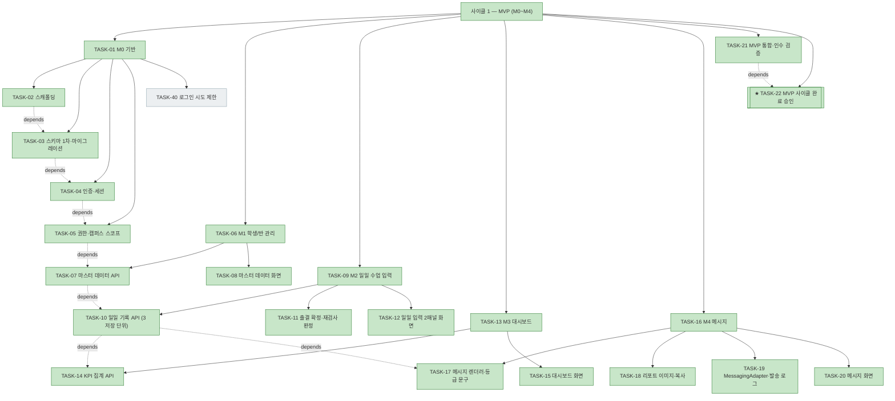
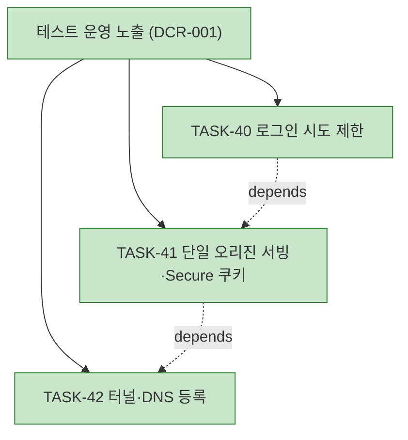
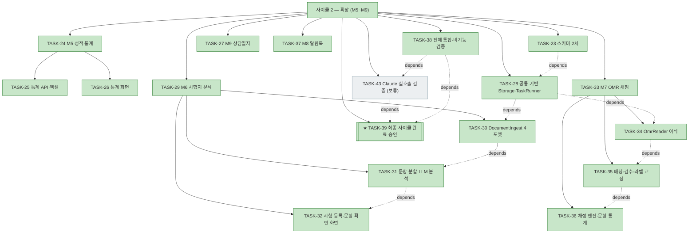
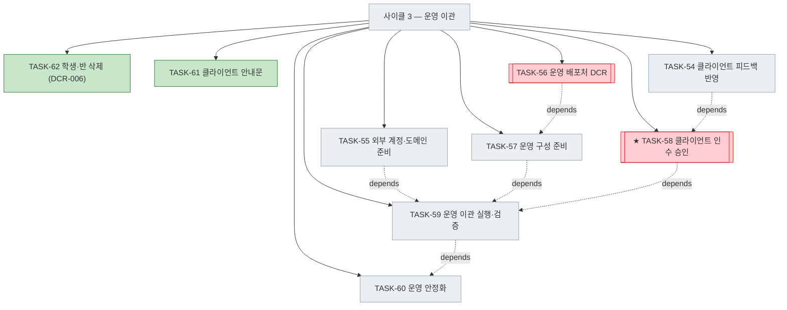
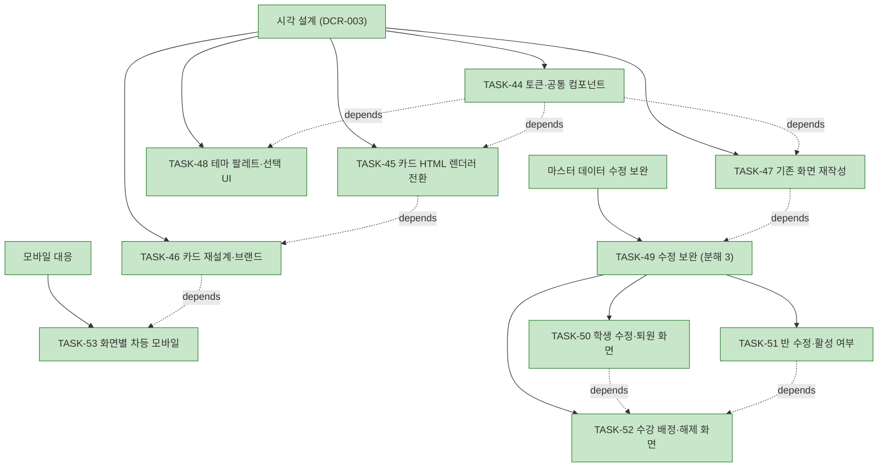

# PLAN-mathdesk: 구현 계획

> 문서 유형: `plan`
> 작업 ID: `20260922-mathdesk-baseline`
> 상태: `in-progress`
> 기준선: `v7`
> 작성일: `2026-09-22`
> 최종 갱신: `2026-09-24`
> 관련 문서: [REQ-mathdesk: 요구사항](./requirements.md), [DESIGN-mathdesk: 설계](./design.md), [결정 등록부](./decisions.md), [WORK-20260922-mathdesk-baseline: 작업 기록](./work/20260922-mathdesk-baseline/work-log.md)

## 요약

- 목적: 승인된 기준선 `v1`(요구사항 FR-01~39 / 설계 DES-01~22)을 구현 작업으로 번역하고 검증·통합 경로를 고정한다.
- 현재 결론 또는 상태: **사이클 1(MVP)이 2026-09-22 사용자 승인으로 완료**되었다. **사이클 2가 2026-09-24 13:46 사용자 승인으로 완료**되었다. 작업 53건 중 52건 완료, TASK-43(Claude 실호출)만 사용자 지시로 보류. 시각 설계(TASK-44~48)와 모바일 대응(TASK-53)이 완료되었다. 사이클 2(M5~M9) 착수 단계다. [DCR-002](./work/20260922-mathdesk-baseline/DCR-002-M6-LLM-공급자-중립화와-Claude-연결.md)로 기준선 `v3`가 발행되어 TASK-23·TASK-31이 갱신되고 TASK-43이 신설되었다.
- 다음 행동: **사이클 3(운영 이관) 계획 수립(2026-09-24).** TASK-61 클라이언트 안내문과 TASK-62 학생·반 삭제는 완료했다. 클라이언트 피드백은 현재 테스트 운영에서 반영하고([TASK-54](#task-54-클라이언트-피드백-반영)), 외부 계정 준비([TASK-55](#task-55-외부-계정도메인-준비))를 병행하며, 클라이언트 인수 승인([TASK-58](#task-58--클라이언트-인수-승인)) 뒤 AWS로 이관한다([TASK-59](#task-59-운영-이관-실행과-검증)). 배포처 변경은 [TASK-56 DCR](#task-56-운영-배포처-dcr)이 먼저다.

## 문서 연결

| 방향 | 관계 | 대상 문서 | 대상 항목 | 비고 |
|---|---|---|---|---|
| input | baseline | [REQ-mathdesk: 요구사항](./requirements.md) | FR-01~FR-39, NFR-01~NFR-16, AC-01~AC-27 | 승인된 요구사항 기준선 v1 |
| input | baseline | [DESIGN-mathdesk: 설계](./design.md) | DES-01~DES-22 | 승인된 설계 기준선 v1 |
| input | decision | [결정 등록부](./decisions.md) | ADR-001~ADR-009 | 적용되는 설계 결정 |
| input | change | [DCR-002: M6 LLM 공급자 중립화와 Claude 연결](./work/20260922-mathdesk-baseline/DCR-002-M6-LLM-공급자-중립화와-Claude-연결.md) | TASK-23, TASK-31, TASK-43 | 기준선 v3가 바꾼 작업 |
| input | change | [DCR-003: 브랜드 자산으로서의 시각 설계](./work/20260922-mathdesk-baseline/DCR-003-브랜드-자산으로서의-시각-설계.md) | TASK-44~TASK-47 | 기준선 v4가 추가한 작업 |
| input | change | [DCR-004: 웹 테마 선택과 브랜드 색의 역할 분리](./work/20260922-mathdesk-baseline/DCR-004-웹-테마-선택.md) | TASK-48 | 기준선 v5가 추가한 작업 |
| input | change | [DCR-005: 화면별 차등 모바일 지원](./work/20260922-mathdesk-baseline/DCR-005-모바일-지원-범위.md) | TASK-53 | 기준선 v6가 추가한 작업 (후순위) |
| output | implementation | [WORK-20260922-mathdesk-baseline: 작업 기록](./work/20260922-mathdesk-baseline/work-log.md) | document | 이 계획의 수행·검증 기록 |

## 기준선

- 관련 요구사항: [REQ-mathdesk](./requirements.md) 기준선 `v6` (2026-09-23 재승인)
- 관련 설계: [DESIGN-mathdesk](./design.md) 기준선 `v6` (2026-09-23 재승인)
- 관련 ADR·DCR: [ADR-001~ADR-012](./decisions.md#등록부) (`approved`), [DCR-001](./work/20260922-mathdesk-baseline/DCR-001-테스트-운영-환경-노출.md) (v2), [DCR-002](./work/20260922-mathdesk-baseline/DCR-002-M6-LLM-공급자-중립화와-Claude-연결.md) (v3), [DCR-003](./work/20260922-mathdesk-baseline/DCR-003-브랜드-자산으로서의-시각-설계.md) (v4), [DCR-004](./work/20260922-mathdesk-baseline/DCR-004-웹-테마-선택.md) (v5), [DCR-005](./work/20260922-mathdesk-baseline/DCR-005-모바일-지원-범위.md) (v6)

## 작업 정의

- 목표: 기준선 `v1`의 M0~M9를 구현하고 인수 조건 AC-01~AC-27을 검증 가능한 상태로 통합한다.
- 범위: [REQ-mathdesk 범위 · 포함](./requirements.md#포함)과 동일. 사이클 1(M0~M4)을 선행하고 사이클 2(M5~M9)를 후행한다.
- 범위 밖: [REQ-mathdesk 범위 · 제외](./requirements.md#제외)와 동일. 추가로 Phase B 배포, 설치 패키지 제작, `.hwp` 시각 검수 렌더링은 이 계획에서 수행하지 않는다.
- 가정
  - 저장소에 제품 코드가 없는 신규 구현이다(현재 `prototype/`과 `assets/`만 존재).
  - [prototype/omr](../prototype/omr/)의 판독기·템플릿·합성 테스트를 제품 코드로 이식해 재사용한다. 이식 전까지는 참조 구현이며 제품 코드가 아니다.
  - 로컬에 Docker가 설치되어 있고 컨테이너를 기동할 수 있다.
- 위험
  - [RISK-07](./requirements.md#위험) 범위 과대 — 사이클 분할과 TASK-22 릴리스 관문으로 MVP를 먼저 완결시킨다.
  - [Q-02·Q-03·Q-08](./requirements.md#가정과-미해결-질문) 미해소 — TASK-19·TASK-37·TASK-34의 검증이 테스트 모드·합성 데이터까지로 제한된다. 제한을 검증 결과에 명시한다.
  - [Q-09·Q-10](./design.md#가정과-미해결-질문) — TaskRunner 방식과 리포트 이미지 렌더 방식은 TASK-28·TASK-18에서 실측 후 확정하며, 설계를 벗어나면 DCR로 반환한다.

## 계획 트리

<!-- generated -->

```text
mathdesk 구현 (기준선 v6, 작업 20260922-mathdesk-baseline)     completed (52/53, TASK-43 보류)
│
├─ [✓] 사이클 1 — MVP (M0~M4) ....................... completed (23/23) 2026-09-22 20:05
│  ├─ [✓] TASK-01 M0 기반 (분해 5, 5/5) ............. 2026-09-22 14:31
│  │   ├─ [✓] TASK-02 모노레포 스캐폴딩과 실행 환경 ... 2026-09-22 09:58
│  │   ├─ [✓] TASK-03 스키마 1차·마이그레이션·시드 .... 2026-09-22 10:26
│  │   ├─ [✓] TASK-04 인증과 세션 .................... 2026-09-22 10:53
│  │   ├─ [✓] TASK-05 권한·캠퍼스 스코프 강제 ........ 2026-09-22 11:14
│  │   └─ [✓] TASK-40 로그인 시도 제한 ............... 2026-09-22 14:31
│  ├─ [✓] TASK-06 M1 학생/반 관리 (분해 2, 2/2) ...... 2026-09-22 12:34
│  │   ├─ [✓] TASK-07 마스터 데이터 API .............. 2026-09-22 11:36
│  │   └─ [✓] TASK-08 마스터 데이터 화면 ............. 2026-09-22 12:34
│  ├─ [✓] TASK-09 M2 일일 수업 입력 (분해 3, 3/3) .... 2026-09-22 13:58
│  │   ├─ [✓] TASK-10 일일 기록 API (3 저장 단위) .... 2026-09-22 13:02
│  │   ├─ [✓] TASK-11 출결 확정·재검사 판정 .......... 2026-09-22 13:29
│  │   └─ [✓] TASK-12 일일 입력 2패널 화면 ........... 2026-09-22 13:58
│  ├─ [✓] TASK-13 M3 대시보드 (분해 2, 2/2) .......... 2026-09-22 16:31
│  │   ├─ [✓] TASK-14 KPI 집계 API ................... 2026-09-22 16:02
│  │   └─ [✓] TASK-15 대시보드 화면 .................. 2026-09-22 16:31
│  ├─ [✓] TASK-16 M4 메시지 (분해 4, 4/4) ............ 2026-09-22 19:12
│  │   ├─ [✓] TASK-17 메시지 렌더러와 등급 문구 ...... 2026-09-22 17:03
│  │   ├─ [✓] TASK-18 리포트 이미지와 복사 ........... 2026-09-22 18:05
│  │   ├─ [✓] TASK-19 MessagingAdapter·발송 로그 ..... 2026-09-22 18:41
│  │   └─ [✓] TASK-20 메시지 화면 .................... 2026-09-22 19:12
│  ├─ [✓] TASK-21 MVP 통합·인수 검증 ................. 2026-09-22 19:48
│  └─ [✓] TASK-22 ★ MVP 사이클 완료 승인 ............. 2026-09-22 20:05
│
├─ 테스트 운영 노출 (DCR-001) ....................... completed (3/3)
│  ├─ [✓] TASK-40 로그인 시도 제한 .................. 2026-09-22 14:31
│  ├─ [✓] TASK-41 단일 오리진 테스트 운영 서빙 ...... 2026-09-22 14:44
│  └─ [✓] TASK-42 mathdesk 터널 등록과 노출 검증 .... 2026-09-22 15:26
│
├─ 시각 설계 (DCR-003·DCR-004) ..................... completed (5/5) 2026-09-24 00:10
│  ├─ [✓] TASK-44 디자인 토큰·공통 컴포넌트 기반 .... 2026-09-23 01:22
│  ├─ [✓] TASK-47 기존 화면 5개 재작성 .............. 2026-09-23 01:43
│  ├─ [✓] TASK-48 테마 팔레트와 선택 UI ............. 2026-09-23 20:20
│  ├─ [✓] TASK-45 리포트 카드 HTML 렌더러 전환 ...... 2026-09-23 21:05
│  └─ [✓] TASK-46 카드 재설계·브랜드 (시안 확인) .... 2026-09-24 00:10
│
├─ 모바일 대응 (DCR-005) ........................... completed (1/1) 2026-09-24 00:25
│  └─ [✓] TASK-53 화면별 차등 모바일 대응 .......... 2026-09-24 00:25
│
├─ 마스터 데이터 수정 기능 보완 .................... completed (4/4) 2026-09-24 01:25
│  └─ [✓] TASK-49 마스터 데이터 수정 보완 (분해 3) .. 2026-09-24 01:25
│      ├─ [✓] TASK-50 학생 수정·퇴원 화면 .......... 2026-09-24 01:05
│      ├─ [✓] TASK-51 반 수정·활성 여부 (API 보완) . 2026-09-24 01:20
│      └─ [✓] TASK-52 수강 배정·해제 화면 .......... 2026-09-24 01:25
│
├─ [✓] 사이클 2 — 확장 (M5~M9) ...................... completed (17/18, TASK-43 보류) 2026-09-24 13:46
│  ├─ [✓] TASK-23 스키마 2차 (시험·OMR·상담·파일) .... 2026-09-22 23:53
│  ├─ [✓] TASK-24 M5 성적 통계 (분해 2) .............. 2026-09-24 02:05
│  │   ├─ [✓] TASK-25 통계 집계 API와 엑셀 내보내기 ... 2026-09-24 01:45
│  │   └─ [✓] TASK-26 통계 화면 ...................... 2026-09-24 02:05
│  ├─ [✓] TASK-27 M9 상담일지 ........................ 2026-09-24 12:21
│  ├─ [✓] TASK-28 공통 기반 — Storage·업로드·TaskRunner  2026-09-24 02:30
│  ├─ [✓] TASK-29 M6 시험지 분석 (분해 3) ............ 2026-09-24 04:10
│  │   ├─ [✓] TASK-30 DocumentIngest 4포맷 정규화
│  │   ├─ [✓] TASK-31 문항 분할·LlmAdapter·분석 ...... 2026-09-24 03:30
│  │   └─ [✓] TASK-32 시험 등록·문항 확인 화면 ....... 2026-09-24 04:10
│  ├─ [✓] TASK-33 M7 OMR 채점 (분해 3) ............... 2026-09-24 12:11
│  │   ├─ [✓] TASK-34 OmrReader 제품 이식 ............ 2026-09-24 10:55
│  │   ├─ [✓] TASK-35 학생 매칭·검수·라벨 교정 ....... 2026-09-24 11:54
│  │   └─ [✓] TASK-36 채점 엔진과 문항별 통계 ........ 2026-09-24 12:11
│  ├─ [✓] TASK-37 M8 카카오 알림톡 ................... 2026-09-24 12:39
│  ├─ [✓] TASK-38 전체 통합·비기능 검증 .............. 2026-09-24 12:59
│  ├─ [⏸] TASK-43 Claude 실호출 검증 ................. blocked: 사용자 보류(2026-09-24)
│  └─ [✓] TASK-39 ★ 최종 사이클 완료 승인 ............ 2026-09-24 13:46
│
└─ [ ] 사이클 3 — 운영 이관 (계획 2026-09-24) ......... in-progress (2/9)
   ├─ [✓] TASK-62 학생·반 삭제 (DCR-006) ............. 2026-09-24 18:08
   ├─ [✓] TASK-61 클라이언트 안내문 작성 ............. 2026-09-24 19:55
   ├─ [ ] TASK-54 클라이언트 피드백 반영 (반복) ...... 현재 테스트 운영
   ├─ [ ] TASK-55 외부 계정·도메인 준비 (병행) ....... 클라이언트·사용자
   ├─ [ ] TASK-56 운영 배포처 DCR ........... wf-design, 사용자 승인
   ├─ [ ] TASK-57 운영 구성 준비 ..................... depends: TASK-56
   ├─ [ ] TASK-58 ★ 클라이언트 인수 승인 ............. depends: TASK-54
   ├─ [ ] TASK-59 운영 이관 실행과 검증 .............. depends: TASK-55, 57, 58 (TASK-43 흡수)
   └─ [ ] TASK-60 운영 안정화 ........................ depends: TASK-59
```

사이클 1 (노드 23)



테스트 운영 노출 (노드 4)



사이클 2 (노드 19)



사이클 3 (노드 10)



시각 설계·모바일·마스터 데이터 보완 (노드 13)



## 작업 목록

### 시각 설계 (DCR-003)

> [DCR-003](./work/20260922-mathdesk-baseline/DCR-003-브랜드-자산으로서의-시각-설계.md)은 학부모에게 도달하는 자산(리포트 카드)을 먼저 완성하고 내부 운영 화면 재작성을 마지막에 두었다.
>
> **순서 변경(2026-09-23, 사용자 지시):** TASK-47을 TASK-45·46보다 먼저 수행한다. 기준선(FR-40·NFR-18·NFR-19·AC-30~32·DES-08·DES-24)과 작업 내용은 바뀌지 않고 수행 순서만 바뀌므로 DCR을 발행하지 않는다. TASK-47은 의존성이 TASK-44뿐이라 선행 조건을 이미 충족한다. 기술적으로는 화면 5개를 재작성하며 토큰·컴포넌트의 부족분이 드러나므로, 카드 렌더러가 토큰 위에 올라타기 전에 그것을 발견하는 이점이 있다.

### TASK-44: 디자인 토큰과 공통 컴포넌트 기반

- 상태: completed
- 완료: 2026-09-23 01:22
- 상위: 없음
- 목표: Tailwind v4를 도입하고 `tokens.css`에 색·간격·타이포·라운드·그림자를 CSS 변수로 단일 정의한다. shadcn/ui 패턴으로 공통 컴포넌트(버튼·입력·표·카드·대화상자)와 레이아웃 셸을 저장소에 둔다.
- 관련 요구사항과 설계: [NFR-13·NFR-14·NFR-18](./requirements.md#비기능-요구사항), [DES-24](./design.md#컴포넌트와-책임), [DES-24 상세](./design.md#des-24-상세), [ADR-010](./work/20260922-mathdesk-baseline/ADR-010-웹-UI-디자인-시스템.md)
- 변경 대상: `apps/web/src/styles/`, `apps/web/src/components/ui/`, `apps/web/vite.config.ts`, `package.json`
- 의존성: 없음
- 위험: 토큰 구조를 잘못 잡으면 이후 3개 작업이 모두 영향을 받는다. 번들 크기 증가
- 검증 방법: 선행 테스트 — 토큰 파일이 웹과 카드 양쪽에서 참조 가능한 순수 CSS임을 고정하는 테스트(VER-30의 웹 측). 기존 웹 테스트 20건 전량 통과 유지
- 완료 조건: `npm test`와 `npm run build` 통과, 토큰 단일 소스 확립, 공통 컴포넌트가 최소 1개 화면에서 동작
- 결과: Tailwind v4.3.3 도입, `src/styles/tokens.css`에 순수 CSS 변수 38개(색·타이포·간격·라운드·그림자) 단일 정의. `app.css`의 `@theme inline`이 토큰을 Tailwind 이름에 연결해 모든 유틸리티가 `var(--md-*)`를 참조한다(VER-30 웹 측 통과). 공통 컴포넌트 `button`·`input`·`card`·`table`·`dialog`와 `AppShell` 추가, 로그인 화면에 적용. 웹 테스트 24건(기존 20 + 토큰 4)·`npm run build` 통과. 번들 JS 324.18 → 355.96 kB(+31.8, gzip +9.9), CSS 신규 13.48 kB. Recharts·lucide-react는 [ADR-010](./work/20260922-mathdesk-baseline/ADR-010-웹-UI-디자인-시스템.md) 결정을 유지하되 실제 사용처가 생길 때까지 설치를 미뤘다(Recharts는 TASK-26 통계 화면). **TASK-47 완료 시점에도 둘 다 미설치다** — 화면 재작성에서 아이콘 없이도 정보 위계가 성립했다

### TASK-45: 리포트 카드 HTML 렌더러 전환

- 상태: completed
- 완료: 2026-09-23 21:05
- 상위: 없음
- 목표: `report.py`를 HTML 템플릿 + Playwright(Chromium) 스크린샷으로 교체한다. 브라우저를 lifespan에서 warm 유지하고 `tokens.css`를 인라인한다. 컨테이너에 Chromium을 설치한다.
- 관련 요구사항과 설계: [FR-20·FR-22](./requirements.md#기능-요구사항), [NFR-19](./requirements.md#비기능-요구사항), [AC-16·AC-31·AC-32](./requirements.md#인수-조건), [DES-08 상세](./design.md#des-08-상세), [ADR-011](./work/20260922-mathdesk-baseline/ADR-011-리포트-카드-HTML-렌더링.md)
- 변경 대상: `apps/api/src/mathdesk/report.py`, `apps/api/src/mathdesk/main.py`(lifespan), `apps/api/Dockerfile`, `Dockerfile.testops`, `pyproject.toml`
- 의존성: TASK-44
- 위험: 컨테이너 이미지 +300~400MB, Chromium 상시 메모리. 맥미니에서 home-wiki와 경합할 수 있다. 폰트 가용성 차이로 로컬과 컨테이너 결과가 갈릴 수 있다
- 검증 방법: 선행 테스트 — 기존 `test_report_image.py`의 계약(PNG 반환·내용 변경 시 이미지 변화·스코프 거부)을 새 렌더러로 유지하고 Red로 시작. 시각 회귀 기준 이미지 비교. **컨테이너에서 검증**. warm 상태 30장 연속 p95 측정(VER-31)
- 완료 조건: AC-16 유지, NFR-19(p95 3초) 충족, 이미지 크기·메모리 실측 기록, Pillow 경로와 글리프 테스트 제거
- 결과: `report.py`를 HTML 템플릿 + Playwright(Chromium) 스크린샷으로 교체. 브라우저를 lifespan에서 warm 유지(`ReportRenderer`), `tokens.css`를 파일째 인라인(VER-30 카드 측 통과). **VER-31: 컨테이너에서 30장 p95 86ms** (기준 3000ms, p50 83ms·최대 101ms). 호스트 p95 92ms. 콜드 스타트 0.17s는 lifespan에서 흡수. 이미지 77KB(평균), API 컨테이너 메모리 216.5MiB, 이미지 1.51GB(`--only-shell`로 2.11GB에서 축소). 해상도를 CSS 760px × 2배(1520px)로 올렸다 — AC-16은 픽셀 크기를 규정하지 않으며 760은 Pillow 산출물 크기였다. 컨테이너에서 한글 렌더 육안 확인. 브랜드 색 CSS 주입 방어 추가. API 83건 통과
- 미이행: **시각 회귀 기준 이미지 비교.** [TASK-46](#task-46-카드-재설계와-브랜드-반영)이 카드를 전면 재설계하므로 지금 기준 이미지를 잡으면 곧 폐기된다. 설계가 확정되는 TASK-46에서 함께 수립한다

### TASK-46: 카드 재설계와 브랜드 반영

- 상태: completed
- 완료: 2026-09-24 00:10
- 상위: 없음
- 목표: 리포트 카드의 레이아웃·타이포·정보 위계를 재설계하고 학원 브랜드(학원명·로고·시그니처 색)를 반영한다. 난이도 분석표 카드 템플릿도 같은 언어로 준비한다.
- 관련 요구사항과 설계: [FR-40](./requirements.md#기능-요구사항), [FR-20·FR-30](./requirements.md#기능-요구사항), [AC-30](./requirements.md#인수-조건), [DES-08 상세](./design.md#des-08-상세)
- 변경 대상: 카드 템플릿, `integration_setting` 브랜드 키, 설정 화면
- 의존성: TASK-45
- 위험: **디자인 품질은 도구가 보장하지 않는다.** 학원 로고 자산이 없을 수 있다
- 검증 방법: **시안을 먼저 만들어 사용자 확인을 받은 뒤 확정한다.** 브랜드 설정 반영 확인(VER-29). 실제 카톡 발송 후 폰에서 확인
- 완료 조건: 사용자가 시안을 확정하고 AC-30 통과. 로고 미설정 시 학원명 텍스트 대체 동작
- 결과: 시안 3안(성적 강조형·컬러 헤더형·여백 중심형)을 렌더해 사용자가 **B 컬러 헤더형**을 확정했다. 정보 위계를 바꿔 출결·과제·테스트를 헤더 바로 아래 요약으로 올리고 점수에 반평균 대비를 붙였다(본문 순서대로면 점수가 다섯 번째로 묻힌다). 밝은 시그니처 색 대응으로 WCAG 상대 휘도 기반 `header_ink` 추가. 기록이 없으면 빈 띠 대신 안내 문구. 브랜드 설정은 `GET/PUT /api/settings/brand`와 `SettingsPage`로 구현했고 카드가 이를 읽는다(AC-30·VER-29 통과, 시그니처 색 픽셀 대조). 시그니처 색은 핑크 스킨 실측값 `#C3457F`. 로고 미설정 시 학원명 텍스트 대체 동작. API 94건·웹 39건 통과
- 함께 이행: **시각 회귀 기준 이미지**(TASK-45에서 미룬 항목). `tests/baseline/card.png`를 **컨테이너에서** 생성하고 `test_report_visual.py`가 대조한다(컨테이너 대조 결과 다른 픽셀 0). 글꼴이 호스트와 달라 호스트에서는 자동으로 건너뛴다
- 미이행: **난이도 분석표 카드 템플릿(FR-30).** 이 카드가 담을 시험 분석 데이터가 아직 없다([TASK-29~TASK-36](#task-29-m6-시험지-분석) 미착수). 지금 만들면 내용 구조를 추측하게 되므로, 디자인 언어(시안 B)만 확립해 두고 데이터가 생기는 [TASK-36](#task-36-채점-엔진과-문항별-통계)에서 같은 언어로 만든다
- 후속: 시각 회귀 테스트는 컨테이너 글꼴과 `pytest`가 함께 필요한데 운영 이미지는 `--no-dev`다. 정기 실행하려면 개발 의존성을 포함한 검증용 이미지나 별도 서비스가 필요하다

### TASK-47: 기존 화면 5개 재작성

- 상태: completed
- 완료: 2026-09-23 01:43
- 상위: 없음
- 목표: Dashboard·Daily·Students·Classes·Messages와 `LoginForm`·`Roster`·`AttendanceButtons`를 공통 컴포넌트 위로 옮긴다. 일일 입력의 표 기반 키보드 이동을 공통 컴포넌트가 소유하도록 정리한다.
- 관련 요구사항과 설계: [NFR-13](./requirements.md#비기능-요구사항), [DES-24 상세](./design.md#des-24-상세)
- 변경 대상: `apps/web/src/pages/`, `apps/web/src/components/`, `apps/web/src/App.tsx`
- 의존성: TASK-44
- 위험: 재작성 중 기능 회귀. 화면 수가 많아 한 번에 하면 원인 추적이 어렵다
- 검증 방법: **화면 단위로 나눠 진행하고 매 화면마다 기존 테스트 20건 전량 재실행.** 역할·레이블 보존 원칙 — 테스트가 깨지면 마크업이 잘못된 것으로 본다
- 완료 조건: 웹 테스트 20건과 API 78건 전량 통과, `npm run build` 통과, 화면 ①~④ 시각 확인
- 결과: Dashboard·Daily·Students·Classes·Messages와 `AttendanceButtons`를 공통 컴포넌트 위로 옮겼다. NFR-13의 키보드 이동을 `components/ui/keyboard-grid.tsx`(`KeyboardGrid`)로 신설해 저장소가 소유한다 — 방향키는 같은 열을 유지한 채 행 이동, Enter는 입력란에서만 아래로 이동(버튼에서 가로채면 키보드로 버튼을 누를 수 없다). 열 기준을 포커스 순번이 아니라 `td` 위치로 잡아 행마다 버튼 수가 달라도 어긋나지 않는다. 공통 컴포넌트 `toggle`·`select`·`field`·`stat`·`textarea`·`PageHeader`와 `AttendanceCell`을 추가했다. 웹 테스트 29건(기존 24 + 키보드 5)·API 78건·`npm run build` 통과, **기존 테스트 수정 0건**. 번들 JS 355.96 → 362.75 kB, CSS 13.48 → 17.34 kB

### TASK-48: 테마 팔레트와 선택 UI

- 상태: completed
- 완료: 2026-09-23 20:20
- 상위: 없음
- 목표: `tokens.css`를 `data-theme` 기반 팔레트 5벌(라이트·다크·블루·그린·핑크)로 확장하고, 앱 셸 헤더에 테마 선택 UI를 두며 선택을 `localStorage`에 유지한다.
- 관련 요구사항과 설계: [FR-41](./requirements.md#기능-요구사항), [NFR-18](./requirements.md#비기능-요구사항), [AC-31·AC-33·AC-34](./requirements.md#인수-조건), [DES-24 상세](./design.md#des-24-상세), [ADR-012](./work/20260922-mathdesk-baseline/ADR-012-테마-팔레트와-적용-방식.md)
- 변경 대상: `apps/web/src/styles/tokens.css`, `apps/web/src/components/AppShell.tsx`, `apps/web/index.html`(첫 페인트 전 적용), 테마 상태 모듈
- 의존성: TASK-44
- 위험: 팔레트 하나에 토큰이 빠지면 그 테마에서만 색이 깨진다(AC-34 테스트로 차단). 다크 팔레트의 대비는 육안 확인에 의존한다. 색값 자체가 심미 판단이라 사용자 확인이 필요하다
- 검증 방법: 선행 테스트 — (1) 5개 팔레트가 동일한 색 토큰 집합을 정의함(VER-32), (2) 타이포·간격·라운드·그림자 스케일이 어느 팔레트에서도 재정의되지 않음(AC-31, 기존 `tokens.test.ts` 확장), (3) 테마를 고르면 `data-theme`가 바뀌고 `localStorage`에 저장되며 재마운트 후에도 유지됨(VER-33). 기존 웹 테스트 29건 전량 통과 유지
- 완료 조건: `npm test`·`npm run build` 통과, AC-33·AC-34 통과, 5개 테마의 시안을 사용자가 확인. **색값 확정은 사용자 판단 항목이므로 그 지점에서 멈추고 묻는다**
- 결과: `[data-theme='dark'|'blue'|'green'|'pink']` 4벌 추가(라이트는 `:root`). 속성 선택자만 써서 카드 인라인 제약을 유지. `src/theme.ts`와 `components/ThemeSelect.tsx`를 앱 셸 헤더에 배치하고 `localStorage`에 유지, `index.html` 인라인 스크립트로 첫 페인트 번쩍임 제거. 자체 리뷰에서 다크 테마의 지각(warning) 토글 대비 결함(명도차 0.16)을 찾아 `--md-color-warning-fg` 신설로 0.62까지 올렸다. 웹 36건(기존 29 + 팔레트 3 + 테마 4)·API 78건·`npm run build` 통과. 번들 CSS 17.34 → 19.19 kB. **사용자가 5개 테마 스크린샷으로 시안 확인 완료(2026-09-23)**

### TASK-53: 화면별 차등 모바일 대응

- 상태: completed
- 완료: 2026-09-24 00:25
- 상위: 없음
- 목표: 최소 390px까지 지원한다. 조회·발송 화면(대시보드·알림문자·학생/반 목록)은 휴대폰에서 페이지 본문의 가로 스크롤 없이 조작 가능하게 하고, 밀집 입력 화면(일일 입력·등록 폼)은 데스크톱 전제를 유지하되 표를 가로 스크롤로 읽을 수 있게 한다.
- 관련 요구사항과 설계: [NFR-14](./requirements.md#비기능-요구사항), [NFR-14 상세](./requirements.md#nfr-14-상세), [NFR-13](./requirements.md#비기능-요구사항), [AC-35](./requirements.md#인수-조건), [DES-24 상세](./design.md#des-24-상세), [DCR-005](./work/20260922-mathdesk-baseline/DCR-005-모바일-지원-범위.md)
- 변경 대상: `apps/web/src/components/AppShell.tsx`, `PageHeader.tsx`, `ui/stat.tsx`, `apps/web/src/pages/` 전체의 레이아웃 클래스
- 의존성: TASK-46
- 위험: 반응형 분기가 레이아웃 클래스를 넘어 마크업 구조까지 바꾸면 기존 테스트가 깨진다. **역할·레이블은 건드리지 않는다.** 일일 입력을 억지로 좁은 폭에 맞추려 하면 NFR-13의 키보드 이동과 충돌한다 — 그 화면은 데스크톱 전제를 지킨다
- 검증 방법: 선행 테스트 — 390px 뷰포트에서 조회·발송 화면 렌더 시 페이지 본문에 가로 넘침이 없음을 확인(VER-35). 기존 웹 테스트 36건 **수정 없이** 전량 통과
- 완료 조건: AC-35 통과, 기존 테스트 36건 무수정 통과, `npm run build` 통과, 실제 휴대폰에서 사용자 확인
- 우선순위: **후순위.** [DCR-005](./work/20260922-mathdesk-baseline/DCR-005-모바일-지원-범위.md) 승인 시 사용자가 리포트 카드(TASK-45·46) 이후로 지정했다
- 결과: `PageHeader`·KPI 타일·2단 본문·등록 폼에 반응형 분기를 넣었다. 390px에서 조회·발송 화면 4종 모두 페이지 본문 가로 넘침 0(VER-35 통과, 390·768·1280px 측정). 일일 입력은 데스크톱 전제를 유지한다. **기존 웹 테스트 39건을 한 줄도 고치지 않았다** — 레이아웃 클래스만 바꾸고 역할·레이블을 건드리지 않았다. 착수 시점 넘침은 알림문자 17px·학생/반 351px이었다
- 검증 도구: [`ops/verify/responsive.py`](../ops/verify/responsive.py). jsdom은 레이아웃을 계산하지 않아 vitest로는 가로 넘침을 잴 수 없어 실제 브라우저로 잰다. API를 가로채 고정 응답을 주므로 백엔드·자격 증명이 필요 없다. **CI에 넣지 않았다** — 웹 빌드 산출물과 Chromium이 함께 필요해 단위 테스트 체계와 결합도가 높다. 웹 레이아웃 변경 후 수동 실행한다

### TASK-49: 마스터 데이터 수정 기능 보완

- 상태: completed (2026-09-24 01:25)
- 상위: 없음 (분해 3 — TASK-50~52)
- 목표: 기준선이 요구했으나 화면·API에 없는 마스터 데이터 수정 경로를 채운다. [TASK-08](#task-08-마스터-데이터-화면)의 목표가 "등록·수정 화면"이었으나 완료 조건이 AC-05(목록 반영)만 검사해 수정 경로가 빠진 채 통과한 것이 원인이다.
- 관련 요구사항과 설계: [FR-05 상세](./requirements.md#fr-05-상세), [FR-07·FR-08](./requirements.md#기능-요구사항), [DES-04](./design.md#컴포넌트와-책임)
- 변경 대상: TASK-50~52 참조
- 의존성: TASK-47
- 위험: 하드 삭제를 도입하면 출결·성적·발송 이력의 참조가 깨진다. **기준선대로 상태 전이(퇴원)와 비활성 플래그만 쓰고 학생·반의 물리 삭제 경로는 만들지 않는다**
- 검증 방법: 하위 작업별 선행 테스트. 퇴원 학생이 기본 목록에서 빠지되 과거 기록이 보존됨을 확인
- 완료 조건: TASK-50~52가 모두 `completed`

### TASK-50: 학생 수정·퇴원 화면

- 상태: completed (2026-09-24 01:05)
- 상위: TASK-49
- 목표: 학생 목록에서 수정과 재원 상태 전환(`재원`·`휴원`·`퇴원`)을 할 수 있게 한다. 퇴원 학생은 기본 목록에서 제외하고 필터로 볼 수 있게 한다.
- 관련 요구사항과 설계: [FR-05 상세](./requirements.md#fr-05-상세)
- 변경 대상: `apps/web/src/pages/StudentsPage.tsx`, `apps/web/src/api.ts`
- 의존성: 없음 (API `PATCH /students/{id}`는 이미 구현되어 있고 `status`를 받는다)
- 위험: 낮음. 서버 계약이 이미 존재한다
- 검증 방법: 선행 테스트 — 퇴원으로 바꾸면 기본 목록에서 사라지고 필터를 켜면 다시 보인다
- 완료 조건: FR-05의 수정·퇴원 경로가 화면에서 동작
- 결과: 행마다 `수정` 대화상자(이름·학교·학년·연락처·수험번호·상태)를 열고 `PATCH /students/{id}`로 저장한다. 퇴원 학생은 기본 목록에서 빠지고 `퇴원 포함` 토글로 다시 보인다. 상태는 화면에서 `재원`·`휴원`·`퇴원`으로 표시한다. 웹 테스트 2건(신규, 실패→성공)과 API 특성화 테스트 1건(퇴원 후 과거 일일 기록 보존)을 남겼다. 기존 웹 테스트 39건을 고치지 않았다
- 범위 참고: `PATCH`가 `StudentIn` 전체를 받는 전치환이라 연락처를 보내지 않으면 지워진다. 데이터 손실을 막기 위해 연락처를 수정 폼에 넣었고, 같은 필드 목록을 쓰는 등록 폼에도 함께 들어갔다(FR-05가 요구하는 항목이다)

### TASK-51: 반 수정·활성 여부 (API 보완 포함)

- 상태: completed (2026-09-24 01:20)
- 상위: TASK-49
- 목표: 반 수정과 활성 여부 전환을 구현한다. **`PATCH /classes/{id}`가 `is_active`를 다루지 않고 `ClassIn`에도 필드가 없으므로 API부터 보완한다.**
- 관련 요구사항과 설계: [FR-07](./requirements.md#기능-요구사항), [DES-04](./design.md#컴포넌트와-책임)
- 변경 대상: `apps/api/src/mathdesk/masterdata.py`(`ClassIn`·`update_class`), `apps/web/src/pages/ClassesPage.tsx`, `apps/web/src/api.ts`
- 의존성: 없음
- 위험: 비활성 반이 대시보드·일일 입력의 반 선택 목록에서 어떻게 다뤄지는지 확인이 필요하다. 활성 반 수 KPI(`활성 N개 반`)에 영향이 간다
- 검증 방법: 선행 테스트 — `is_active`를 `false`로 PATCH하면 `GET /classes`의 기본 목록과 대시보드 활성 반 수에서 빠진다
- 완료 조건: FR-07의 수정·활성 여부 경로가 API와 화면에서 동작
- 결과: `ClassIn.is_active`를 추가하고 `update_class`·`create_class`가 이를 반영한다. `GET /classes`는 **기본으로 활성 반만** 주고 `?include_inactive=true`로 전부 준다. 반 선택 목록(대시보드·일일 입력·알림문자)이 자동으로 비활성 반을 빼고, 과거 기록 조회는 반 단건 경로(`_visible_class`)를 쓰므로 영향이 없다. 화면은 행별 `수정` 대화상자와 `비활성 포함` 토글을 얻었다
- 주의: `queryFn: fetchClasses`를 그대로 넘기면 react-query가 컨텍스트 객체를 첫 인자로 주어 `include_inactive`가 켜진다. 세 화면의 호출부를 `() => fetchClasses()`로 바꿨다

### TASK-52: 수강 배정·해제 화면

- 상태: completed (2026-09-24 01:25)
- 상위: TASK-49
- 목표: 학생을 반에 배정하고 해제하는 화면을 만든다. 배정 기간 이력이 보존되어 과거 수업일의 소속 반을 재현할 수 있어야 한다.
- 관련 요구사항과 설계: [FR-08](./requirements.md#기능-요구사항)
- 변경 대상: `apps/web/src/pages/ClassesPage.tsx` 또는 신규 화면, `apps/web/src/api.ts`
- 의존성: TASK-50, TASK-51
- 위험: 해제가 `DELETE`인지 기간 종료(`end_date`)인지에 따라 과거 재현이 갈린다. **FR-08이 "배정 기간 이력을 보존"을 요구하므로 해제는 기간 종료로 처리하고, 기존 `DELETE` 엔드포인트는 오등록 취소 용도로 한정한다**
- 검증 방법: 선행 테스트 — 배정 후 해제하면 현재 명단에서 빠지되 해제 이전 날짜의 일일 기록은 그대로 재현된다
- 완료 조건: FR-08의 배정·해제 경로가 화면에서 동작하고 과거 재현이 유지됨
- 결과: `PATCH /classes/{id}/enrollments/{id}`를 신설해 해제를 종료일(`end_date`)로 처리한다. 기존 `DELETE`는 오등록 취소 전용으로 주석에 못박았다. 반 행의 `명단` 대화상자에서 배정(오늘부터)과 해제(오늘까지)를 한다. API 테스트가 9/17 종료 후 9/18 명단에서 빠지고 9/11 명단에는 남는 것을 검사한다
- 주의: 종료일이 오늘이면 `end_date >= on` 규칙상 **오늘 명단에는 아직 남는다**(오늘 수업의 출결이 그대로 유지되어야 하므로 의도된 동작이다). 명단 행이 `<종료일> 종료`를 표시하고 해제 버튼을 감춰 상태를 드러낸다

### 사이클 1 — MVP (M0~M4)

### TASK-01: M0 기반

- 상태: completed (2026-09-22 14:31) — 완료 조건은 TASK-40 완료 시점에 충족됐으나 상태 갱신이 빠져 2026-09-24 TASK-39 준비 중 바로잡았다
- 상위: 없음
- 목표: 애플리케이션이 기동하고 로그인·권한 검사가 동작하는 최소 골격을 만든다.
- 관련 요구사항과 설계: [FR-01~FR-04](./requirements.md#기능-요구사항), [DES-01~DES-03](./design.md#컴포넌트와-책임), [DES-21](./design.md#컴포넌트와-책임)
- 변경 대상: 저장소 전역 골격
- 의존성: 없음
- 위험: 스캐폴딩 선택이 이후 전 작업에 영향을 준다
- 검증 방법: 자식 작업의 검증 통과 + `docker compose up` 후 로그인하여 빈 대시보드 진입
- 완료 조건: TASK-02~TASK-05와 TASK-40이 모두 `completed`이고 [AC-01~AC-03](./requirements.md#인수-조건)이 통과한다

### TASK-02: 모노레포 스캐폴딩과 실행 환경

- 상태: completed
- 완료: 2026-09-22 09:58
- 상위: TASK-01
- 목표: `apps/api`(FastAPI) + `apps/web`(React·Vite·TS) + `docker compose`(api·web·postgres) 골격과 테스트 하네스를 만든다.
- 관련 요구사항과 설계: [NFR-08](./requirements.md#비기능-요구사항), [NFR-12](./requirements.md#비기능-요구사항), [DES-01·DES-02](./design.md#컴포넌트와-책임), [ADR-001](./work/20260922-mathdesk-baseline/ADR-001-기술-스택과-실행-형태.md)
- 변경 대상: `compose.yaml`, `apps/api/`(pyproject·앱 엔트리·설정), `apps/web/`(package.json·vite 설정), 테스트 러너 설정
- 의존성: 없음
- 위험: 의존성 과다 도입. 결정 사다리에 따라 기준선이 요구하는 패키지만 추가한다
- 검증 방법: 선행 테스트 — API 헬스 엔드포인트 호출이 200을 반환하는 통합 테스트 1건을 먼저 작성(Red)
- 완료 조건: `docker compose up`으로 3개 컨테이너가 기동하고, API 테스트와 웹 빌드가 각각 1회 성공한다

### TASK-03: 스키마 1차·마이그레이션·시드

- 상태: completed
- 완료: 2026-09-22 10:26
- 상위: TASK-01
- 목표: M0~M4 범위 테이블(캠퍼스·사용자·학생·보호자·반·시간표·수강·수업 세션·진도·학생 일일 기록·등급 문구·메시지 템플릿·발송 로그·연동 설정·감사 로그)을 Alembic 리비전으로 만든다.
- 관련 요구사항과 설계: [NFR-09](./requirements.md#비기능-요구사항), [DES-21](./design.md#컴포넌트와-책임), [데이터 모델](./design.md#데이터-모델), [ADR-002](./work/20260922-mathdesk-baseline/ADR-002-PostgreSQL-단일-저장소.md)
- 변경 대상: `apps/api/models/`, `apps/api/alembic/versions/`, 시드 스크립트
- 의존성: TASK-02
- 위험: 전환 작업이므로 롤백 준비가 필수다
- 검증 방법: 선행 테스트 — 빈 DB에서 `alembic upgrade head` → `downgrade base` 왕복이 성공하는 테스트를 먼저 작성(Red). 각 리비전에 `downgrade` 포함
- 완료 조건: 왕복 마이그레이션 테스트 통과, 시드 스크립트로 반 4개·학생 47명 투입 성공

### TASK-04: 인증과 세션

- 상태: completed
- 완료: 2026-09-22 10:53
- 상위: TASK-01
- 목표: 로그인·로그아웃·현재 사용자 조회와 서버 세션, Argon2id 비밀번호 해시, 초기 원장 계정 1회 생성을 구현한다.
- 관련 요구사항과 설계: [FR-01](./requirements.md#기능-요구사항), [NFR-05·NFR-06](./requirements.md#비기능-요구사항), [DES-03](./design.md#des-03-상세), [ADR-007](./work/20260922-mathdesk-baseline/ADR-007-인증-권한-모델.md)
- 변경 대상: `apps/api/auth/`, 세션 미들웨어, 로그인 화면
- 의존성: TASK-03
- 위험: 신뢰 경계이므로 입력 검증과 오류 처리를 최소화 대상에서 제외한다
- 검증 방법: 선행 테스트 — [AC-01](./requirements.md#인수-조건)을 인수 테스트로 전환(유효 자격 증명 로그인 성공, 로그아웃 후 보호 경로 접근 시 인증 실패)
- 완료 조건: AC-01 통과, 비밀번호 평문이 DB·로그·응답 어디에도 남지 않음을 테스트로 확인

### TASK-05: 권한·캠퍼스 스코프 강제

- 상태: completed
- 완료: 2026-09-22 11:14
- 상위: TASK-01
- 목표: `CurrentScope` 의존성과 `campus_id` 필터를 요구하는 리포지토리 기반 클래스를 만들어 역할·캠퍼스 검사를 두 지점에 고정한다.
- 관련 요구사항과 설계: [FR-02·FR-03](./requirements.md#fr-03-상세), [NFR-07](./requirements.md#비기능-요구사항), [DES-03](./design.md#des-03-상세), [RISK-08](./design.md#위험)
- 변경 대상: `apps/api/core/scope.py`, 리포지토리 기반 클래스, 사용자·캠퍼스 API
- 의존성: TASK-04
- 위험: 검사 누락이 한 곳이라도 생기면 격리가 깨진다
- 검증 방법: 선행 테스트 — [AC-02·AC-03](./requirements.md#인수-조건)을 인수 테스트로 전환하고, 등록된 엔드포인트 목록을 순회하며 스코프 의존성 누락을 탐지하는 회귀 테스트를 추가
- 완료 조건: AC-03 통과, AC-02의 역할 기반 거부 통과(반 소유권 부분은 학생 기록 API가 생기는 TASK-07·TASK-10에서 재검증), 엔드포인트 순회 테스트가 누락 0건을 보고

### TASK-40: 로그인 시도 제한

- 상태: completed
- 완료: 2026-09-22 14:31
- 상위: TASK-01
- 목표: 연속 로그인 실패가 임계 횟수에 이르면 일정 시간 잠근다. TASK-04에서 실패 지연(계정 유무와 무관한 동일 검증 비용)만 구현했다. 공개 노출([DCR-001](./work/20260922-mathdesk-baseline/DCR-001-테스트-운영-환경-노출.md))의 선행 조건이다.
- 관련 요구사항과 설계: [NFR-06](./requirements.md#비기능-요구사항), [AC-29](./requirements.md#인수-조건), [DES-03](./design.md#des-03-상세), [ADR-008](./work/20260922-mathdesk-baseline/ADR-008-테스트-운영-노출-구성.md)
- 변경 대상: `apps/api/src/mathdesk/auth.py`, 시도 기록 저장소, 마이그레이션
- 의존성: TASK-04
- 위험: 잠금이 과하면 실사용자가 막힌다. 기본값은 연속 10회·3분이며 설정값으로 노출한다
- 검증 방법: 선행 테스트 — [AC-29](./requirements.md#인수-조건)를 통합 테스트로 전환(임계 횟수 실패 후 올바른 비밀번호 거부, 잠금 경과 후 허용, 감사 로그 기록)
- 완료 조건: AC-29 통과, 임계값·잠금 시간이 환경변수로 조정 가능하고 잠금 사건이 감사 로그에 남는다

### TASK-41: 단일 오리진 테스트 운영 서빙

- 상태: completed
- 완료: 2026-09-22 14:44
- 상위: 없음
- 목표: 웹 정적 빌드를 API가 SPA fallback으로 서빙하는 테스트 운영 이미지와 compose 구성을 만들고, `Secure` 쿠키와 노출 표면 축소를 설정으로 제어한다.
- 관련 요구사항과 설계: [NFR-06·NFR-08·NFR-17](./requirements.md#비기능-요구사항), [AC-28](./requirements.md#인수-조건), [DES-23](./design.md#컴포넌트와-책임), [ADR-008](./work/20260922-mathdesk-baseline/ADR-008-테스트-운영-노출-구성.md)
- 변경 대상: 테스트 운영용 Dockerfile·compose 오버레이, `apps/api/src/mathdesk/{main,auth}.py`, `.env` 예시, README
- 의존성: TASK-40
- 위험: 정적 서빙 경로가 `/api`를 가리면 API가 막힌다. 라우팅 순서를 테스트로 고정한다
- 검증 방법: 선행 테스트 — 정적 fallback이 `/api/*`를 가로채지 않고, `MATHDESK_COOKIE_SECURE=true`에서 쿠키에 `Secure`가 붙는 통합 테스트
- 완료 조건: 단일 포트에서 웹과 API가 함께 응답하고, 노출 구성에서 postgres·API 호스트 포트가 게시되지 않으며, 개발용 기본 비밀번호가 쓰이지 않는다

### TASK-42: mathdesk 터널 등록과 노출 검증

- 상태: completed
- 완료: 2026-09-22 15:26
- 상위: 없음
- 목표: 전용 Cloudflare 터널 `mathdesk`와 DNS 라우트, launchd 서비스를 만들어 `mathdesk.yongs-wiki.com`을 연결하고 AC-28을 실제 도메인에서 검증한다.
- 관련 요구사항과 설계: [AC-28](./requirements.md#인수-조건), [DES-23](./design.md#컴포넌트와-책임), [ADR-008](./work/20260922-mathdesk-baseline/ADR-008-테스트-운영-노출-구성.md)
- 변경 대상: `ops/`(터널 설정·운영 문서), `compose.testops.yaml`의 `cloudflared` 서비스. launchd 대신 compose 서비스로 운용해 호스트 포트 게시를 없앴다. 기존 `homewiki` 터널 설정은 수정하지 않는다
- 의존성: TASK-41
- 위험: 외부·비가역 작업이다. 터널·DNS 생성은 사용자 계정에 자원을 만든다(사용자 요청으로 승인됨). 기존 home-wiki 서비스에 영향을 주지 않도록 별도 터널을 쓴다
- 검증 방법: 공개 도메인에서 로그인 → 쿠키 속성 확인 → 로그아웃 후 401. 기존 `yongs-wiki.com` 정상 응답 확인
- 완료 조건: [AC-28](./requirements.md#인수-조건) 통과, 로그인 시 자동 기동(launchd 에이전트 + Docker AutoStart), 롤백 절차 문서화

### TASK-06: M1 학생/반 관리

- 상태: completed
- 완료: 2026-09-22 12:34
- 상위: 없음
- 목표: 학생·보호자·반·시간표·수강 등록을 등록·조회·수정할 수 있게 한다.
- 관련 요구사항과 설계: [FR-05~FR-08](./requirements.md#fr-05-상세), [DES-04](./design.md#컴포넌트와-책임)
- 변경 대상: 마스터 데이터 모듈 전반
- 의존성: TASK-05
- 위험: 수강 등록 기간 이력을 빠뜨리면 과거 수업일 재현이 불가능해진다
- 검증 방법: 자식 작업의 검증 통과
- 완료 조건: TASK-07·TASK-08이 `completed`이고 [AC-04·AC-05](./requirements.md#인수-조건)가 통과한다

### TASK-07: 마스터 데이터 API

- 상태: completed
- 완료: 2026-09-22 11:36
- 상위: TASK-06
- 목표: 학생·보호자·반·시간표·수강 등록 CRUD API와 무결성 규칙(수험번호 자리별 범위, 캠퍼스 내 유일성, 재원 상태)을 구현한다.
- 관련 요구사항과 설계: [FR-05~FR-08](./requirements.md#fr-05-상세), [DES-04](./design.md#컴포넌트와-책임), [REST 계약](./design.md#rest-계약)
- 변경 대상: `apps/api/masterdata/`
- 의존성: TASK-05
- 위험: 없음(내부 CRUD)
- 검증 방법: 선행 테스트 — [AC-04](./requirements.md#인수-조건)를 단위 테스트로 전환(`90000001` 허용, `00000001`·`18600001` 거부)
- 완료 조건: AC-04 통과, 수강 등록 기간으로 특정 날짜의 소속 반을 조회하는 테스트 통과

### TASK-08: 마스터 데이터 화면

- 상태: completed
- 완료: 2026-09-22 12:34
- 상위: TASK-06
- 목표: 학생·반 목록과 등록·수정 화면(`/students`, `/classes`)을 구현한다.
- 관련 요구사항과 설계: [FR-05~FR-08](./requirements.md#fr-05-상세), [DES-01](./design.md#컴포넌트와-책임), [NFR-13](./requirements.md#비기능-요구사항)
- 변경 대상: `apps/web/src/pages/students/`, `apps/web/src/pages/classes/`
- 의존성: TASK-07
- 위험: 없음
- 검증 방법: 선행 테스트 — 학생 등록 폼이 수험번호 범위 위반 시 서버 오류를 사용자 메시지로 표시하는 컴포넌트 테스트
- 완료 조건: [AC-05](./requirements.md#인수-조건) 시나리오(반 4개·학생 47명)가 화면 목록에 반영됨을 컴포넌트 테스트로 확인. 실제 브라우저 육안 확인은 자동화 대상이 아니며 사용자 확인으로 남긴다

### TASK-09: M2 일일 수업 입력

- 상태: completed
- 완료: 2026-09-22 13:58
- 상위: 없음
- 목표: 화면 ②의 일일 입력을 저장 단위 3종 분리 규칙대로 동작시킨다.
- 관련 요구사항과 설계: [FR-09~FR-14](./requirements.md#fr-09-상세), [DES-05](./design.md#des-05-상세)
- 변경 대상: 일일 기록 모듈 전반
- 의존성: TASK-07
- 위험: 저장 단위가 서로의 미저장 편집을 덮어쓰면 실사용에서 데이터가 사라진다
- 검증 방법: 자식 작업의 검증 통과
- 완료 조건: TASK-10~TASK-12가 `completed`이고 [AC-06~AC-12](./requirements.md#인수-조건)가 통과한다

### TASK-10: 일일 기록 API (3 저장 단위)

- 상태: completed
- 완료: 2026-09-22 13:02
- 상위: TASK-09
- 목표: `GET /daily`와 표 일괄 저장·재검사 즉시 저장·메모 저장 3개 엔드포인트를 서로 독립적인 부분 갱신으로 구현한다.
- 관련 요구사항과 설계: [FR-09~FR-14](./requirements.md#fr-14-상세), [DES-05](./design.md#des-05-상세), [REST 계약](./design.md#rest-계약)
- 변경 대상: `apps/api/daily/`
- 의존성: TASK-07
- 위험: 부분 갱신 범위를 넘어 다른 필드를 덮어쓸 위험
- 검증 방법: 선행 테스트 — [AC-11](./requirements.md#인수-조건)(저장 단위 독립)을 인수 테스트로 전환하고, [AC-12](./requirements.md#인수-조건) 반 평균 계산을 단위 테스트로 전환
- 완료 조건: AC-11·AC-12 통과, 각 엔드포인트가 자신의 필드만 변경함을 테스트로 확인

### TASK-11: 출결 확정·재검사 판정

- 상태: completed
- 완료: 2026-09-22 13:29
- 상위: TASK-09
- 목표: 출결 토글·해제, 확정·편집 2단계 잠금, 직전 세션 기반 재검사 대상 조회 시 계산을 구현한다.
- 관련 요구사항과 설계: [FR-09·FR-12](./requirements.md#fr-12-상세), [DES-05](./design.md#des-05-상세)
- 변경 대상: `apps/api/daily/service.py`, 감사 로그
- 의존성: TASK-10
- 위험: 기준 등급이 설정값이므로 판정을 저장하면 설정 변경 시 낡는다
- 검증 방법: 선행 테스트 — [AC-06·AC-09·AC-10](./requirements.md#인수-조건)을 인수 테스트로 전환(토글 해제, B 등급 재검사 대상 표시, 즉시 저장 유지)
- 완료 조건: AC-06·AC-09·AC-10 통과, 확정 상태에서 출결 변경 요청이 409로 거부되고 확정·해제가 감사 로그에 남음

### TASK-12: 일일 입력 2패널 화면

- 상태: completed
- 완료: 2026-09-22 13:58
- 상위: TASK-09
- 목표: 좌측 명단 그리드(출결·재검사·과제 등급·테스트)와 우측 상세 패널(진도·과제·영상·첨언)을 저장 단위별 뮤테이션으로 구현한다.
- 관련 요구사항과 설계: [FR-09~FR-14](./requirements.md#fr-14-상세), [DES-01](./design.md#컴포넌트와-책임), [NFR-13](./requirements.md#비기능-요구사항)
- 변경 대상: `apps/web/src/pages/daily/`
- 의존성: TASK-10, TASK-11
- 위험: 미저장 상태에서 반·날짜 전환 시 입력 유실
- 검증 방법: 선행 테스트 — 메모 편집 중 표 일괄 저장이 메모 입력값을 유지하는 컴포넌트 테스트([AC-11](./requirements.md#인수-조건) UI 측면)
- 완료 조건: [AC-07·AC-08](./requirements.md#인수-조건) 통과, 미저장 전환 시 경고 표시

### TASK-13: M3 대시보드

- 상태: completed
- 완료: 2026-09-22 16:31
- 상위: 없음
- 목표: 화면 ①의 KPI 4종·출결 위젯·지난 수업 요약을 집계 뷰로 제공한다.
- 관련 요구사항과 설계: [FR-15~FR-17](./requirements.md#fr-15-상세), [DES-06](./design.md#컴포넌트와-책임)
- 변경 대상: 집계 모듈과 대시보드 화면
- 의존성: TASK-10
- 위험: 집계 쿼리 성능([NFR-01](./requirements.md#비기능-요구사항))
- 검증 방법: 자식 작업의 검증 통과
- 완료 조건: TASK-14·TASK-15가 `completed`이고 [AC-07·AC-13](./requirements.md#인수-조건)이 통과한다

### TASK-14: KPI 집계 API

- 상태: completed
- 완료: 2026-09-22 16:02
- 상위: TASK-13
- 목표: 재원생·활성 반, 선택 반 등원 현황, 금주 과제 완수율과 전주 대비 증감, 주간 테스트 평균(N·MAX·MIN)을 집계 쿼리로 계산한다.
- 관련 요구사항과 설계: [FR-15](./requirements.md#fr-15-상세), [DES-06](./design.md#컴포넌트와-책임), [NFR-01](./requirements.md#비기능-요구사항)
- 변경 대상: `apps/api/stats/aggregate.py`, 인덱스 마이그레이션
- 의존성: TASK-10
- 위험: 집계 테이블을 만들지 않기로 했으므로 인덱스 설계가 성능을 좌우한다
- 검증 방법: 선행 테스트 — 고정 시드 데이터에 대해 [AC-07·AC-13](./requirements.md#인수-조건)의 기대값을 검증하는 단위 테스트
- 완료 조건: AC-07·AC-13 통과, 표본 없음 입력에서 `—` 표현 값이 반환됨

### TASK-15: 대시보드 화면

- 상태: completed
- 완료: 2026-09-22 16:31
- 상위: TASK-13
- 목표: KPI 카드 4개, 반별 출결 체크 위젯, 지난 수업 진도·과제 요약을 표시한다.
- 관련 요구사항과 설계: [FR-15~FR-17](./requirements.md#fr-15-상세), [DES-01](./design.md#컴포넌트와-책임)
- 변경 대상: `apps/web/src/pages/dashboard/`
- 의존성: TASK-14
- 위험: 없음
- 검증 방법: 선행 테스트 — 출결 위젯에서 확정 후 읽기 전용이 되고 편집으로 해제되는 컴포넌트 테스트
- 완료 조건: 화면 ① 구성 요소가 모두 표시되고 [AC-07](./requirements.md#인수-조건)이 화면에서 재현됨

### TASK-16: M4 메시지

- 상태: completed
- 완료: 2026-09-22 19:12
- 상위: 없음
- 목표: 화면 ③의 미리보기·복사·리포트 이미지·발송을 제공한다.
- 관련 요구사항과 설계: [FR-18~FR-23](./requirements.md#fr-18-상세), [DES-07~DES-09](./design.md#컴포넌트와-책임), [DES-19](./design.md#컴포넌트와-책임)
- 변경 대상: 메시지 모듈 전반
- 의존성: TASK-10
- 위험: [Q-02](./requirements.md#가정과-미해결-질문) 미해소 시 실발송 검증 불가
- 검증 방법: 자식 작업의 검증 통과
- 완료 조건: TASK-17~TASK-20이 `completed`이고 [AC-14~AC-18](./requirements.md#인수-조건)이 통과한다

### TASK-17: 메시지 렌더러와 등급 문구

- 상태: completed
- 완료: 2026-09-22 17:03
- 상위: TASK-16
- 목표: 세션·학생 기록·등급 문구·템플릿을 병합해 7개 구획 본문을 만드는 순수 함수와 등급 문구 설정 API를 구현한다. 본문은 저장하지 않는다.
- 관련 요구사항과 설계: [FR-18·FR-19](./requirements.md#fr-18-상세), [DES-07](./design.md#컴포넌트와-책임)
- 변경 대상: `apps/api/messaging/renderer.py`, 등급 문구 API
- 의존성: TASK-10
- 위험: 없음
- 검증 방법: 선행 테스트 — [AC-14·AC-15](./requirements.md#인수-조건)를 렌더러 단위 테스트로 전환(7구획 포함, 테스트 없으면 구획 생략, 등급 문구 수정 반영)
- 완료 조건: AC-14·AC-15 통과

### TASK-18: 리포트 이미지와 복사

- 상태: completed
- 완료: 2026-09-22 18:05
- 상위: TASK-16
- 목표: 본문을 카드형 리포트 이미지로 렌더하고 텍스트·이미지 클립보드 복사를 제공한다.
- 관련 요구사항과 설계: [FR-20~FR-22](./requirements.md#기능-요구사항), [DES-08](./design.md#컴포넌트와-책임), [Q-10](./design.md#가정과-미해결-질문)
- 변경 대상: 리포트 렌더러, 웹 클립보드 유틸. [prototype/notice-generator.html](../prototype/notice-generator.html)의 카드 마크업을 출발점으로 재사용
- 의존성: TASK-17
- 위험: 서버 렌더가 헤드리스 브라우저 의존을 유발하면 이미지 크기가 커진다([RISK-10](./design.md#위험)). 설계를 벗어나는 방식 변경이 필요하면 DCR로 반환
- 검증 방법: 선행 테스트 — [AC-16](./requirements.md#인수-조건)을 통합 테스트로 전환(이미지 파일 생성과 본문 텍스트 포함 확인)
- 완료 조건: AC-16 통과, 채택한 렌더 방식과 근거를 작업 기록에 남김

### TASK-19: MessagingAdapter·발송 로그

- 상태: completed
- 완료: 2026-09-22 18:41
- 상위: TASK-16
- 목표: 단일 발송 계약과 알리고 구현·테스트 모드 구현, 발송 로그 스냅샷, 잔여 발송 가능량 조회를 구현한다. 기본값은 테스트 모드다.
- 관련 요구사항과 설계: [FR-23](./requirements.md#fr-23-상세), [DES-09·DES-19](./design.md#컴포넌트와-책임), [ADR-005](./work/20260922-mathdesk-baseline/ADR-005-메시징-어댑터-단일화.md)
- 변경 대상: `apps/api/messaging/adapter.py`, 발송 로그 모델·API
- 의존성: TASK-03
- 위험: [Q-02](./requirements.md#가정과-미해결-질문) 미해소 시 실발송 경로는 미검증으로 남는다
- 검증 방법: 선행 테스트 — [AC-17·AC-18](./requirements.md#인수-조건)을 가짜 어댑터 통합 테스트로 전환(테스트 모드에서 외부 호출 0회, 스냅샷 불변)
- 완료 조건: AC-17·AC-18 통과, 실발송 미검증 사실을 검증 결과에 명시

### TASK-20: 메시지 화면

- 상태: completed
- 완료: 2026-09-22 19:12
- 상위: TASK-16
- 목표: 문자 보기·리포트 보기 탭, 수신 대상 체크박스, 복사·저장·발송 액션과 발송 내역 화면을 구현한다.
- 관련 요구사항과 설계: [FR-18~FR-23](./requirements.md#fr-18-상세), [DES-01](./design.md#컴포넌트와-책임)
- 변경 대상: `apps/web/src/pages/messages/`
- 의존성: TASK-17, TASK-18, TASK-19
- 위험: 없음
- 검증 방법: 선행 테스트 — 수신 대상 미선택 시 발송 버튼이 비활성화되는 컴포넌트 테스트
- 완료 조건: 화면 ③ 구성 요소가 모두 표시되고 테스트 모드 발송이 발송 내역에 기록됨

### TASK-21: MVP 통합·인수 검증

- 상태: completed
- 완료: 2026-09-22 19:48
- 상위: 없음
- 목표: 사이클 1 전체를 통합하고 AC-01~AC-18과 NFR-01·NFR-02를 측정한다.
- 관련 요구사항과 설계: [AC-01~AC-18](./requirements.md#인수-조건), [NFR-01·NFR-02](./requirements.md#비기능-요구사항), [검증 전략](./design.md#검증-전략)
- 변경 대상: 통합 테스트, 시드 데이터, 실행 문서
- 의존성: TASK-08, TASK-12, TASK-15, TASK-20
- 위험: 개별 작업에서 통과한 검증이 통합 상태에서 깨질 수 있다
- 검증 방법: 전체 테스트 실행 + 시드 데이터 규모에서 응답 시간 측정 스크립트
- 완료 조건: AC-01~AC-18 전항 결과가 [작업 기록](./work/20260922-mathdesk-baseline/work-log.md)에 기록되고, 실패·미수행 항목이 명시됨

### TASK-22: ★ MVP 사이클 완료 승인

- 상태: completed
- 완료: 2026-09-22 20:05
- 상위: 없음
- 목표: 사이클 1(MVP)의 완료를 사용자에게 확인받고 사이클 2 착수 여부를 결정한다.
- 관련 요구사항과 설계: [AC-01~AC-18](./requirements.md#인수-조건) 검증 결과
- 변경 대상: 없음(승인 관문)
- 의존성: TASK-21
- 위험: 미검증 항목이 남은 채로 사이클 2에 들어가면 회귀를 늦게 발견한다
- 검증 방법: TASK-21 검증 결과와 미수행 항목을 사용자에게 제시하고 응답을 기록
- 완료 조건: 사용자 승인과 시점을 작업 기록에 남김. 일상적인 커밋·push는 사용자 지시(2026-09-22)에 따라 TASK 단위로 수행하며 이 관문의 대상이 아니다

### 사이클 2 — 확장 (M5~M9)

사이클 2의 작업은 사이클 1 완료 시점에 변경 대상 파일 수준까지 구체화한다. 아래 목표·의존성·완료 조건은 기준선에서 직접 도출한 확정 내용이다.

### TASK-23: 스키마 2차 (시험·OMR·상담·파일)

- 상태: completed
- 완료: 2026-09-22 23:53
- 상위: 없음
- 목표: 시험·문항·응시·답안·OMR 스캔·라벨 교정·저장 파일·LLM 호출 로그·상담일지 테이블을 Alembic 리비전으로 추가한다. `llm_call_log`는 기준선 `v3`의 컬럼 구성(`provider`·`cache_read_tokens`·`cache_write_tokens` 포함)으로 최초 정의한다.
- 관련 요구사항과 설계: [데이터 모델](./design.md#데이터-모델), [NFR-09](./requirements.md#비기능-요구사항), [NFR-15](./requirements.md#비기능-요구사항), [ADR-009](./work/20260922-mathdesk-baseline/ADR-009-LLM-공급자-추상화와-Claude-연결.md)
- 변경 대상: `apps/api/models/`, `apps/api/alembic/versions/`
- 의존성: TASK-03
- 위험: 전환 작업이므로 롤백 준비가 필수다
- 검증 방법: 선행 테스트 — 왕복 마이그레이션 테스트 확장(Red)
- 완료 조건: `upgrade head` → `downgrade base` 왕복 통과
- 결과: 리비전 `6f28fe0c3cac`로 테이블 9건(`stored_file`·`exam`·`exam_question`·`exam_attempt`·`exam_answer`·`omr_scan`·`label_correction`·`llm_call_log`·`consult_log`) 추가. `llm_call_log`는 기준선 `v3` 컬럼 구성으로 최초 정의. 왕복 통과, 전체 78건 통과, 개발·테스트 운영 DB 모두 head 적용

### TASK-24: M5 성적 통계

- 상태: completed (2026-09-24 02:05)
- 상위: 없음
- 목표: 학생·반 시계열과 분포, 기간 비교, 엑셀 내보내기를 제공한다.
- 관련 요구사항과 설계: [FR-24~FR-26](./requirements.md#기능-요구사항), [DES-06·DES-22](./design.md#컴포넌트와-책임), [Q-01](./requirements.md#가정과-미해결-질문)
- 변경 대상: 통계 모듈과 화면
- 의존성: TASK-23
- 위험: 요구사항이 추정안이므로 실사용 피드백에서 변경 가능성이 있다
- 검증 방법: 자식 작업의 검증 통과
- 완료 조건: TASK-25·TASK-26이 `completed`이고 [AC-19·AC-20](./requirements.md#인수-조건)이 통과한다

### TASK-25: 통계 집계 API와 엑셀 내보내기

- 상태: completed (2026-09-24 01:45)
- 상위: TASK-24
- 목표: 학생별 테스트·과제 등급·출결률 시계열, 반 분포와 기간 비교 API, 엑셀 생성기를 구현한다.
- 관련 요구사항과 설계: [FR-24~FR-26](./requirements.md#기능-요구사항), [DES-06·DES-22](./design.md#컴포넌트와-책임)
- 변경 대상: `apps/api/stats/`
- 의존성: TASK-23
- 위험: 없음
- 검증 방법: 선행 테스트 — [AC-19·AC-20](./requirements.md#인수-조건)을 통합 테스트로 전환(시계열 값 일치, 생성 파일 파싱 후 행 비교)
- 완료 조건: AC-19·AC-20 통과
- 결과: `GET /stats/students/{id}`(주 단위 시계열 + 같은 주 반 평균), `GET /stats/classes/{id}`(학생 행·점수 분포·등급 분포·출결률 + 비교 기간), `GET /stats/export`(학생 행 xlsx). DES-06대로 저장 집계 테이블 없이 SQL 집계로 계산하고 대시보드가 쓰던 `_completion_rate`·`_week_bounds`·`ATTENDING`을 그대로 쓴다. AC-19·AC-20의 **API 절반**이 통합 테스트로 덮였고, 화면 표시는 TASK-26에서 닫는다
- 새 의존성: `openpyxl` — xlsx는 표준 라이브러리로 만들 수 없고 저장소에 다른 엑셀 경로가 없다. 되돌릴 수 있는 내부 선택이라 ADR을 만들지 않았다
- 권한: 강사는 담당 반 학생의 이력만 본다(설계 권한 표). 담당 반이 아니면 403이며 이름도 돌려주지 않는다

### TASK-26: 통계 화면

- 상태: completed (2026-09-24 02:05)
- 상위: TASK-24
- 목표: 학생 상세 히스토리 탭과 반 통계 화면(`/stats`)을 구현한다.
- 관련 요구사항과 설계: [FR-24·FR-25](./requirements.md#기능-요구사항), [DES-01](./design.md#컴포넌트와-책임)
- 변경 대상: `apps/web/src/pages/stats/`
- 의존성: TASK-25
- 위험: 없음
- 검증 방법: 선행 테스트 — 표본 없음 기간에서 빈 상태 표시 컴포넌트 테스트
- 완료 조건: 학생 히스토리 탭이 최근 8주 추이를 표시
- 결과: `/stats` 화면 신설(반·기간 선택, 반 통계 표 + 점수 분포 막대, 학생 주간 추이 선 + 표, 엑셀 내려받기 링크). 차트는 [ADR-010](./work/20260922-mathdesk-baseline/ADR-010-웹-UI-디자인-시스템.md)대로 Recharts를 쓴다. 차트에는 표를 함께 두어 값이 색에만 실리지 않게 했다
- 차트 계열색: `--md-color-chart-1`·`--md-color-chart-2`를 토큰에 추가했다. 브랜드색은 테마·학원별로 바뀌지만 계열 구분은 어느 테마에서나 같아야 하고, 상태색은 의미가 예약되어 있다. 라이트·다크 표면 각각에 대해 색각 이상과 정상 시각 분리를 검증해 골랐다(다크는 별도 단계값)
- 번들: Recharts가 주 번들을 413→819 kB로 키워 `/stats`만 지연 로딩으로 분리했다. 다른 화면의 첫 로딩은 그대로다
- [`ops/verify/responsive.py`](../ops/verify/responsive.py)에 성적 통계 화면을 추가했다. 첫 측정에서 390px 28px 넘침이 나왔고 원인은 그리드 칸의 기본 `min-width: auto`였다(차트가 자기 폭을 고정하면 칸이 뷰포트보다 넓어진다). `min-w-0`으로 고쳐 통과

### TASK-27: M9 상담일지

- 상태: completed (2026-09-24 12:21)
- 상위: 없음
- 목표: 학생별 상담 날짜·내용·후속 조치 CRUD와 화면을 구현한다.
- 관련 요구사항과 설계: [FR-39](./requirements.md#기능-요구사항), [DES-04](./design.md#컴포넌트와-책임)
- 변경 대상: `apps/api/masterdata/consult.py`, 상담 화면
- 의존성: TASK-23
- 위험: 없음
- 검증 방법: 선행 테스트 — 상담 기록 생성·수정·조회 통합 테스트
- 완료 조건: 학생 상세에서 상담 기록을 등록·조회할 수 있고 캠퍼스 스코프가 적용됨
- 결과: [`consult.py`](../apps/api/src/mathdesk/consult.py)에 `GET/POST /students/{id}/consults`, `PATCH /students/{id}/consults/{consult_id}`. 학생 목록 행의 [상담] → [`ConsultDialog`](../apps/web/src/pages/ConsultDialog.tsx)(새 기록 + 최신순 목록 + 제자리 수정). 강사 가시성은 학생 목록과 같은 `visible_students()`를 쓴다
- 규칙: 원장은 캠퍼스 전체, 강사는 담당 반 학생만. 강사는 자기가 쓴 기록만 수정. 삭제 없음. 내용 필수(공백 불가, 5000자), 후속 조치 2000자

### TASK-28: 공통 기반 — Storage·업로드·TaskRunner

- 상태: completed (2026-09-24 02:30)
- 상위: 없음
- 목표: `StorageAdapter`(로컬 구현), 파일 업로드와 `stored_file` 메타데이터, DB 상태 기반 백그라운드 작업 실행기와 진행 상태 조회를 구현한다.
- 관련 요구사항과 설계: [DES-10·DES-18](./design.md#컴포넌트와-책임), [NFR-08](./requirements.md#비기능-요구사항), [Q-09](./design.md#가정과-미해결-질문), [RISK-09](./design.md#위험)
- 변경 대상: `apps/api/core/storage.py`, `apps/api/core/tasks.py`, 업로드 API
- 의존성: TASK-23
- 위험: 프로세스 내 큐는 재시작 시 진행 중 작업이 유실될 수 있다
- 검증 방법: 선행 테스트 — 작업 상태가 DB에 저장되고 재기동 후 `queued`부터 재개되는 통합 테스트
- 완료 조건: 업로드·작업 등록·상태 조회가 동작하고 재기동 재개 테스트 통과
- 결과: `storage.py`(`StorageAdapter`+`LocalStorage`), `files.py`(`POST /exams/uploads`, `GET /files/{id}`), `tasks.py`(`TaskRunner`+`GET /tasks/{task_id}`), `background_task` 테이블과 마이그레이션. 재기동 재개는 `running`으로 끊긴 행을 `queued`로 되돌려 다시 실행하는 것으로 구현했고 통합 테스트가 이를 검사한다
- 설계와의 차이 2건: ① `background_task` 테이블이 [설계의 데이터 모델 목록](./design.md#데이터-모델)에 없다 — [RISK-09](./design.md#위험) 완화책과 이 작업의 검증 방법이 "작업 상태를 DB에 저장"을 규정하므로 목록이 열거하지 않았을 뿐으로 보고 내부 구현으로 추가했다(`user_session`과 같은 처리). ② 저장소에 `core/` 패키지가 없어 기존 구조대로 `src/mathdesk/` 평면에 두었다
- `signed_url`은 Phase A에서 앱 경로(`/api/files/{id}`)를 준다. 같은 오리진에서 세션으로 인가하므로 서명이 필요 없다. 앱 밖에서 직접 받아 가는 Phase B에서 실제 서명 URL이 된다
- 운영: 업로드 파일은 DB가 아니라 파일시스템에 있으므로 개발·테스트 운영 compose에 `files` 볼륨과 `MATHDESK_STORAGE_ROOT`를 넣었다. 없으면 재배포 때 사라진다

### TASK-29: M6 시험지 분석

- 상태: completed (2026-09-24 04:10)
- 상위: 없음
- 목표: 시험지 4포맷 정규화부터 문항 메타 확정까지의 경로를 제공한다.
- 관련 요구사항과 설계: [FR-27~FR-31](./requirements.md#fr-27-상세), [DES-11~DES-14](./design.md#컴포넌트와-책임), [ADR-003](./work/20260922-mathdesk-baseline/ADR-003-AI-작업-분리와-개인정보-경계.md), [ADR-004](./work/20260922-mathdesk-baseline/ADR-004-문서-입력-정규화-파이프라인.md)
- 변경 대상: 시험지 모듈 전반
- 의존성: TASK-28
- 위험: [RISK-02·RISK-03·RISK-04](./requirements.md#위험)
- 검증 방법: 자식 작업의 검증 통과
- 완료 조건: TASK-30~TASK-32가 `completed`이고 [AC-21~AC-23](./requirements.md#인수-조건)이 통과한다

### TASK-30: DocumentIngest 4포맷 정규화

- 상태: completed (2026-09-24 02:55)
- 상위: TASK-29
- 목표: `.hwp`·`.hwpx`·`.pdf`·이미지를 공통 구조로 정규화하고 텍스트 추출 불가 시 이미지 경로로 폴백한다.
- 관련 요구사항과 설계: [FR-27](./requirements.md#fr-27-상세), [DES-11](./design.md#컴포넌트와-책임), [ADR-004](./work/20260922-mathdesk-baseline/ADR-004-문서-입력-정규화-파이프라인.md)
- 변경 대상: `apps/api/exams/ingest/`
- 의존성: TASK-28
- 위험: `.hwp` 파서 품질 한계
- 검증 방법: 선행 테스트 — [AC-21](./requirements.md#인수-조건)을 고정 픽스처 단위 테스트로 전환(`.hwpx`·`.pdf` 추출 성공, 암호 `.hwp` 오류 사유 반환)
- 완료 조건: AC-21 통과, 픽스처 미확보 포맷은 미검증으로 명시
- 결과: `ingest.py`의 `normalize(data, filename) -> NormalizedDocument`. `.pdf`는 줄 단위 텍스트 블록과 좌표를, 텍스트 레이어가 없는 페이지는 페이지 이미지를 준다. 이미지는 단일 페이지 이미지로, `.hwpx`는 OWPML 섹션을 페이지로 보고 텍스트·수식 스크립트 블록을 만든다(수식은 원문 보존)
- **검증 범위(사용자 확인 2026-09-24 — 실파일 없음)**: `.pdf` 2종은 실제 PDF로 검증했다(Chromium 인쇄본·이미지 PDF). `.hwpx`는 공개 규격대로 만든 합성 파일로만, 암호 `.hwp`는 FileHeader 비트 해석 단위로만 검증했다. **`.hwp`·`.hwpx` 실파일 경로는 미검증이다**
- 새 의존성: `pypdfium2`(BSD-3/Apache-2.0), `olefile`(BSD). PyMuPDF는 한 라이브러리로 전부 되지만 AGPL이라 선택하지 않았다
- AC-21의 업로드→정규화 연결은 [TASK-31](#task-31-문항-분할llmadapter분석)의 분석 작업에서 닫는다. 이 작업은 정규화 로직까지다

### TASK-31: 문항 분할·LlmAdapter·분석

- 상태: completed (2026-09-24 03:30)
- 상위: TASK-29
- 목표: 문항 번호 기준 분할, 공급자 중립 `LlmAdapter`와 구현체 3종(`TestModeLlm`·`AnthropicLlm`·`OpenAICompatLlm`), 전송 필드 화이트리스트를 강제하는 `QuestionAnalyzer`, 토큰 상한과 호출 로그를 구현한다. 기본 공급자는 `test`이며 API 키 없이 완료할 수 있다.
- 관련 요구사항과 설계: [FR-28·FR-29](./requirements.md#기능-요구사항), [NFR-04·NFR-12·NFR-15](./requirements.md#nfr-04-상세), [DES-12~DES-14](./design.md#컴포넌트와-책임), [DES-14 상세](./design.md#des-14-상세), [ADR-003](./work/20260922-mathdesk-baseline/ADR-003-AI-작업-분리와-개인정보-경계.md), [ADR-009](./work/20260922-mathdesk-baseline/ADR-009-LLM-공급자-추상화와-Claude-연결.md)
- 변경 대상: `apps/api/exams/analyze/`, `apps/api/core/llm.py`, `pyproject.toml`(`anthropic` 의존성)
- 의존성: TASK-30
- 위험: 개인정보 경계 위반은 최소화 대상이 아니다. 화이트리스트 검증을 생략하지 않는다. 구현체 2종의 동작이 갈라질 수 있어 계약 테스트를 공유한다
- 검증 방법: 선행 테스트 — [AC-22·AC-23·AC-27](./requirements.md#인수-조건)을 가짜 어댑터 테스트로 전환(30문항 초안 생성, 공급자 교체, 외부 호출 차단 환경에서 호출 카운터 0). 구현체 3종이 동일한 `LlmAdapter` 계약 테스트를 통과
- 완료 조건: AC-22·AC-23·AC-27 통과, 토큰 상한 초과 시 중단과 사용량 보고 동작, `llm_call_log`에 공급자·캐시 토큰 기록. **Anthropic 실호출은 이 작업의 완료 조건이 아니며 [TASK-43](#task-43-claude-실호출-검증)에서 검증한다**
- 결과: `llm.py`(계약·구현체 3종·`select_adapter`), `analysis.py`(`segment`·`analyze_segments`·`exam_analyze` 작업 핸들러), `exams.py`(`POST /exams`, `POST /exams/{id}/analyze` → `task_id`, `GET /exams/{id}/questions`). 30문항 합성 PDF를 올려 분석하면 초안 30건이 생기고 저신뢰 문항만 `확인 필요`가 된다(AC-22). 공급자는 환경변수 → 캠퍼스 설정 → `test` 순으로 고른다(AC-23). 세 구현체가 같은 계약 테스트를 가짜 전송 계층으로 통과한다
- AC-27은 **발송 경로만** 닫았다. OMR 경로는 판독기가 생기는 [TASK-34](#task-34-omr-스캔-판독)에서 같은 검사를 넣는다
- 계획 밖 추가 1건: Anthropic 호출에 서버 측 거절 폴백(`fallbacks: "default"`)을 켰다. 거절되면 서버가 거절 범주에 맞는 모델로 다시 돌리고, 그 모델도 거절하면 기존 설계대로 문항 단위 실패 경로를 탄다. 실제 응답 모델을 `llm_call_log.model`에 남긴다. 사용자가 원하지 않으면 한 줄로 끈다
- 새 의존성: `anthropic` 1.8.0(공식 SDK, ADR-009)

### TASK-32: 시험 등록·문항 확인 화면

- 상태: completed (2026-09-24 04:10)
- 상위: TASK-29
- 목표: 시험 등록(문항 수·배점·홀짝 정답표), 문항 메타 확인·수정, `확인 필요` 표시, 난이도 분석표 이미지 저장을 구현한다.
- 관련 요구사항과 설계: [FR-29~FR-31](./requirements.md#기능-요구사항), [DES-01·DES-22](./design.md#컴포넌트와-책임)
- 변경 대상: `apps/web/src/pages/exams/`, 시험 등록 API
- 의존성: TASK-31
- 위험: 없음
- 검증 방법: 선행 테스트 — 저신뢰 문항에 `확인 필요`가 표시되고 확정 시 사라지는 컴포넌트 테스트
- 완료 조건: 화면 ④ 상단·문항 표가 재현되고 정답표 2벌을 등록·수정할 수 있음
- 결과: `/exams` 화면(시험지 등록 → 분석 진행 폴링, 최근 등록한 시험지, 시험 정보·홀짝 정답표, 난이도 분석표와 [이미지 저장], 문항 분석 표의 `확인 필요` 배지·확인·수정). API는 `GET /exams`, `GET/PATCH /exams/{id}`, `PATCH /exams/{id}/questions`, `GET /exams/{id}/difficulty-card`를 더했다. 난이도 분석표 카드는 리포트 카드 렌더러에 템플릿만 추가했다(DES-08)
- 규칙: 사용자가 손댄 문항은 확인된 것으로 보고 `확인 필요`를 끈다(번호만 보내면 초안 그대로 확인). `확인 필요`가 남아 있으면 시험을 확정할 수 없다(409). 정답표 길이는 문항 수와 같아야 하고 값은 0~999다
- 범위 밖: 화면 ④의 OMR 채점·시험 KPI·정오답 탭은 TASK-34~37이다. 난이도 카드의 시각 회귀 기준 이미지는 만들지 않았다(내용이 시험마다 달라 고정 기준의 효용이 낮다)

### TASK-33: M7 OMR 채점

- 상태: completed (2026-09-24 12:11)
- 상위: 없음
- 목표: OMR PDF 업로드부터 채점 반영까지를 검수 단계와 함께 제공한다.
- 관련 요구사항과 설계: [FR-32~FR-36](./requirements.md#fr-33-상세), [DES-15~DES-17](./design.md#컴포넌트와-책임), [ADR-006](./work/20260922-mathdesk-baseline/ADR-006-OMR-양식-고정과-템플릿-판독.md)
- 변경 대상: OMR 모듈 전반
- 의존성: TASK-28
- 위험: [RISK-01](./requirements.md#위험) 임계값 미보정
- 검증 방법: 자식 작업의 검증 통과
- 완료 조건: TASK-34~TASK-36이 `completed`이고 [AC-24·AC-25](./requirements.md#인수-조건)가 통과한다

### TASK-34: OmrReader 제품 이식

- 상태: completed (2026-09-24 10:55)
- 상위: TASK-33
- 목표: [prototype/omr](../prototype/omr/)의 템플릿 JSON과 판독기를 `OmrReader` 인터페이스 뒤의 제품 코드로 이식하고 PDF 페이지 분리를 연결한다. 임계값은 설정값으로 노출한다.
- 관련 요구사항과 설계: [FR-32·FR-33](./requirements.md#fr-33-상세), [NFR-03·NFR-16](./requirements.md#비기능-요구사항), [DES-15](./design.md#컴포넌트와-책임)
- 변경 대상: `apps/api/omr/`, 템플릿 리소스
- 의존성: TASK-28
- 위험: 실제 스캔본 미확보([Q-08](./requirements.md#가정과-미해결-질문))로 현장 정확도는 미검증으로 남는다
- 검증 방법: 선행 테스트 — [prototype/omr/test_omr.py](../prototype/omr/test_omr.py)의 합성 왜곡 테스트를 제품 테스트로 이식해 [AC-24](./requirements.md#인수-조건)로 전환
- 완료 조건: AC-24 통과, 30쪽 처리 시간 측정치 기록, 실스캔 미검증 사실 명시
- 결과: [`omr.py`](../apps/api/src/mathdesk/omr.py)에 `OmrReader` 프로토콜과 `TemplateOmrReader`, 임계값 설정(`MATHDESK_OMR_ABS_TH`·`_REL`·`_MARGIN`), PDF 페이지 분리, 배경 작업 `omr_read`, `POST /exams/{id}/omr/uploads`(20MB·30쪽, 원장만)를 넣었다. 템플릿은 `omr_templates/ksat-2027-math.json`. 판독 결과는 페이지마다 `omr_scan`(상태 `read`)에 남는다. AC-24 통과, AC-27 OMR 경로 검사 추가. 30쪽 판독 2.0초(Apple M4, 컨테이너 2.1초)
- 범위 밖: 학생 매칭·`unmatched`·`needs_review` 전이·`GET /omr/scans`는 TASK-35다. **실제 학생 스캔본으로는 검증하지 않았다**([Q-08](./requirements.md#가정과-미해결-질문)) — 임계값은 합성 기준값이다

### TASK-35: 학생 매칭·검수·라벨 교정

- 상태: completed (2026-09-24 11:54)
- 상위: TASK-33
- 목표: 수험번호 학생 매칭, 플래그 기반 `needs_review` 상태, 원본 크롭 대조 검수 화면, 교정값의 `label_correction` 저장을 구현한다.
- 관련 요구사항과 설계: [FR-34·FR-35](./requirements.md#기능-요구사항), [DES-16](./design.md#컴포넌트와-책임)
- 변경 대상: `apps/api/omr/review.py`, `apps/web/src/pages/exams/omr/`
- 의존성: TASK-34
- 위험: 검수를 건너뛰고 반영되면 오채점이 그대로 성적이 된다
- 검증 방법: 선행 테스트 — 플래그가 있는 스캔이 검수 전 채점에 반영되지 않는 통합 테스트([AC-25](./requirements.md#인수-조건) 전반부)
- 완료 조건: 미매칭 수동 지정과 교정 기록 저장이 동작
- 결과: 판독 직후 수험번호로 학생을 매칭하고(실패 시 `student` 필드 `unmatched`), 플래그가 있으면 `needs_review`다. [`omr_review.py`](../apps/api/src/mathdesk/omr_review.py)에 `GET /exams/{id}/omr/scans`, `PATCH /exams/{id}/omr/scans/{scan_id}`(답·문형·수험번호 교정, 학생 지정, 원장만), `GET …/scans/{scan_id}/image?field=`(원본 대조 크롭)을 넣었다. 판독값을 바꾼 교정만 `label_correction`에 남는다. 웹은 시험지 화면 아래 [`OmrSection`](../apps/web/src/pages/OmrSection.tsx)(업로드·스캔 표·검수 대화상자)
- 범위 밖: 채점 반영(`POST /omr/apply`)과 `needs_review` 제외 검사는 TASK-36이다

### TASK-36: 채점 엔진과 문항별 통계

- 상태: completed (2026-09-24 12:11)
- 상위: TASK-33
- 목표: 문형별 정답표 대조, 학생 점수·문항별 정답률 계산, 오답 유형 통계와 재적용 시 기존 시도 대체를 구현한다.
- 관련 요구사항과 설계: [FR-36](./requirements.md#기능-요구사항), [DES-17](./design.md#컴포넌트와-책임)
- 변경 대상: `apps/api/omr/scoring.py`, 시험 결과 API·화면
- 의존성: TASK-35, TASK-32
- 위험: 재적용 시 중복 시도 생성
- 검증 방법: 선행 테스트 — [AC-25](./requirements.md#인수-조건) 후반부(교정 후 점수·정답률 갱신)와 재적용 멱등성 통합 테스트
- 완료 조건: AC-25 통과, 문항별 정오답·오답 유형 탭 표시
- 결과: [`omr_scoring.py`](../apps/api/src/mathdesk/omr_scoring.py)에 `POST /exams/{id}/omr/apply`, `GET /exams/{id}/results`, `GET /exams/{id}/question-stats`. 반영은 현재 스캔 상태로 이 시험의 OMR 시도 전체를 다시 계산한다(멱등, 감사 로그 `omr.apply`). 웹은 OMR 카드의 [채점 반영]과 [`ExamResults`](../apps/web/src/pages/ExamResults.tsx)(KPI 4종 + 문항별 정오답·학생별 성적·오답 유형 통계 탭)
- 규칙: 검수 대기는 반영하지 않는다. 한 학생에 답안지가 둘 이상이면 둘 다 보류하고 알린다. 사용 중인 문형의 정답표가 없으면 422. 점수는 모든 문항에 배점이 있으면 배점 합, 아니면 맞힌 비율 × 만점(기본 100). 오답 유형은 단원별 오답률(세부 유형은 문항마다 달라 묶이지 않는다). 집중 해설은 정답률 40% 미만

### TASK-37: M8 카카오 알림톡

- 상태: completed (2026-09-24 12:39)
- 상위: 없음
- 목표: 발신프로필·승인 템플릿 관리, 변수 매핑, 알림톡 발송과 SMS 폴백을 구현한다.
- 관련 요구사항과 설계: [FR-37·FR-38](./requirements.md#기능-요구사항), [DES-09](./design.md#컴포넌트와-책임), [ADR-005](./work/20260922-mathdesk-baseline/ADR-005-메시징-어댑터-단일화.md)
- 변경 대상: `apps/api/messaging/alimtalk.py`, 알림톡 화면
- 의존성: TASK-19
- 위험: [Q-03](./requirements.md#가정과-미해결-질문) 템플릿 심사 미완료 시 실발송 미검증
- 검증 방법: 선행 테스트 — [AC-26](./requirements.md#인수-조건)을 가짜 어댑터 테스트로 전환(알림톡 실패 → SMS 대체, 두 시도 모두 로그 기록)
- 완료 조건: AC-26 통과, 실발송 미검증 사실 명시
- 결과: `MessagingAdapter.send_alimtalk()`(테스트 모드·알리고 `kakaoapi.aligo.in/akv10/alimtalk/send/`), `GET/PUT /messages/templates`(승인 템플릿·`#{변수}` 매핑·문자 대체 설정), `POST /messages/send`의 `template_code`, `GET /messages/preview`의 `template_code`. `message_template`에 `code`·`variables` 열 추가(마이그레이션 `492d52940879`). 웹은 알림문자 화면의 [발송 방식]과 `알림톡 템플릿` 카드
- 규칙: 접수 거절 시 같은 문구를 문자로 대체하고 두 시도를 모두 로그에 남긴다(AC-26). 폴백이 켜져 있으면 알리고 `failover=Y`도 켜서 전달 단계 실패도 문자로 가게 한다(그 대체는 알리고 내역에만 남는다). 발신프로필 키는 `ALIGO_SENDER_KEY`
- **실발송 미검증**(Q-03): 카카오 채널·발신프로필·템플릿 심사 전

### TASK-38: 전체 통합·비기능 검증

- 상태: completed (2026-09-24 12:59)
- 상위: 없음
- 목표: 사이클 1·2를 통합하고 남은 비기능 요구사항을 측정한다.
- 관련 요구사항과 설계: [NFR-01~NFR-03](./requirements.md#비기능-요구사항), [NFR-09·NFR-11](./requirements.md#비기능-요구사항), [AC-01~AC-27](./requirements.md#인수-조건)
- 변경 대상: 통합 테스트, 백업 스크립트, 운영 문서
- 의존성: TASK-26, TASK-27, TASK-32, TASK-36, TASK-37
- 위험: 누적된 미검증 항목이 이 시점에 드러난다
- 검증 방법: 전체 테스트 실행, 응답 시간·OMR 처리 시간 측정, 백업·복원 1회 수행, 마이그레이션 왕복
- 완료 조건: AC-01~AC-27 전항 결과와 실패·미수행 항목이 작업 기록에 기록됨
- 결과: AC-01~AC-27 전항 자동 검증 성공(실발송·실스캔·실파일·육안 확인은 미수행으로 명시). NFR-01·02·03 재측정 통과, VER-24 백업·복원 1회 성공(`ops/backup.sh`·`ops/restore.sh` 신설), VER-23 마이그레이션 왕복 통과. 상세는 작업 기록

### TASK-43: Claude 실호출 검증

- 상태: blocked — 사용자 지시로 보류(2026-09-24). 완료 조건의 "키 미확보 시 `차단됨`으로 보고하며 다른 작업의 완료를 막지 않는다"에 따라 TASK-39로 넘어간다. 사이클 3에서 운영 이관([TASK-59](#task-59-운영-이관-실행과-검증)) 때 운영 키로 함께 검증한다
- 상위: 없음
- 목표: Anthropic API 키를 설정하고 `AnthropicLlm`으로 실제 시험지 1건을 분석해 품질·비용·토큰 상한을 실측한다. **사용자 지시로 API 키 검증은 최종 단계에 배치한다.**
- 관련 요구사항과 설계: [NFR-15](./requirements.md#비기능-요구사항), [DES-14 상세](./design.md#des-14-상세), [ADR-009](./work/20260922-mathdesk-baseline/ADR-009-LLM-공급자-추상화와-Claude-연결.md)
- 변경 대상: `.env`(키 주입), 설정 문서. 코드 변경은 실측 결과가 요구할 때만
- 의존성: TASK-38
- 위험: 키 미확보 시 이 작업만 미검증으로 남는다. 실측 비용이 추정(시험지당 약 740원)과 다를 수 있다
- 검증 방법: `MATHDESK_LLM_PROVIDER=anthropic`으로 전환 후 시험지 1건 분석 → 문항별 결과 품질 확인, `llm_call_log`의 공급자·입출력·캐시 토큰·비용 확인, 토큰 상한 초과 시 중단 동작 확인. 확인 후 기본 공급자를 `test`로 되돌린다
- 완료 조건: 실측 비용·품질이 작업 기록에 남고, 추정과 차이가 크면 토큰 상한·모델을 재조정한다. **키 미확보 시 `차단됨`으로 보고하며 다른 작업의 완료를 막지 않는다**

### TASK-39: ★ 최종 사이클 완료 승인

- 상태: completed (2026-09-24 13:46) — **사용자 승인**(무조건 승인, 미검증 항목은 알려진 제한으로 남기고 TASK-43은 키 제공 시 재개)
- 상위: 없음
- 목표: 기준선 `v6` 전체 구현의 완료를 사용자에게 확인받는다(작성 당시 `v3`에서 갱신).
- 관련 요구사항과 설계: [AC-01~AC-35](./requirements.md#인수-조건) 검증 결과
- 변경 대상: 없음(승인 관문)
- 의존성: TASK-38, TASK-43
- 위험: 미검증·제한 사항이 보고되지 않은 채 완료로 처리될 수 있다
- 검증 방법: TASK-38 검증 결과와 남은 위험을 사용자에게 제시하고 응답을 기록
- 완료 조건: 사용자 승인과 시점을 작업 기록에 남김. 배포·패키지 게시 등 새로운 외부 작업은 이 관문과 별도로 확인한다

### 사이클 3 — 운영 이관 (2026-09-24 계획)

사용자가 정한 순서: ① 클라이언트 추가 요구의 수정·테스트는 **현재 환경(맥미니 테스트 운영)** 유지 → ② 클라이언트 승인 뒤 **AWS 배포** → ③ 배포 때 **신규 도메인·문자 계정·(가능하면) 카카오 계정** 설정. 비용·방식 비교는 2026-09-24 조사(작업 기록)를 따르며, 권장안은 Lightsail 2GB 단일 서버 + 현행 compose + Cloudflare 터널이다. 이 결정은 TASK-56(DCR)에서 확정한다.

### TASK-62: 학생·반 삭제 (DCR-006)

- 상태: completed (2026-09-24 18:08)
- 상위: 없음
- 목표: 퇴원 학생·비활성 반을 기록째 삭제하는 기능(미리보기·이름 확인)을 구현한다.
- 관련 요구사항과 설계: [FR-05 상세·FR-07](./requirements.md#fr-05-상세), [AC-36](./requirements.md#인수-조건), [DES-04 상세](./design.md#des-04-상세--학생반-삭제-dcr-006), [DCR-006](./work/20260922-mathdesk-baseline/DCR-006-퇴원-비활성-학생과-반의-삭제.md)
- 변경 대상: `apps/api/src/mathdesk/masterdata.py`(또는 삭제 전용 모듈), `apps/web/src/pages/StudentsPage.tsx`·`ClassesPage.tsx`, `api.ts`
- 의존성: 없음
- 위험: 되돌릴 수 없는 삭제. 삭제 규칙이 참조 테이블을 빠뜨리면 외래키 오류(삭제 실패) 또는 고아 데이터가 생긴다
- 검증 방법: 선행 테스트 — AC-36 ①~④ API 통합 테스트, 미리보기 건수 = 실제 삭제 건수, 모델 외래키 전수 분류 테스트, 권한·감사 로그. 웹 — 퇴원·비활성일 때만 [삭제], 미리보기 표시, 이름 입력 확인
- 완료 조건: AC-36 통과(VER-36), 테스트 운영 배포
- 결과: [`deletion.py`](../apps/api/src/mathdesk/deletion.py)에 미리보기·삭제 4개 경로, 삭제·보존 목록 상수(`STUDENT_CASCADE`·`CLASS_CASCADE`·`CLASS_UNLINK`). 웹은 수정 대화상자의 [삭제](퇴원·비활성으로 저장된 대상만) → [`DeleteDialog`](../apps/web/src/pages/DeleteDialog.tsx)(건수·영향 안내, 이름 입력 후 [영구 삭제])

### TASK-61: 클라이언트 안내문 작성

- 상태: completed (2026-09-24 19:55) — 사용자 확정. 위치 [`docs/client/운영-이관-안내.md`](./client/운영-이관-안내.md)(사용자 지정: docs 하위, 형식 자유)
- 상위: 없음
- 목표: 클라이언트에게 보낼 운영 이관 안내문을 작성한다 — 클라이언트가 할 일(도메인·Cloudflare·알리고·AWS 계정·(가능 시) 카카오·인수 확인), 준비물, 예상 월 비용(반 8개·주 8회 발송·시험지 하루 1회 기준), 일정
- 관련 요구사항과 설계: [TASK-55](#task-55-외부-계정도메인-준비), [`ops/messaging-setup.md`](../ops/messaging-setup.md), 작업 기록의 사이클 3 계획·월 비용 산출
- 변경 대상: 안내문(형식·보관 위치는 착수 시 사용자에게 확인)
- 의존성: 없음
- 위험: 비용이 추정치(환율 1,400원/$, Claude 하한~상한)임을 빠뜨리면 기대와 청구가 어긋난다
- 검증 방법: 사용자 검토
- 완료 조건: 사용자가 안내문을 확정

### TASK-54: 클라이언트 피드백 반영

- 상태: pending
- 상위: 없음(반복 작업의 상위 노드)
- 목표: 클라이언트가 테스트 운영(`mathdesk.yongs-wiki.com`, 합성 데이터)에서 확인하고 낸 요구를 반영한다.
- 관련 요구사항과 설계: 요청마다 다르다. 동작·계약·데이터·보안에 닿으면 wf-design(DCR), 국소적이면 경량 경로
- 변경 대상: 요청별
- 의존성: 없음
- 위험: 요구가 계속 늘어 인수 승인이 밀린다 — 인수 기준에 들어갈 요구와 이관 뒤로 미룰 요구를 요청마다 나눈다
- 검증 방법: 요청마다 선행 테스트 → 전체 테스트·빌드·VER-35 → 테스트 운영 즉시 배포(사용자 지시)
- 완료 조건: 클라이언트가 인수에 필요한 요구가 모두 반영됐다고 확인(TASK-58로 넘김). 시작 전 클라이언트용 테스트 운영 계정을 만들어 준다(`director`/`director` 공유 금지)

### TASK-55: 외부 계정·도메인 준비

- 상태: pending
- 상위: 없음
- 목표: 이관에 필요한 외부 계정과 자격 증명을 미리 확보한다. 심사 기간이 있어 TASK-54와 **병행**한다.
- 관련 요구사항과 설계: [NFR-05](./requirements.md#비기능-요구사항), [Q-02·Q-03](./requirements.md#가정과-미해결-질문), [`ops/messaging-setup.md`](../ops/messaging-setup.md)
- 변경 대상: 없음(외부 준비). 결과는 작업 기록에 체크리스트로 남기고 비밀값은 저장소에 넣지 않는다
- 의존성: 없음
- 위험: 카카오 알림톡은 사업자등록번호가 필요해 클라이언트 단독으로는 불가(학원 직원 신청 시 원장 협조). 계정 명의(누가 소유·결제하는지)를 정하지 않으면 이관 뒤 소유권 분쟁이 생긴다
- 검증 방법: 항목별 확인 — 도메인 소유·Cloudflare 연결, AWS 계정(MFA·결제), 알리고 개인 회원·발신번호 승인, (가능 시) 카카오 비즈니스 채널·발신프로필 키·템플릿 승인, Anthropic API 키
- 완료 조건: TASK-59 시작에 필요한 값이 모두 준비됨. 알림톡이 불가하면 "문자만"으로 확정 기록

### TASK-56: 운영 배포처 DCR

- 상태: pending
- 상위: 없음
- 목표: 요구사항이 범위 밖으로 둔 실제 배포(Phase B, Kubernetes 전제)를 **AWS Lightsail 단일 서버 + compose + Cloudflare 터널**로 바꾸는 설계 변경을 작성하고 승인받는다.
- 관련 요구사항과 설계: [요구사항 범위](./requirements.md), [NFR-08·NFR-11·NFR-17](./requirements.md#비기능-요구사항), [ADR-008](./work/20260922-mathdesk-baseline/ADR-008-테스트-운영-노출-구성.md)
- 변경 대상: 요구사항·설계·ADR(wf-design 소유)
- 의존성: 없음(TASK-54와 병행 가능)
- 위험: 운영 데이터(실제 학생·학부모 정보)의 보호 조치 — 기본 자격 증명 교체, 백업 암호화·보관 위치, 접근 계정 관리가 DCR에서 정해져야 한다
- 검증 방법: wf-design 승인 관문
- 완료 조건: 운영 배포처 DCR(번호는 작성 시 등록부에서 발행) `approved`, 새 기준선 발행

### TASK-57: 운영 구성 준비

- 상태: pending
- 상위: 없음
- 목표: 운영 서버에 올릴 구성을 코드·설정·문서로 준비한다.
- 관련 요구사항과 설계: 운영 배포처 DCR 결과
- 변경 대상: 운영용 compose(또는 테스트 운영 compose의 운영 프로필) — 시드 없음, 문자·LLM 설정 전달(`MATHDESK_LLM_*`·`ANTHROPIC_API_KEY` 전달 누락 해소), `linux/amd64` 이미지 빌드·전달 스크립트, 서버 자동 백업(주기 실행·보관 기간), 운영 절차서(배포·롤백·복원·계정 발급)
- 의존성: TASK-56
- 위험: 맥(arm64)에서 만든 이미지를 x86 서버에서 쓰려면 교차 빌드가 필요하다(Chromium·OpenCV 포함)
- 검증 방법: 로컬에서 `linux/amd64` 이미지 기동·전체 스모크, 백업·복원 스크립트를 운영 프로필로 1회 수행
- 완료 조건: 절차서만 보고 빈 서버에 올릴 수 있음

### TASK-58: ★ 클라이언트 인수 승인

- 상태: pending
- 상위: 없음
- 목표: 클라이언트가 테스트 운영에서 기능을 확인하고 운영 이관을 승인한다.
- 관련 요구사항과 설계: 사이클 1·2 인수 결과 + TASK-54 반영분
- 변경 대상: 없음(승인 관문)
- 의존성: TASK-54
- 위험: 합성 데이터로만 확인해 실제 운영 흐름(학생 등록 수십 명 입력 등)의 부담이 드러나지 않는다 — 인수 때 실제 사용 순서대로 한 번 따라 해 본다
- 검증 방법: 클라이언트 확인 결과와 날짜 기록
- 완료 조건: 클라이언트 승인 기록

### TASK-59: 운영 이관 실행과 검증

- 상태: pending
- 상위: 없음
- 목표: AWS 서버를 열고 운영을 시작한다.
- 관련 요구사항과 설계: 운영 배포처 DCR, [TASK-43](#task-43-claude-실호출-검증)(Claude 실호출 — 운영에서 함께 검증)
- 변경 대상: 운영 서버·DNS·외부 계정 설정(외부 상태 변경 — 사용자 지시에 따라 진행)
- 의존성: TASK-55, TASK-57, TASK-58
- 위험: 실제 개인정보가 들어가는 첫 시점이다. 테스트 운영 데이터를 옮기지 않는다(합성 데이터). 운영 DB는 빈 상태 + 초기 원장 계정으로 시작한다
- 검증 방법: 신규 도메인 HTTPS·로그인·권한 확인, 문자 실발송 1건(클라이언트 본인 번호), 알림톡 1건(가능 시), 시험지 1건 Claude 분석(비용 기록), 백업 1회·복원 확인, 방화벽(SSH 외 입력 포트 없음)
- 완료 조건: 위 검증 통과, 클라이언트에게 계정 인계, 결과 기록

### TASK-60: 운영 안정화

- 상태: pending
- 상위: 없음
- 목표: 이관 뒤 1~2주 동안 백업·오류·비용을 지켜보고 운영 체계를 굳힌다.
- 관련 요구사항과 설계: NFR-10·NFR-11
- 변경 대상: 운영 문서
- 의존성: TASK-59
- 위험: 자동 백업이 조용히 실패한다 — 백업 결과 확인 절차를 둔다
- 검증 방법: 자동 백업 생성 확인, 첫 달 AWS 청구액 확인, 오류 로그 확인
- 완료 조건: 1~2주 무사고. 이후 맥미니 테스트 운영은 **스테이징**(변경 사항 선검증)으로 유지한다

## 검증 계획

인수 조건은 다음 작업에서 실패하는 인수 테스트로 먼저 전환한다(TDD Red 시작점). 검증 결과와 증거는 [작업 기록](./work/20260922-mathdesk-baseline/work-log.md)에 기록한다.

| 검증 | 인수 조건 | 전환 작업 | 방법 |
|---|---|---|---|
| VER-01 | [AC-01](./requirements.md#인수-조건) | TASK-04 | API 통합 테스트 |
| VER-02 | AC-02, AC-03 | TASK-05 | 역할·캠퍼스 조합 접근 거부 테스트 + 엔드포인트 순회 회귀 |
| VER-03 | AC-04 | TASK-07 | 수험번호 자리별 범위 단위 테스트 |
| VER-04 | AC-05 | TASK-08 | 등록 시나리오 통합 테스트 |
| VER-05 | AC-06, AC-09, AC-10 | TASK-11 | 출결 토글·확정·재검사 인수 테스트 |
| VER-06 | AC-07 | TASK-14, TASK-15 | 집계 단위 테스트 + 화면 확인 |
| VER-07 | AC-08 | TASK-12 | 반 단위 기록 저장·재조회 통합 테스트 |
| VER-08 | AC-11 | TASK-10, TASK-12 | 저장 단위 독립성 테스트(API·UI) |
| VER-09 | AC-12 | TASK-10 | 반 평균 계산 단위 테스트 |
| VER-10 | AC-13 | TASK-14 | 과제 완수율·증감 집계 단위 테스트 |
| VER-11 | AC-14, AC-15 | TASK-17 | 렌더러 스냅샷 단위 테스트 |
| VER-12 | AC-16 | TASK-18 | 이미지 생성 통합 테스트 |
| VER-13 | AC-17, AC-18 | TASK-19 | 가짜 어댑터 통합 테스트, 스냅샷 불변성 |
| VER-14 | AC-19, AC-20 | TASK-25 | 통계 통합 테스트 + 생성 파일 파싱 |
| VER-15 | AC-21 | TASK-30 | 고정 픽스처 단위 테스트 |
| VER-16 | AC-22, AC-23 | TASK-31 | 가짜 LLM 어댑터 테스트, 공급자 교체. 구현체 3종 공유 계약 테스트 |
| VER-17 | AC-24 | TASK-34 | 합성 왜곡 판독 테스트(프로토타입 이식) |
| VER-18 | AC-25 | TASK-35, TASK-36 | 검수 전 미반영 + 교정 후 갱신 통합 테스트 |
| VER-19 | AC-26 | TASK-37 | 알림톡 실패 → SMS 폴백 테스트 |
| VER-20 | AC-27 | TASK-31 | 외부 호출 차단 환경에서 LLM 호출 카운터 0 확인 |
| VER-21 | NFR-01, NFR-02 | TASK-21 | 시드 데이터 규모 응답 시간 측정 |
| VER-22 | NFR-03 | TASK-34 | 30쪽 PDF 판독 시간 측정 |
| VER-23 | NFR-09 | TASK-03, TASK-23 | `upgrade head` → `downgrade base` 왕복 |
| VER-24 | NFR-11 | TASK-38 | 백업·복원 1회 수행 — **통과** (별도 프로젝트에 복원, 행 수·데이터 해시·파일 체크섬 일치) |
| VER-25 | AC-28 | TASK-42 | 공개 도메인 로그인 → 쿠키 `Secure`·`HttpOnly` 확인 → 로그아웃 후 401 |
| VER-26 | AC-29 | TASK-40 | 임계 횟수 실패 후 거부, 잠금 경과 후 허용, 감사 로그 확인 |
| VER-27 | NFR-17 | TASK-41 | 노출 구성의 호스트 포트 게시 목록과 기본 비밀번호 미사용 확인 |
| VER-29 | AC-30 | TASK-46 | 브랜드 설정 후 카드 렌더 → 학원명·로고·색 반영 확인 — **통과** (시그니처 색 픽셀 대조) |
| VER-30 | AC-31 | TASK-44, TASK-45, TASK-48 | 웹 번들과 카드 템플릿이 같은 토큰 파일을 참조하고, 타이포·간격·라운드·그림자 스케일이 어느 팔레트에서도 재정의되지 않음을 테스트로 확인 |
| VER-32 | AC-34 | TASK-48 | `tokens.css`를 파싱해 5개 팔레트가 동일한 색 토큰 집합을 정의함을 확인 |
| VER-33 | AC-33 | TASK-48 | 테마 선택 → `data-theme` 전환과 `localStorage` 저장 → 재마운트 후 유지 확인 |
| VER-35 | AC-35 | TASK-53 | 390px 뷰포트에서 조회·발송 화면 렌더 → 페이지 본문 가로 넘침 없음 확인 — **통과** (390·768·1280px, `ops/verify/responsive.py`) |
| VER-34 | FR-05, FR-07, FR-08 | TASK-50, TASK-51, TASK-52 | 퇴원 학생이 기본 목록에서 빠지되 과거 기록 보존, 비활성 반이 활성 반 수에서 제외, 수강 해제 후에도 과거 수업일 소속 반 재현 |
| VER-31 | AC-32, NFR-19 | TASK-45 | warm 상태에서 카드 30장 연속 생성 p95 측정 — **컨테이너 p95 86ms (기준 3000ms), 통과** |
| VER-36 | AC-36 | TASK-62 | 삭제 선행 조건·기록째 삭제·다른 학생 불변·시험 보존·이름 확인 통합 테스트 + 외래키 전수 분류 테스트 — **통과** (`test_deletion.py` 9건) |
| VER-28 | NFR-15 | TASK-31, TASK-43 | 호출 로그의 공급자·입출력·캐시 토큰·비용 기록, 상한 초과 시 중단. Anthropic 실호출 실측은 TASK-43 |

자동화하지 않는 시나리오 검증: 화면 ①~④의 시각적 재현 확인(TASK-15·TASK-12·TASK-20·TASK-32), 실발송·실스캔 검증(Q-02·Q-03·Q-08 해소 시점까지 보류), Claude 실호출 검증(TASK-43 — API 키 확보 시점까지 보류), 카드 시안 심미 확인(TASK-46 — 사용자 판단 항목), 테마 팔레트 색값과 다크 모드 대비 확인(TASK-48 — 완료), **실제 휴대폰에서의 조작 확인(TASK-53 — 사용자 판단 항목)**.

## 마이그레이션과 롤백

- 이관할 기존 데이터가 없다. 초기 데이터는 시드 스크립트 또는 화면 등록으로 투입한다.
- 스키마 변경은 TASK-03·TASK-23의 Alembic 리비전으로만 수행하며 각 리비전은 `downgrade`를 제공한다.
- 롤백 절차: 애플리케이션은 이전 커밋으로 되돌리고, 스키마는 해당 리비전으로 `alembic downgrade` 후 필요 시 백업 복원.
- 파괴적 스키마 변경(컬럼 삭제)은 사용 중단 → 삭제 두 단계로 나눈다.
- 백업은 `pg_dump`와 업로드 디렉터리 복사를 단일 스크립트로 제공한다(TASK-38에서 검증).

## 인계

- 다음 단계 또는 워크플로우: wf-implement 구현 — [TASK-40 로그인 시도 제한](#task-40-로그인-시도-제한)
- 시작 조건: 충족됨 — 기준선 `v2` 재승인 완료(2026-09-22)
- 입력 문서와 기준선: [REQ-mathdesk](./requirements.md) `v1`, [DESIGN-mathdesk](./design.md) `v1`, [ADR-001~007](./decisions.md#등록부)
- 완료된 항목: 계획 수립(작업 42건, 계획 트리, 검증 계획 VER-01~27), TASK-02~TASK-12 구현
- 미완료 항목: TASK-40·41·42(테스트 운영 노출), TASK-13~TASK-39
- 차단 요인: 없음. [Q-02·Q-03·Q-08](./requirements.md#가정과-미해결-질문)은 TASK-19·TASK-34·TASK-37의 검증 범위를 제한하지만 착수를 막지 않는다
- 다음 행동: TASK-40의 AC-29 통합 테스트(Red)부터 작성한다
- 재개 프롬프트: 작업 20260922-mathdesk-baseline 재개 — docs/work/20260922-mathdesk-baseline/work-log.md의 인계 절을 읽고 "다음 행동"부터 진행하라.
