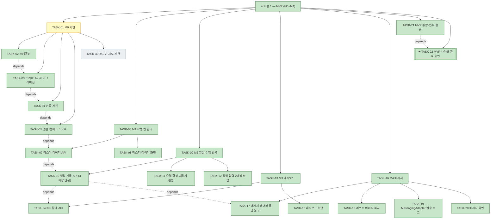
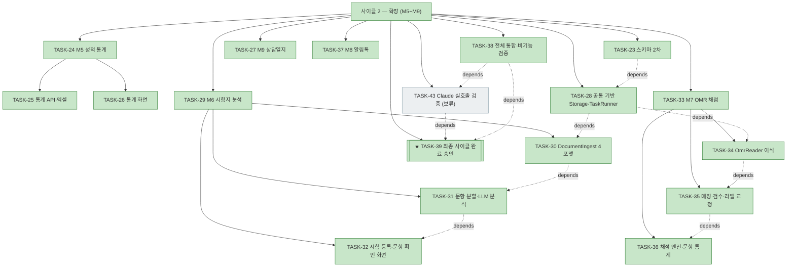

# WORK-20260922-mathdesk-baseline: 작업 기록

> 문서 유형: `work-log`
> 작업 ID: `20260922-mathdesk-baseline`
> 상태: `in-progress`
> 기준선: `v10`
> 작성일: `2026-09-22`
> 최종 갱신: `2026-09-24`
> 관련 문서: [PLAN-mathdesk: 구현 계획](../../plan.md), [REQ-mathdesk: 요구사항](../../requirements.md), [DESIGN-mathdesk: 설계](../../design.md), [결정 등록부](../../decisions.md)

## 요약

- 목적: 기준선 `v1`의 구현 진행 상태, 결정, 검증 결과와 재개 지점을 기록한다.
- 현재 결론 또는 상태: 사이클 1(MVP) 완료(2026-09-22 사용자 승인), **사이클 2 완료(2026-09-24 사용자 승인).** 2026-09-24 세션에서 마스터 데이터 수정(TASK-49~52), M5 성적 통계(TASK-24~26), 공통 기반(TASK-28), M6 시험지 분석(TASK-29~32), M7 OMR 채점(TASK-33~36), M9 상담일지(TASK-27), M8 알림톡(TASK-37, 실발송 미검증), 전체 통합 검증(TASK-38)을 완료했고 **사이클 2가 2026-09-24 13:46 사용자 승인으로 끝났다.** 작업 53건 중 52건, TASK-43만 보류.
- 다음 행동: 계획된 구현 없음. 재개 후보는 [인계](#인계) 참조.

## 문서 연결

| 방향 | 관계 | 대상 문서 | 대상 항목 | 비고 |
|---|---|---|---|---|
| input | implementation | [PLAN-mathdesk: 구현 계획](../../plan.md) | TASK-01~TASK-39 | 이 기록이 수행하는 계획 |
| input | baseline | [REQ-mathdesk: 요구사항](../../requirements.md) | AC-01~AC-27 | 검증 대상 인수 조건 |
| input | baseline | [DESIGN-mathdesk: 설계](../../design.md) | DES-01~DES-22 | 적용 설계 기준선 |
| input | decision | [결정 등록부](../../decisions.md) | ADR-001~ADR-007 | 적용 결정 |

## 기준선과 현재 계획

- 적용 기준선: [REQ-mathdesk](../../requirements.md) `v6`, [DESIGN-mathdesk](../../design.md) `v6` (2026-09-23 재승인)
- 현재 계획: [PLAN-mathdesk](../../plan.md) — 작업 47건, 사이클 1(MVP M0~M4, TASK-01~22 + TASK-40~42) / 사이클 2(확장 M5~M9, TASK-23~39, TASK-43)
- 발생한 DCR: [DCR-001](./DCR-001-테스트-운영-환경-노출.md) (v2), [DCR-002](./DCR-002-M6-LLM-공급자-중립화와-Claude-연결.md) (v3), [DCR-003](./DCR-003-브랜드-자산으로서의-시각-설계.md) (v4), [DCR-004](./DCR-004-웹-테마-선택.md) (v5), [DCR-005](./DCR-005-모바일-지원-범위.md) (v6) — 모두 `approved`

## 현재 상태

- 진행 중인 작업: 없음. 사이클 2 사용자 승인 완료(2026-09-24 13:46)
- 마지막 완료 작업: [TASK-39 최종 사이클 완료 승인](../../plan.md#task-39--최종-사이클-완료-승인) (2026-09-24 13:46)
- 차단 요인: 없음. Anthropic API 키는 [TASK-43](../../plan.md#task-43-claude-실호출-검증)에서만 필요하며 그 앞 구현을 차단하지 않는다. 구 경로(`/api/messages/report.png`)의 Cloudflare 엣지 캐시 퍼지는 사용자가 보류했다(TTL 만료로 자연 해소)

## 계획 트리

<!-- snapshot: 2026-09-22 완료 시점 — 사이클 1(MVP) 서브트리. 재생성하지 않는다. -->

```text
├─ [✓] 사이클 1 — MVP (M0~M4) ....................... completed (23/23) 2026-09-22 20:05
│  ├─ [▶] TASK-01 M0 기반 (분해 5, 4/5)
│  │   ├─ [✓] TASK-02 모노레포 스캐폴딩과 실행 환경 ... 2026-09-22 09:58
│  │   ├─ [✓] TASK-03 스키마 1차·마이그레이션·시드 .... 2026-09-22 10:26
│  │   ├─ [✓] TASK-04 인증과 세션 .................... 2026-09-22 10:53
│  │   ├─ [✓] TASK-05 권한·캠퍼스 스코프 강제 ........ 2026-09-22 11:14
│  │   └─ [✓] TASK-40 로그인 시도 제한 ............... 2026-09-22 14:31
│  ├─ [✓] TASK-06 M1 학생/반 관리 (분해 2, 2/2) ...... 2026-09-22 12:34
│  │   ├─ [✓] TASK-07 마스터 데이터 API .............. 2026-09-22 11:36
│  │   └─ [✓] TASK-08 마스터 데이터 화면 ............. 2026-09-22 12:34
│  ├─ [✓] TASK-09 M2 일일 수업 입력 (분해 3, 3/3) .... 2026-09-22 13:58
│  │   ├─ [✓] TASK-10 일일 기록 API (3 저장 단위) .... 2026-09-22 13:02
│  │   ├─ [✓] TASK-11 출결 확정·재검사 판정 .......... 2026-09-22 13:29
│  │   └─ [✓] TASK-12 일일 입력 2패널 화면 ........... 2026-09-22 13:58
│  ├─ [✓] TASK-13 M3 대시보드 (분해 2, 2/2) .......... 2026-09-22 16:31
│  │   ├─ [✓] TASK-14 KPI 집계 API ................... 2026-09-22 16:02
│  │   └─ [✓] TASK-15 대시보드 화면 .................. 2026-09-22 16:31
│  ├─ [✓] TASK-16 M4 메시지 (분해 4, 4/4) ............ 2026-09-22 19:12
│  │   ├─ [✓] TASK-17 메시지 렌더러와 등급 문구 ...... 2026-09-22 17:03
│  │   ├─ [✓] TASK-18 리포트 이미지와 복사 ........... 2026-09-22 18:05
│  │   ├─ [✓] TASK-19 MessagingAdapter·발송 로그 ..... 2026-09-22 18:41
│  │   └─ [✓] TASK-20 메시지 화면 .................... 2026-09-22 19:12
│  ├─ [✓] TASK-21 MVP 통합·인수 검증 ................. 2026-09-22 19:48
│  └─ [✓] TASK-22 ★ MVP 사이클 완료 승인 ............. 2026-09-22 20:05
```



<!-- snapshot: 2026-09-24 완료 시점 — 사이클 2(확장 M5~M9) 서브트리. 재생성하지 않는다. -->

```text
└─ [✓] 사이클 2 — 확장 (M5~M9) ...................... completed (17/18, TASK-43 보류) 2026-09-24 13:46
   ├─ [✓] TASK-23 스키마 2차 (시험·OMR·상담·파일) .... 2026-09-22 23:53
   ├─ [✓] TASK-24 M5 성적 통계 (분해 2) .............. 2026-09-24 02:05
   │   ├─ [✓] TASK-25 통계 집계 API와 엑셀 내보내기 ... 2026-09-24 01:45
   │   └─ [✓] TASK-26 통계 화면 ...................... 2026-09-24 02:05
   ├─ [✓] TASK-27 M9 상담일지 ........................ 2026-09-24 12:21
   ├─ [✓] TASK-28 공통 기반 — Storage·업로드·TaskRunner  2026-09-24 02:30
   ├─ [✓] TASK-29 M6 시험지 분석 (분해 3) ............ 2026-09-24 04:10
   │   ├─ [✓] TASK-30 DocumentIngest 4포맷 정규화
   │   ├─ [✓] TASK-31 문항 분할·LlmAdapter·분석 ...... 2026-09-24 03:30
   │   └─ [✓] TASK-32 시험 등록·문항 확인 화면 ....... 2026-09-24 04:10
   ├─ [✓] TASK-33 M7 OMR 채점 (분해 3) ............... 2026-09-24 12:11
   │   ├─ [✓] TASK-34 OmrReader 제품 이식 ............ 2026-09-24 10:55
   │   ├─ [✓] TASK-35 학생 매칭·검수·라벨 교정 ....... 2026-09-24 11:54
   │   └─ [✓] TASK-36 채점 엔진과 문항별 통계 ........ 2026-09-24 12:11
   ├─ [✓] TASK-37 M8 카카오 알림톡 ................... 2026-09-24 12:39
   ├─ [✓] TASK-38 전체 통합·비기능 검증 .............. 2026-09-24 12:59
   ├─ [⏸] TASK-43 Claude 실호출 검증 ................. blocked: 사용자 보류(2026-09-24)
   └─ [✓] TASK-39 ★ 최종 사이클 완료 승인 ............ 2026-09-24 13:46
```



## 수행 기록

### 2026-09-22 — 기준선 승인과 계획 수립

- 수행 내용
  - wf-design으로 [요구사항](../../requirements.md)(FR 39·NFR 16·AC 27)과 [설계](../../design.md)(DES 22·테이블 24·REST 계약)를 작성하고 사용자 승인으로 기준선 `v1`을 발행했다.
  - ADR-001~007을 작성하고 `approved`로 전이했다.
  - wf-implement로 [구현 계획](../../plan.md)을 수립했다. 작업 39건을 두 사이클로 분할하고 계획 트리(ASCII + mermaid 2종)와 검증 계획 VER-01~24를 작성했다.
- 변경 파일: `docs/requirements.md`, `docs/design.md`, `docs/decisions.md`, `docs/plan.md`, `docs/work/20260922-mathdesk-baseline/ADR-001~007`, `README.md`, `docs/SPEC-mathdesk-outline.md`
- 발견 사항
  - 저장소에 제품 코드가 없다. `prototype/omr`(판독기·템플릿·합성 테스트)과 `prototype/notice-generator.html`만 존재하며 둘 다 참조 구현이다.
  - `prototype/omr/test_omr.py`의 합성 왜곡 테스트가 AC-24의 검증 방법과 그대로 대응하므로 TASK-34에서 제품 테스트로 이식하기로 계획했다.
- 결정과 이유
  - 포트폴리오(`docs/status.md`) 계층을 두지 않고 단일 작업 ID의 `plan.md` 하나로 관리한다. 기준선이 작업 ID를 하나만 발행했고, 사이클 축약 규칙으로 문서 비대화를 처리할 수 있다.
  - 사이클 2 작업(TASK-23~39)은 목표·의존성·완료 조건까지만 확정하고 변경 대상 파일 수준의 상세는 사이클 1 완료 시점에 구체화한다. 지금 상세화하면 사이클 1 결과에 따라 낡는다.
  - 릴리스 관문 TASK-22·TASK-39를 별도 작업으로 두었다. push는 설계 승인으로 대체되지 않는 외부·비가역 작업이다.
- 실행한 검증
  - 문서 링크·앵커 전수 검사(로컬 링크 전부 해석 성공), 식별자 중복 검사(FR 39 / NFR 16 / AC 27 / DES 22 / Q 11 / RISK 10, 중복 0).
  - 코드 검증은 없음 — 구현 미착수.
- 결과: 계획 수립 완료. 구현 미착수.

### 2026-09-22 — TASK-02 모노레포 스캐폴딩과 실행 환경

- 수행 내용
  - TDD Red: `apps/api/tests/test_health.py`에 `GET /api/health` → 200 `{"status":"ok"}`를 기대하는 통합 테스트를 먼저 작성하고 실행해 `ModuleNotFoundError: No module named 'mathdesk.main'`로 의도한 실패를 확인했다.
  - Green: `apps/api/src/mathdesk/main.py`에 FastAPI 앱과 헬스 엔드포인트만 구현했다.
  - `apps/web`에 React 19 + Vite + TypeScript 최소 SPA를 손으로 구성했다(API 상태 표시 1화면).
  - `compose.yaml`과 api·web Dockerfile로 api + web + postgres 3개 서비스를 구성했다.
- 변경 파일: `apps/api/{pyproject.toml,uv.lock,Dockerfile,.dockerignore,src/mathdesk/{__init__,main}.py,tests/test_health.py}`, `apps/web/{package.json,package-lock.json,tsconfig.json,vite.config.ts,index.html,Dockerfile,.dockerignore,src/{main,App}.tsx}`, `compose.yaml`, `README.md`, `.gitignore`
- 발견 사항
  - 호스트의 8000 포트를 다른 Docker 컨테이너가 이미 점유하고 있어 api 컨테이너 기동이 실패했다. 호스트 포트를 `API_PORT`(기본 8080)·`WEB_PORT`(기본 5173) 환경변수로 노출해 해소했다.
  - Vite 설정에서 `process.env`를 쓰려면 `@types/node`가 필요해 devDependency 1건을 추가했다.
  - 시스템 Python이 3.9라 `uv`로 3.12 가상환경을 만들어 사용한다. 저장소는 `uv.lock`으로 버전을 고정한다.
- 결정과 이유
  - Vite 공식 템플릿 생성기 대신 최소 파일만 손으로 작성했다. 템플릿은 로고·데모 카운터·린트 설정 등 기준선이 요구하지 않는 보일러플레이트를 포함한다(결정 사다리 1단계).
  - 이 작업에서는 DB 연결 설정(`DATABASE_URL`)을 추가하지 않았다. 사용처가 TASK-03에서 처음 생기므로 지금 넣으면 미사용 설정이 된다. postgres 서비스 자체는 완료 조건이 요구하므로 포함했다.
  - 라우팅(React Router)과 서버 상태(TanStack Query)는 화면이 생기는 TASK-08부터 도입한다.
  - `POSTGRES_PASSWORD`는 로컬 기동성을 위해 기본값을 두되 5432를 호스트에 게시하지 않고 README에 `.env` 재정의를 안내했다.
- 실행한 검증
  - `uv run pytest -q` — 최초 실행 `1 error`(의도한 Red, 모듈 없음) → 구현 후 `1 passed`.
  - `npm run build` — `tsc -b && vite build` 성공(28 modules, dist 생성). 최초 실행은 `process` 타입 누락으로 실패 후 `@types/node` 추가로 통과.
  - `docker compose up -d --build` → `docker compose ps`에서 api·postgres·web 3개 `running`.
  - `curl http://localhost:8080/api/health` → `{"status":"ok"}`, `curl http://localhost:5173/api/health`(웹 개발 서버 프록시 경유) → `{"status":"ok"}`.
- 결과: TASK-02 완료. 완료 조건(3개 컨테이너 기동 + API 테스트 1회 성공 + 웹 빌드 1회 성공) 전항 충족.

### 2026-09-22 — TASK-03 스키마 1차·마이그레이션·시드

- 수행 내용
  - TDD Red: `tests/test_migrations.py`에 빈 DB → `upgrade head` → 16개 테이블 존재 확인 → `downgrade base` → 테이블 소거를 검증하는 테스트를 먼저 작성해 `No 'script_location' key found`로 의도한 실패를 확인했다.
  - Green: SQLAlchemy 2.0 선언형 모델 16개(`models/{base,masterdata,daily,messaging,system}.py`)와 alembic 비동기 환경(`migrations/env.py`)을 만들고 초기 리비전 `5b67d2c537eb`을 autogenerate했다.
  - TDD Red → Green: 시드 스크립트 테스트(반 4 · 학생 47 · 수강 47 · 수험번호 누락 0)를 먼저 작성하고 `src/mathdesk/seed.py`를 구현했다.
  - `compose.yaml`에 postgres 호스트 포트 게시(`POSTGRES_PORT`, 기본 55432)와 api의 `DATABASE_URL`을 추가했다.
- 변경 파일: `apps/api/{alembic.ini,migrations/,src/mathdesk/models/,src/mathdesk/seed.py,tests/{conftest,test_migrations,test_seed}.py,pyproject.toml,uv.lock}`, `compose.yaml`, `README.md`
- 발견 사항
  - SQLAlchemy 비동기 엔진이 `greenlet`을 요구해 의존성 1건을 추가했다.
  - 호스트 5432는 로컬 postgres가 점유 중이라 컨테이너 postgres를 55432로 게시했다.
- 결정과 이유
  - 열거값은 네이티브 Postgres enum 대신 `native_enum=False`(VARCHAR + CHECK)로 만들었다. 네이티브 enum은 downgrade에서 타입 삭제가 따로 필요해 왕복 마이그레이션이 복잡해진다.
  - `MetaData`에 명명 규칙을 두어 제약·인덱스 이름을 결정적으로 만들었다. 이름 없는 제약은 downgrade에서 삭제 대상을 특정하기 어렵다.
  - 테스트 DB를 `mathdesk_test`로 분리하고 픽스처가 매번 다시 만든다. 개발 DB에 직접 `downgrade base`를 걸면 시드 데이터가 사라진다.
  - 시드의 원장 계정 `password_hash`는 로그인 불가 표시 `!`로 두었다. 실제 해시는 TASK-04에서 설정하며, 지금 임시 비밀번호를 심으면 약한 자격 증명이 저장소에 남는다.
  - `db.py`(엔진·세션 팩토리) 도입을 미뤘다. 현재 사용처는 시드 하나뿐이며 앱 배선이 생기는 TASK-04에서 만든다.
  - 시드는 이미 캠퍼스가 있으면 예외로 중단한다. 재실행 시 학생이 94명으로 불어나는 사고를 막는다.
- 실행한 검증
  - `uv run pytest -q` — 마이그레이션 테스트 최초 `1 failed`(의도한 Red), 시드 테스트 최초 `ModuleNotFoundError`(의도한 Red) → 구현 후 전체 `3 passed`.
  - 개발 DB에 `alembic upgrade head` + `python -m mathdesk.seed` 실행 → class 4 / student 47 / enrollment 47 / guardian 47, 수험번호 `10000100`~`10004700`(자리별 범위 준수).
  - `docker compose ps` — postgres가 55432로 게시된 상태로 재기동 확인.
- 결과: TASK-03 완료. 완료 조건(왕복 마이그레이션 통과, 시드로 반 4개·학생 47명 투입) 전항 충족. VER-23(NFR-09)의 마이그레이션 왕복 근거가 확보되었다.

### 2026-09-22 — TASK-04 인증과 세션

- 수행 내용
  - TDD Red: `tests/test_auth.py`에 AC-01 흐름(로그인 → `/me` → 로그아웃 → `/me` 401), 오답 거부, 평문 미저장·미노출, 쿠키 속성 4개 테스트를 먼저 작성해 `ModuleNotFoundError: mathdesk.security`로 의도한 실패를 확인했다.
  - Green: `security.py`(Argon2id), `db.py`(엔진·세션 의존성), `models/auth.py`(`user_session`), `auth.py`(로그인·로그아웃·`/me`·`current_user` 의존성·초기 원장 계정), `main.py` lifespan 배선을 구현했다.
  - 웹에 로그인 화면(`LoginForm.tsx`)과 인증 상태 분기(`App.tsx`), API 클라이언트(`api.ts`)를 추가했다.
  - alembic 리비전 `977a7bf03a58`(user_session)을 추가했다.
- 변경 파일: `apps/api/src/mathdesk/{security,db,auth,main}.py`, `apps/api/src/mathdesk/models/{auth.py,__init__.py}`, `apps/api/migrations/versions/977a7bf03a58_user_session.py`, `apps/api/tests/{conftest,test_auth,test_migrations}.py`, `apps/web/src/{api.ts,LoginForm.tsx,App.tsx}`, `compose.yaml`, `README.md`
- 발견 사항
  - 시드가 만든 원장 계정의 `password_hash`가 `!`(사용 불가)였고, 초기 계정 준비 로직이 이를 실제 해시로 교체해 로그인이 가능해졌다. 이미 사용 중인 비밀번호는 덮어쓰지 않는다.
- 결정과 이유
  - 세션 토큰은 SHA-256 해시로만 저장한다. DB 덤프가 곧 세션 탈취가 되지 않도록.
  - 계정이 없거나 비밀번호가 미설정이어도 더미 해시로 동일한 검증 비용을 치른다. 응답 시간으로 계정 존재를 알아내는 것을 막는다.
  - 초기 원장 계정 환경변수는 compose에 기본값을 두지 않았다. 기본 비밀번호를 저장소에 남기지 않기 위해서다. 비우면 계정을 만들지 않는다.
  - React Router·TanStack Query는 아직 도입하지 않았다. 화면이 2개(로그인·빈 대시보드)뿐이라 필요가 없다. TASK-08에서 도입한다.
- 실행한 검증
  - `uv run pytest -q` — 인증 테스트 최초 `ModuleNotFoundError`(의도한 Red) → 구현 후 전체 `7 passed`.
  - `npm run build` 성공.
  - 실행 스택 e2e(`curl`): 비로그인 `/api/auth/me` 401 → 오답 로그인 401 → 정상 로그인 200(쿠키 `HttpOnly`) → `/me` 200 → 로그아웃 204 → `/me` 401.
- 결과: TASK-04 완료. AC-01(VER-01) 통과, 완료 조건(평문 미저장 확인 포함) 충족.

### 2026-09-22 — TASK-05 권한·캠퍼스 스코프 강제

- 수행 내용
  - TDD Red: `tests/test_scope.py`에 엔드포인트 순회 회귀 테스트, 캠퍼스 목록 필터링(AC-03), 타 캠퍼스 헤더 거부(AC-03), 강사의 사용자 관리 거부(AC-02 역할 부분), 원장의 사용자 생성·조회를 먼저 작성해 `ModuleNotFoundError: mathdesk.scope`로 의도한 실패를 확인했다.
  - Green: `scope.py`(`Scope`·`current_scope`·`ScopedRepository`)와 `users.py`(캠퍼스 목록, 사용자 CRUD)를 구현하고 `main.py`에 배선했다.
  - `ScopedRepository`의 캠퍼스 필터를 검증하는 테스트를 추가하고, 필터를 제거하는 변이를 넣어 테스트가 실제로 실패하는지 확인했다(제거 시 `1 failed`, 복원 시 통과).
- 변경 파일: `apps/api/src/mathdesk/{scope,users,main}.py`, `apps/api/tests/{conftest,test_scope}.py`
- 발견 사항
  - 엔드포인트 순회 테스트는 FastAPI의 `route.dependant`를 재귀 탐색해 `current_scope` 의존 여부를 판정한다. 인증·헬스 4개 경로만 예외 목록으로 두었으므로, 이후 스코프를 빠뜨린 엔드포인트가 추가되면 즉시 실패한다([RISK-08](../../design.md#위험) 완화).
- 결정과 이유
  - 권한 없음은 404가 아니라 403으로 통일했다(설계 REST 계약). 자원 존재 여부를 응답으로 알아낼 수 없게 하기 위해서다.
  - `X-Campus-Id`를 생략하면 접근 가능한 첫 캠퍼스를 사용한다. Phase A 단일 캠퍼스에서 헤더를 매 요청에 붙이지 않아도 되게 하되, 지정한 캠퍼스가 접근 불가면 403이다.
  - `ScopedRepository`는 현재 엔드포인트에서 쓰이지 않지만 유지했다. 계획이 요구하는 산출물이고, 변이 테스트로 실효성을 확인했으며 TASK-07에서 바로 사용한다.
  - 사용자 목록·수정은 현재 캠퍼스에 속한 사용자로 제한한다. 다른 캠퍼스 사용자 조회·수정 시도는 403이다.
- 실행한 검증
  - `uv run pytest -q` — 스코프 테스트 최초 `ModuleNotFoundError`(의도한 Red) → 구현 후 전체 `13 passed`.
  - 변이 테스트: `ScopedRepository.select`의 캠퍼스 필터 제거 → `1 failed`, 복원 → `13 passed`.
  - 실행 스택 e2e(`curl`): 로그인 후 `/api/campuses` → 접근 가능한 1개만 반환, `/api/users` → 캠퍼스 내 사용자만, `X-Campus-Id: 999` → 403.
- 결과: TASK-05 완료. AC-03(VER-02 일부) 통과, AC-02는 역할 기반 거부만 통과. 반 소유권 기반 거부는 학생 기록 API가 생기는 TASK-07·TASK-10에서 재검증한다.

### 2026-09-22 — TASK-07 마스터 데이터 API

- 수행 내용
  - TDD Red: `tests/test_masterdata.py`에 수험번호 자리별 범위(AC-04) 파라미터 테스트, 학생 생성·목록, 범위 위반 422, 중복 409, 수강 등록의 날짜 기준 소속 판정, 강사의 비담당 반 접근 403, 강사의 담당 반·소속 학생 조회를 먼저 작성해 `ModuleNotFoundError: mathdesk.masterdata`로 의도한 실패를 확인했다.
  - Green: `masterdata.py`에 `validate_omr_number`와 학생·보호자·반·시간표·수강 등록 엔드포인트를 구현하고 `main.py`에 배선했다.
- 변경 파일: `apps/api/src/mathdesk/{masterdata,main}.py`, `apps/api/tests/test_masterdata.py`
- 발견 사항
  - 엔드포인트를 11개 추가했는데 [TASK-05](../../plan.md#task-05-권한캠퍼스-스코프-강제)의 순회 회귀 테스트가 그대로 통과했다. 스코프 누락 없이 추가되었다는 자동 근거다.
- 결정과 이유
  - 시간표를 별도 엔드포인트로 두지 않고 반 생성·수정 페이로드에 포함했다. 설계의 REST 계약에 시간표 엔드포인트가 없고, 반과 분리해 관리할 요구가 없다.
  - 강사 가시성은 쿼리 자체에 반영했다. 반은 `teacher_id`로, 학생은 담당 반의 수강 등록으로 좁힌다. 조회 후 필터링하면 누락 시 노출로 이어진다.
  - 수험번호 중복 검사는 캠퍼스 범위로 한정했다(스키마의 `uq_student_campus_id_omr_number`와 일치). DB 제약과 API 검사를 모두 두어 409를 사용자 메시지로 돌려준다.
  - 수강 등록 조회에 `on=<date>` 파라미터를 두어 특정 날짜의 소속을 재현한다(FR-08).
- 실행한 검증
  - `uv run pytest -q` — 마스터 데이터 테스트 최초 `ModuleNotFoundError`(의도한 Red) → 구현 후 전체 `26 passed`.
  - 시드된 개발 DB e2e(`curl`): 학생 47명, 반 4개(각 시간표 1건), 범위 위반 수험번호 `18600001` → 422, `2026-04-01` 기준 1반 수강생 8명.
- 결과: TASK-07 완료. AC-04(VER-03) 통과, 완료 조건의 날짜 기준 소속 조회 통과. AC-02의 반 소유권 차원이 이 작업에서 검증되었고, 일일 학생 기록 API 대상 검증은 TASK-10에 남는다.

### 2026-09-22 — TASK-08 마스터 데이터 화면 (TASK-06 완료)

- 수행 내용
  - 웹 테스트 하네스를 붙였다(vitest + jsdom + Testing Library, `npm test`).
  - TDD Red: `StudentsPage.test.tsx`에 목록 렌더와 "수험번호 범위 위반 시 서버 메시지 표시"를 먼저 작성해 `Failed to resolve import "./StudentsPage"`로 의도한 실패를 확인했다.
  - Green: `api.ts`를 서버 오류 메시지를 예외로 전달하는 클라이언트로 확장하고 `StudentsPage`·`ClassesPage`를 구현했다. React Router와 TanStack Query를 이 시점에 도입했다.
  - AC-05 렌더 테스트(`Roster.test.tsx`)와 시간표 문자열 포맷 테스트를 추가했다.
- 변경 파일: `apps/web/{package.json,package-lock.json,vite.config.ts,tsconfig.json}`, `apps/web/src/{api.ts,App.tsx,main.tsx}`, `apps/web/src/pages/{StudentsPage,ClassesPage}.tsx`, `apps/web/src/pages/*.test.tsx`, `apps/web/src/test/setup.ts`
- 발견 사항
  - `vite.config.ts`에 `test` 블록을 두려면 `defineConfig`를 `vitest/config`에서 가져와야 한다. `vite`에서 가져오면 타입 오류로 빌드가 실패한다.
- 결정과 이유
  - 서버의 `detail` 문구를 그대로 화면에 표시한다. 수험번호 자리별 범위 같은 규칙을 클라이언트에 복제하면 서버와 어긋날 수 있고, 서버 메시지가 이미 사용자용 한국어다.
  - 학생과 반 화면을 한 라우트(`/students`)에 함께 두었다. 참조 화면의 메뉴가 "학생/반 관리" 하나이고, 지금 분리할 이유가 없다.
  - AC-05는 47명·4반 응답을 주입한 렌더 테스트로 검증했다. 실제 브라우저 육안 확인은 계획의 자동화 제외 항목으로 남긴다.
- 실행한 검증
  - `npm test` — 컴포넌트 테스트 최초 import 실패(의도한 Red) → 구현 후 `3 files, 5 tests passed`.
  - `npm run build` — `defineConfig` 출처 수정 후 성공.
  - `uv run pytest -q` — `26 passed` (회귀 없음).
  - 실행 스택: `http://localhost:5173/students` 200, 개발 서버 프록시 경유 `/api/students`가 시드 47명 반환.
- 결과: TASK-08 완료, 이로써 TASK-06(M1 학생/반 관리)도 완료. AC-05(VER-04) 통과.

### 2026-09-22 — TASK-10 일일 기록 API (3 저장 단위)

- 수행 내용
  - TDD Red: `tests/test_daily.py`에 수업일 기준 수강생 목록, 저장 단위 독립(AC-11), 재검사 즉시 저장, 반 평균(AC-12), 등원 집계, 강사의 타 반 접근 거부를 먼저 작성해 `6 failed`로 의도한 실패를 확인했다.
  - Green: `daily.py`에 `GET /api/daily`와 메모·표 일괄·재검사 3개 저장 엔드포인트를 구현했다.
- 변경 파일: `apps/api/src/mathdesk/{daily,main}.py`, `apps/api/tests/test_daily.py`
- 결정과 이유
  - 세 저장 엔드포인트 모두 `model_dump(exclude_unset=True)`로 **보낸 필드만** 갱신한다. 이것이 AC-11(저장 단위 독립)을 만족시키는 핵심이다. 전체 객체를 덮어쓰면 다른 단위의 값이 사라진다.
  - 수업 세션은 `GET /api/daily`에서 없으면 만든다. 설계 REST 계약에 세션 생성 엔드포인트가 없고 [DES-05](../../design.md#des-05-상세)가 "첫 입력 시 생성"이라 조회 시점이 유일한 생성 지점이다. 생성되는 행은 `class_id`+`session_date`뿐이라 비용이 낮다.
  - 학생 목록은 수업일 기준 수강 등록으로 정한다([TASK-07](../../plan.md#task-07-마스터-데이터-api)의 `on=<date>` 판정과 같은 규칙). 과거 수업일을 열어도 그날의 명단이 재현된다.
  - 표 일괄 저장은 그날 수강 등록이 없는 학생 ID를 403으로 거부한다. 다른 반 학생 ID를 섞어 보내는 경로를 막는다.
  - 등원 인원은 `출석+지각+조퇴`로 계산한다(FR-09).
- 실행한 검증
  - `uv run pytest -q` — 일일 기록 테스트 최초 `6 failed`(의도한 Red) → 구현 후 전체 `32 passed`.
  - 시드 DB e2e(`curl`): 세션 생성 → 진도·과제·시험명 메모 저장 → 학생 3명 점수 78·72·65와 출결 저장 → 재조회에서 진도·과제 보존, `{'enrolled': 8, 'attending': 2, 'test_average': 71.7, 'test_count': 3}`.
- 결과: TASK-10 완료. AC-11(VER-08)·AC-12(VER-09) 통과. AC-02의 일일 기록 API 대상 검증도 이 작업에서 통과했다(강사의 타 반 `GET`·`PUT` 모두 403).

### 2026-09-22 — TASK-11 출결 확정·재검사 판정

- 수행 내용
  - TDD Red: `tests/test_attendance.py`에 출결 토글 해제(AC-06), 확정 후 잠금과 해제, 잠금 중 등급 수정 허용, 확정·해제 감사 기록, 직전 수업 등급 기반 재검사 판정(AC-09), 재검사 즉시 저장(AC-10)을 먼저 작성해 `4 failed`로 의도한 실패를 확인했다.
  - Green: `daily.py`에 `attendance/confirm`·`attendance/unlock` 엔드포인트, 잠금 중 출결 필드 409 거부, 직전 세션 등급 조회와 재검사 판정을 구현했다.
  - `klass` 픽스처를 `conftest.py`로 옮겨 일일 기록·출결 테스트가 공유하게 했다.
- 변경 파일: `apps/api/src/mathdesk/daily.py`, `apps/api/tests/{conftest,test_daily,test_attendance}.py`
- 결정과 이유
  - 재검사 대상은 저장하지 않고 조회할 때마다 계산한다. 기준 등급이 설정값이라 저장하면 설정 변경 즉시 낡는다([FR-12 상세](../../requirements.md#fr-12-상세)).
  - 기준 등급은 환경변수 `MATHDESK_RECHECK_THRESHOLD_GRADE`(기본 `B`)로 노출했다. 설정값 요구를 만족하면서 새 테이블을 만들지 않는 가장 작은 방법이다.
  - 잠금은 출결 필드(`attendance_status`·`attendance_reason`)에만 적용한다. 설계가 "학생 출결 필드 변경 요청은 409"라고 한정했고, 과제 등급·점수는 출결 확정과 무관하게 계속 입력한다.
  - `RecordOut.recheck_result`(평면)를 설계 예시의 `recheck` 중첩 객체(`target`·`prev_grade`·`prev_date`·`result`)로 바꿨다. TASK-10에서 평면으로 낸 것이 설계와 어긋났고, 화면(TASK-12)이 판단 근거를 함께 표시해야 한다.
  - 확정·해제는 `audit_log`에 `attendance.confirm`·`attendance.unlock`으로 남긴다(FR-09 상세의 "확정·해제 시각과 수행자").
- 실행한 검증
  - `uv run pytest -q` — 출결 테스트 최초 `4 failed`(의도한 Red) → 구현 후 전체 `38 passed`.
  - 시드 DB e2e(`curl`): 직전 수업 등급 B/A → 재검사 판정 `{target: true, prev_grade: 'B', prev_date: '2026-09-16'}` / `{target: false}`, 확정 200 → 출결 변경 409 → 과제 등급 변경 200 → 해제 200 → 출결 변경 200.
- 결과: TASK-11 완료. AC-06(VER-05 일부)·AC-09·AC-10 통과.

### 2026-09-22 — TASK-12 일일 입력 2패널 화면 (TASK-09 완료)

- 수행 내용
  - TDD Red: `DailyPage.test.tsx`에 "메모 편집 중 표 저장 시 메모 유지"(AC-11 UI), 등원 현황 표시(AC-07 UI), 출결 토글 해제(AC-06 UI), 재검사 즉시 저장 호출 경로를 먼저 작성해 import 실패로 의도한 실패를 확인했다.
  - Green: `api.ts`에 일일 기록 클라이언트를 추가하고 `DailyPage.tsx`(좌측 명단 그리드 + 우측 진도·과제·영상·첨언 패널)를 구현한 뒤 `/daily` 라우트에 연결했다.
- 변경 파일: `apps/web/src/api.ts`, `apps/web/src/pages/DailyPage.tsx`, `apps/web/src/pages/DailyPage.test.tsx`, `apps/web/src/App.tsx`
- 발견 사항
  - 등원 현황을 `등원 현황 {a} / {b}명 ...` 한 문단에 쓰면 React가 텍스트 노드를 쪼개 `4 / 13명`으로 조회되지 않는다. KPI 값을 자체 요소로 분리해 해결했다(마크업상으로도 이쪽이 맞다).
- 결정과 이유
  - 표 편집과 메모 편집을 **별도 상태**(`drafts`, `notes`)로 두고, 초기화는 반·날짜가 바뀔 때만 한다. 서버 응답이 올 때마다 메모 상태를 다시 세우면 표 저장 직후 미저장 메모가 사라진다 — AC-11이 UI에서 깨지는 지점이 정확히 여기다.
  - 재검사 합/불은 `drafts`를 거치지 않고 즉시 뮤테이션을 호출한다(FR-14의 즉시 저장 단위).
  - 출결 확정 중에는 출결 버튼·사유만 비활성화하고 등급·점수 입력은 열어 둔다(TASK-11의 서버 규칙과 일치).
  - 미저장 입력이 있는 상태에서 반·날짜를 바꾸면 확인을 받는다(FR-14 상세).
- 실행한 검증
  - `npm test` — 최초 import 실패(의도한 Red) → 구현 후 `4 files, 9 tests passed`.
  - `npm run build` 성공, `uv run pytest -q` `38 passed`(백엔드 회귀 없음).
  - 실행 스택: `http://localhost:5173/daily` 200.
- 결과: TASK-12 완료, 이로써 TASK-09(M2 일일 수업 입력)도 완료. AC-07·AC-08의 화면 측면과 AC-11의 UI 측면이 통과했다. 실제 브라우저 육안 확인은 자동화 제외 항목으로 남는다.

### 2026-09-22 — TASK-40·41 그리고 TASK-42(부분): 테스트 운영 노출

- 수행 내용
  - TASK-40 TDD Red: `tests/test_login_lockout.py`에 잠금 중 올바른 비밀번호 거부, 잠금 만료 후 허용, 성공 시 카운트 초기화를 먼저 작성해 `2 failed`로 의도한 실패를 확인했다. Green: `app_user`에 `failed_login_count`·`locked_until`을 추가(리비전 `9c040c3bb194`)하고 잠금 로직과 `auth.lockout` 감사 기록을 구현했다.
  - TASK-41 TDD Red: `tests/test_serving.py`에 SPA fallback이 `/api/*`를 가로채지 않음, 클라이언트 라우트에 `index.html` 반환, `Secure` 쿠키 설정을 먼저 작성해 import 실패로 확인했다. Green: `main.py`를 `create_app(web_dist=…)` 형태로 바꾸고 정적 서빙과 `MATHDESK_COOKIE_SECURE`를 구현했다. `Dockerfile.testops`(웹 빌드 → API 이미지)와 `compose.testops.yaml`(별도 프로젝트, 호스트 포트 게시 없음)을 추가했다.
  - TASK-42: 전용 터널 `mathdesk`(`4724c8d8-…`) 생성, DNS 라우트, `cloudflared` compose 서비스 추가, 공개 도메인 검증. `ops/README.md`에 기동·재생성·롤백 절차를 남겼다.
- 변경 파일: `apps/api/src/mathdesk/{auth,main,seed}.py`, `apps/api/src/mathdesk/models/masterdata.py`, `apps/api/migrations/versions/9c040c3bb194_…`, `apps/api/tests/{conftest,test_login_lockout,test_serving,test_seed}.py`, `Dockerfile.testops`, `compose.testops.yaml`, `.env.example`, `.gitignore`, `ops/`
- 발견 사항
  - **시드가 초기 원장 계정과 충돌했다.** 테스트 운영 기동 시 환경변수로 `director`가 먼저 생성되는데 시드가 같은 `login_id`를 다시 만들어 `UniqueViolationError`가 났다. 재현 테스트를 먼저 추가한 뒤 기존 계정을 재사용하도록 고쳤다.
  - **`cloudflared tunnel route dns`가 엉뚱한 터널로 라우팅했다.** `~/.cloudflared/config.yml`의 `tunnel:` 값이 인자를 덮어써 `mathdesk.yongs-wiki.com`이 `homewiki` 터널에 연결됐다. 빈 설정을 `--config`로 지정하고 `--overwrite-dns`로 재라우팅해 바로잡았다. 이 함정을 `ops/README.md`에 남겼다.
  - `Secure` 쿠키 때문에 컨테이너 내부 HTTP 호출로는 인증 흐름을 검증할 수 없다(쿠키가 재전송되지 않음). 의도된 동작이며 검증은 HTTPS 경로에서 수행했다.
  - Docker Desktop `AutoStart`가 꺼져 있어 재부팅 후 자동 기동이 성립하지 않는다.
- 결정과 이유
  - cloudflared를 launchd 대신 **compose 서비스**로 운용했다. 컨테이너 네트워크로 `app:8000`에 직접 닿으므로 호스트 포트를 하나도 게시하지 않아 NFR-17을 문자 그대로 만족한다. 계획의 `변경 대상`도 이에 맞춰 수정했다.
  - 테스트 운영을 별도 compose 프로젝트로 분리했다. 개발 스택과 DB·볼륨·수명주기가 섞이지 않는다.
  - 마이그레이션은 컨테이너 기동 시 `alembic upgrade head`로 적용한다. 단일 노드 테스트 운영에서 별도 배포 단계를 두지 않는 가장 단순한 방법이다.
  - 잠금 임계·시간은 호출 시점에 환경변수를 읽는다. 모듈 로드 시 고정하면 설정 변경과 테스트가 반영되지 않는다.
- 실행한 검증
  - `uv run pytest -q` — 잠금 테스트 최초 `2 failed`, 서빙 테스트 최초 import 실패, 시드 회귀 테스트 최초 `1 failed`(모두 의도한 Red) → 구현 후 전체 `46 passed`.
  - 테스트 운영 스택: `docker compose -f compose.testops.yaml ps`에서 3개 서비스 `running`, 호스트 게시 포트 0개(`Publishers`의 PublishedPort 모두 0) → VER-27 충족.
  - 공개 도메인(VER-25/AC-28): `/` 200, `/api/health` `{"status":"ok"}`, 비로그인 `/api/auth/me` 401, 로그인 200 + `Set-Cookie … HttpOnly … SameSite=lax; Secure`, 인증 후 학생 47명, 로그아웃 204 → `/me` 401, SPA 딥링크 `/daily` 200.
  - 기존 서비스 영향 없음: `https://yongs-wiki.com/` 200.
  - VER-26(AC-29)는 잠금 테스트 3건으로 충족.
- 결과: TASK-40·TASK-41 완료. TASK-42는 노출과 검증이 끝났으나 **재부팅 자동 기동 조건이 미충족**이라 `in-progress`로 남긴다.

### 2026-09-22 — TASK-42 자동 기동과 환경 분리

- 수행 내용
  - 사용자 지시로 Docker Desktop `AutoStart`를 켰다(설정 파일 직접 수정, 백업 `/tmp/docker-settings-backup.json`).
  - `restart: unless-stopped`만으로는 복구되지 않는 것을 실측하고 launchd 에이전트(`ops/com.mathdesk.testops.plist` + `ops/start-testops.sh`)를 추가했다. 엔진이 준비될 때까지 최대 5분 대기 후 `compose up -d`를 실행한다.
  - 사용자 지시로 초기 원장 비밀번호를 `director`로 교체했다(DB 해시 직접 교체, `.env` 동기화).
- 변경 파일: `ops/{start-testops.sh,com.mathdesk.testops.plist,README.md}`, `compose.yaml`, `docs/plan.md`
- 발견 사항
  - **`restart: unless-stopped`가 이 환경에서 동작하지 않는다.** Docker Desktop을 재시작하면 정책이 있어도 컨테이너가 복구되지 않았다(`docker desktop restart` 후 `docker ps` 비어 있음). launchd 보완이 필수다.
  - **저장소 루트 `.env`가 개발 스택까지 오염시켰다.** 테스트 운영용으로 만든 `POSTGRES_PASSWORD`를 개발 `compose.yaml`이 `${POSTGRES_PASSWORD:-mathdesk}`로 읽어, 기존 볼륨의 비밀번호와 어긋나 개발 API가 `InvalidPasswordError`로 기동 실패했다. 개발 compose의 DB 비밀번호를 고정값으로 바꿔 결합을 끊었다.
  - Docker Desktop 재시작 과정에서 다른 프로젝트 컨테이너(`herongs-backend`)도 함께 내려갔다. 확인 후 복구했다.
- 결정과 이유
  - 자동 기동을 launchd로 처리했다. compose 재시작 정책이 실제로 동작하지 않는 것을 확인했고, 기존 home-wiki 운영도 같은 방식이라 일관된다.
  - 개발 compose는 비밀번호를 변수로 받지 않는다. 로컬 전용 스택이 노출 환경의 비밀 설정에 결합될 이유가 없다.
  - 자격 증명 `director`/`director`는 사용자 지시에 따른 **의도된 선택**이다. 배포 이관 단계에서 교체하기로 합의했고 현재는 합성 데이터만 보관한다.
- 실행한 검증
  - launchd 에이전트: 스택을 `stop`한 뒤 `launchctl kickstart`로 3개 서비스가 모두 `running`으로 복구되고 공개 도메인 `/api/health` 200.
  - 개발 스택 복구: `docker compose ps` 3개 `running`, `http://localhost:8080/api/health` 200.
  - 비밀번호 교체: 공개 도메인에서 새 비밀번호 200, 이전 비밀번호 401, 인증 후 학생 47명.
  - 다른 서비스 무영향: `https://yongs-wiki.com/` 200, `herongs-backend` 복구 확인.
- 결과: TASK-42 완료. 실제 재부팅 검증은 수행하지 않았다(사용자 장비 재부팅을 임의로 하지 않음). 에이전트 동작은 kickstart로 대체 검증했다.

### 2026-09-22 — TASK-14 대시보드 KPI 집계 API

- 수행 내용
  - TDD Red: `tests/test_dashboard.py`에 캠퍼스 집계, 등원 현황(AC-07), 금주 완수율과 전주 대비(AC-13), 재검사 대상 인원, 주간 테스트 N·MAX·MIN, 표본 없음 처리, 지난 수업 요약을 먼저 작성해 `7 failed`로 의도한 실패를 확인했다.
  - Green: `stats.py`에 `GET /api/dashboard`를 구현하고 `main.py`에 배선했다.
- 변경 파일: `apps/api/src/mathdesk/{stats,main}.py`, `apps/api/tests/test_dashboard.py`
- 발견 사항
  - 개발 스택 DB에 `9c040c3bb194`(로그인 잠금 컬럼) 리비전이 적용되지 않아 개발 API가 기동 실패했다. 테스트 운영 이미지는 기동 시 `alembic upgrade head`를 돌리지만 개발용 이미지는 돌리지 않는다. 수동 적용으로 해소했고 README에 절차가 이미 있다.
- 결정과 이유
  - 주간 범위는 월요일 시작으로 계산한다(`date - weekday()` ~ +6일).
  - 완수 기준 등급은 `MATHDESK_HOMEWORK_PASS_GRADE`(기본 `B`)로 노출했다. [Q-07](../../requirements.md#가정과-미해결-질문)이 설정값을 전제한다.
  - **미제출은 등급 `F`로 해석했다.** 요구사항은 "미제출 건수"만 말하고 데이터 모델에 별도 필드가 없다. 6단계 등급의 최하위인 `F`를 미제출로 보는 것이 가장 자연스럽다. 2026-09-22 사용자 승인으로 확정되어 [FR-15 상세](../../requirements.md#fr-15-상세)에 명확화로 반영했다.
  - 재검사 대상 인원은 금주 각 세션에 대해 조회 시 계산을 반복하고 학생 단위로 중복을 제거한다. 저장하지 않는 원칙([TASK-11](../../plan.md#task-11-출결-확정재검사-판정))을 유지했다.
  - 표본이 없으면 0이 아니라 `null`을 반환한다(FR-15 상세의 `—` 표기).
  - 지난 수업 요약(FR-17)을 같은 응답에 담았다. 화면 하나가 쓰는 데이터를 한 번에 주는 편이 왕복을 줄인다.
- 실행한 검증
  - `uv run pytest -q` — 대시보드 테스트 최초 `7 failed`(의도한 Red) → 구현 후 전체 `53 passed`.
  - 시드 DB e2e: 재원생 47·활성 4반, 등원 1/8, 완수율 100%·재검사 대상 1명, 테스트 평균 71.7(N=3, MAX 78, MIN 65), 지난 수업 2026-09-16.
- 결과: TASK-14 완료. AC-07(VER-06)·AC-13(VER-10) 통과.

### 2026-09-22 — TASK-15 대시보드 화면 (TASK-13 완료)

- 수행 내용
  - TDD Red: `DashboardPage.test.tsx`에 KPI 카드 4개 렌더, 지난 수업 진도·과제 표시, 출결 확정 후 버튼 잠금과 편집 해제를 먼저 작성해 import 실패로 확인했다.
  - Green: `api.ts`에 `fetchDashboard`를 추가하고 `DashboardPage.tsx`를 구현해 `/` 라우트에 연결했다.
  - 출결 4버튼 토글을 `components/AttendanceButtons.tsx`로 추출해 일일 입력 화면과 공유했다.
- 변경 파일: `apps/web/src/api.ts`, `apps/web/src/components/AttendanceButtons.tsx`, `apps/web/src/pages/{DashboardPage.tsx,DashboardPage.test.tsx,DailyPage.tsx}`, `apps/web/src/App.tsx`
- 결정과 이유
  - 출결 버튼을 공용 컴포넌트로 추출했다. 대시보드 위젯과 일일 입력이 같은 토글 규칙(같은 값을 다시 누르면 해제)을 쓰므로 두 벌로 두면 어긋난다. 기존 일일 입력 테스트가 회귀를 잡아 준다.
  - 대시보드 출결 위젯은 KPI와 명단을 각각 `/api/dashboard`와 `/api/daily`에서 가져온다. 저장 후 두 쿼리를 함께 무효화해 카드와 표가 동시에 갱신된다.
  - 확정 상태에서는 위젯의 저장 버튼도 비활성화한다. 출결만 다루는 위젯이라 잠금 중에는 저장할 것이 없다.
- 실행한 검증
  - `npm test` — 최초 import 실패(의도한 Red) → 구현 후 `5 files, 12 tests passed`.
  - `npm run build` 성공.
  - 테스트 운영 재배포 후 `https://mathdesk.yongs-wiki.com/` 200, 대시보드 API가 재원생 47·활성 4반·등원 0/8 반환.
- 결과: TASK-15 완료, 이로써 TASK-13(M3 대시보드)도 완료. 화면 ①의 구성 요소가 모두 표시된다.

### 2026-09-22 — TASK-17 메시지 렌더러와 등급 문구

- 수행 내용
  - TDD Red: `tests/test_message_render.py`(7구획 포함, 데이터 없는 구획 생략, 한국어 라벨, 교시 표기, 점수·반평균, 문구 없는 등급, 미확인 출결 생략)와 `tests/test_messages_api.py`(세션·기록 병합, 등급 문구 수정 반영, 강사 권한)를 먼저 작성해 import 실패로 확인했다.
  - Green: `messaging.py`에 순수 함수 `render_daily_message`와 `GET /api/messages/preview`, `GET/PUT /api/messages/grade-comments`를 구현하고 `main.py`에 배선했다.
- 변경 파일: `apps/api/src/mathdesk/{messaging,main}.py`, `apps/api/tests/{test_message_render,test_messages_api}.py`
- 결정과 이유
  - 본문 구성은 렌더러 안에 고정하고 **등급 문구만 설정값**(`grade_comment` 테이블)으로 뒀다. 참조 화면의 구획 구성이 고정이고, AC가 요구하는 가변 요소는 등급 문구다. `message_template` 테이블은 아직 쓰지 않는다 — 템플릿 편집 요구가 생길 때 연결한다.
  - 렌더러를 순수 함수로 분리해 DB 없이 단위 테스트한다. 본문 규칙 회귀를 가장 싸게 잡는 지점이다.
  - 출결이 `unchecked`면 출결 구획을 생략한다. "미확인"을 학부모에게 보낼 이유가 없다.
  - 반평균은 같은 세션의 저장된 점수로 계산한다([TASK-10](../../plan.md#task-10-일일-기록-api-3-저장-단위)의 요약과 같은 규칙).
  - 인사말의 학원명은 캠퍼스명, 강사명은 반 담당 강사의 표시 이름을 쓴다. 담당이 없으면 "담당"으로 대체한다.
- 실행한 검증
  - `uv run pytest -q` — 메시지 테스트 최초 import 실패(의도한 Red) → 구현 후 전체 `64 passed`.
  - 시드 DB e2e: 등급 문구 저장 후 미리보기가 제목·인사말·수업일(`9월 18일(금)`)·출결·교시별 진도·등급과 문구·테스트(학생점수 78점, 반평균 71.7점)·오늘의 과제를 참조 화면과 같은 형식으로 반환했다.
- 결과: TASK-17 완료. AC-14·AC-15(VER-11) 통과.

### 2026-09-22 — TASK-18 리포트 이미지와 복사 (CDN 캐시 노출 사고 포함)

- 수행 내용
  - TDD Red: PNG 반환·내용 변경 시 이미지 변화·스코프 거부를 먼저 작성해 `3 failed`로 확인했다. Green: `report.py`에 Pillow 기반 카드 렌더러와 이미지 엔드포인트를 구현했다.
  - 웹 클립보드 유틸(`clipboard.ts`: 텍스트 복사·이미지 복사·이미지 저장)을 TDD로 추가했다.
  - 컨테이너 이미지에 한글 글꼴(`fonts-nanum`)을 넣었다.
- 변경 파일: `apps/api/src/mathdesk/{report,messaging,main}.py`, `apps/api/tests/test_report_image.py`, `apps/web/src/clipboard.{ts,test.ts}`, `apps/api/Dockerfile`, `Dockerfile.testops`
- 발견 사항
  - **CDN이 인증된 리포트 이미지를 캐시해 무인증 열람이 가능했다.** 엔드포인트 경로가 `/api/messages/report.png`로 끝나 Cloudflare의 확장자 기반 캐시 규칙에 걸렸고, 응답에 `cf-cache-status: HIT`·`cache-control: max-age=14400`이 붙어 **쿠키 없이 200으로 학생 리포트가 내려왔다.** 경로에서 확장자를 없애고(`/api/messages/report-image`) 모든 `/api` 응답에 `Cache-Control: no-store, private`를 붙여 막았다. 확인: 새 경로는 `cf-cache-status: DYNAMIC`, 무인증 요청 401.
  - **컨테이너에서 굵은 글꼴이 한글을 렌더하지 못했다.** 같은 TTF의 face index로 굵게 잡은 것이 원인이며, 제목·소제목이 네모로 깨졌다. 굵은 글꼴 파일을 따로 고르도록 고쳤다. 글리프 커버리지 검사 테스트를 추가했다(로컬 macOS에서는 통과하던 환경 의존 결함이라, 컨테이너에서 직접 확인했다).
  - `npm test`만 돌리고 `npm run build`를 확인하지 않아 타입 오류가 있는 테스트가 Docker 빌드를 깨뜨렸다. 이후 두 명령을 함께 돌린다.
  - `docker compose up -d --build`는 빌드 실패 시에도 기존 이미지로 컨테이너를 올리고 0을 반환했다. 빌드 출력을 확인하지 않으면 옛 코드가 도는 것을 놓친다.
- 결정과 이유
  - **Q-10 해소:** 리포트 이미지는 설계대로 서버에서 생성하되 헤드리스 브라우저 대신 Pillow로 직접 그린다. 설계상 위치(서버)를 바꾸지 않으므로 DCR 없이 진행했고, RISK-10(브라우저 의존으로 인한 이미지 비대)도 함께 해소됐다. 이미지에 추가된 것은 한글 글꼴 패키지뿐이다.
  - 이미지 클립보드 복사는 브라우저 API로만 가능하므로 웹에 유틸을 두고, 서버는 PNG만 제공한다.
  - API 경로에 정적 파일 확장자를 쓰지 않는다. 이번 사고의 근본 원인이다.
- 실행한 검증
  - `uv run pytest -q` — 최초 `3 failed`(의도한 Red) → 캐시·인증 회귀 테스트 추가 후 전체 `71 passed`.
  - `npm test` `15 passed`, `npm run build` 성공.
  - 공개 도메인: 새 경로 200(`cache-control: no-store, private`, `cf-cache-status: DYNAMIC`), 무인증 401, 렌더된 카드에서 한글 제목·소제목 정상.
  - 오리진에서 구 경로는 404다. 남아 있는 200 응답은 Cloudflare 엣지의 잔여 캐시다.
- 결과: TASK-18 완료. AC-16(VER-12) 통과. 잔여 위험: 구 경로의 엣지 캐시 — 사용자 퍼지 또는 TTL 만료(최대 4시간) 필요.

### 2026-09-22 — TASK-19 MessagingAdapter와 발송 로그

- 수행 내용
  - TDD Red: 테스트 모드 무통신 발송, 로그 스냅샷 불변(AC-18), 장문 LMS 전환, 학생·학부모 동시 수신, 연락처 없음 422, 잔여량 조회를 먼저 작성해 `6 failed`로 확인했다.
  - Green: `messaging_adapter.py`(`MessagingAdapter` 계약, `TestModeMessaging`, `AligoMessaging`, 채널 선택)와 `POST /api/messages/send`·`GET /api/messages/logs`·`GET /api/messages/balance`를 구현했다.
- 변경 파일: `apps/api/src/mathdesk/{messaging_adapter,messaging}.py`, `apps/api/tests/test_message_send.py`
- 결정과 이유
  - **테스트 모드가 기본값**이고 실발송은 `MATHDESK_MESSAGING_MODE=live`와 알리고 자격 증명 3개가 모두 있을 때만 선택된다. 설정이 빠진 채 실발송으로 넘어가 과금되는 사고를 막는다.
  - 외부 미통신을 **HTTP 호출 자체를 막고 검증**한다. `httpx.AsyncClient.post/get`을 예외로 바꿔 두고 테스트 모드 발송이 성공하는지 본다. 어댑터 구현을 믿는 대신 경계를 직접 확인하는 방식이다(AC-17).
  - 채널은 본문을 EUC-KR로 인코딩한 바이트 길이 90을 기준으로 SMS/LMS를 고른다(알리고 기준). 첨부가 있으면 MMS다.
  - 본문 스냅샷은 발송 시점 렌더 결과를 그대로 저장한다. 이후 수업 기록이 바뀌어도 로그는 변하지 않는다(AC-18).
  - 알림톡→SMS 폴백은 [TASK-37](../../plan.md#task-37-m8-카카오-알림톡)의 몫이라 여기서는 문자 채널만 다뤘다.
- 실행한 검증
  - `uv run pytest -q` — 발송 테스트 최초 `6 failed`(의도한 Red) → 구현 후 전체 `77 passed`.
  - 공개 도메인 e2e: 테스트 모드 발송이 `channel=lms`, `status=test`로 응답하고 로그에 수신자·채널·상태·스냅샷이 남았다. 잔여량은 `mode=test`로 반환된다.
  - 실발송 경로는 [Q-02](../../requirements.md#가정과-미해결-질문)(알리고 계정·발신번호) 미해소로 **미검증**이다.
- 결과: TASK-19 완료. AC-17·AC-18(VER-13) 통과. 실발송 미검증은 그대로 남는다.

### 2026-09-22 — TASK-20 메시지 화면 (TASK-16 완료, MVP 구현 완료)

- 수행 내용
  - TDD Red: 병합 본문 표시, 수신 대상 미선택 시 발송 비활성, 선택한 대상으로 발송, 리포트 탭 이미지, 문자 복사를 먼저 작성해 import 실패로 확인했다.
  - Green: `api.ts`에 미리보기·발송·로그·리포트 URL을 추가하고 `MessagesPage.tsx`(문자/리포트 탭, 수신 대상 체크박스, 복사·저장·발송, 발송 내역)를 구현해 `/messages` 라우트에 연결했다.
- 변경 파일: `apps/web/src/api.ts`, `apps/web/src/pages/{MessagesPage.tsx,MessagesPage.test.tsx}`, `apps/web/src/App.tsx`
- 발견 사항
  - 학생 선택 `<select>`의 라벨과 수신 대상 체크박스 라벨이 모두 "학생"이라 접근성 조회가 모호해졌다. 선택 라벨을 "학생 선택"으로 바꿔 해소했다 — 화면에서도 이쪽이 명확하다.
  - 미리보기가 도착하기 전에는 복사 버튼이 비활성이라, 테스트가 본문 도착을 기다리도록 고쳤다(제품 결함이 아니라 테스트 타이밍 문제).
- 결정과 이유
  - 탭은 `role="tablist"`/`role="tab"`으로 노출했다. 접근성 조회가 버튼과 구분된다.
  - 발송 버튼은 수신 대상이 하나도 없으면 비활성이다. 빈 발송 요청을 서버에서 422로 막고 있지만 화면에서 먼저 거른다.
  - 리포트 이미지는 ``로 직접 참조한다. 쿠키가 함께 나가므로 별도 처리 없이 인증된 이미지가 표시된다.
- 실행한 검증
  - `npm test` — 최초 import 실패(의도한 Red) → 구현 후 `7 files, 20 tests passed`.
  - `npm run build` 성공, `uv run pytest -q` `77 passed`(회귀 없음).
  - 테스트 운영 재배포 후 `https://mathdesk.yongs-wiki.com/messages` 200.
- 결과: TASK-20 완료, 이로써 TASK-16(M4 메시지)과 **MVP(M0~M4) 구현 전체**가 끝났다. 남은 것은 통합 검증과 완료 승인이다.

### 2026-09-22 — TASK-21 MVP 통합·인수 검증

- 수행 내용
  - 백엔드·프론트 전체 테스트를 실행하고 인수 조건 AC-01~AC-18을 근거 테스트에 매핑해 판정했다.
  - NFR-01·NFR-02를 측정하기 위해 `scripts/measure_perf.py`를 만들어 반 10 · 학생 200 · 수업 520 · 학생 기록 10,400건 규모의 데이터셋을 별도 DB(`mathdesk_perf`)에 만들고 응답 시간을 30회씩 측정했다.
- 변경 파일: `apps/api/scripts/measure_perf.py`
- 실행한 검증
  - `uv run pytest -q` → **77 passed**
  - `npm test` → **20 passed** (7 files)
  - `npm run build` → 성공
  - `uv run python scripts/measure_perf.py` → 아래 성능 결과

| 검증 | 대상 | 방법과 근거 | 결과 |
|---|---|---|---|
| VER-01 | AC-01 | `test_auth.py::test_login_then_me_then_logout_blocks_protected_access` | 성공 |
| VER-02 | AC-02 | `test_scope.py::test_teacher_cannot_manage_users`, `test_masterdata.py::test_teacher_cannot_read_a_class_they_do_not_teach`, `test_daily.py::test_teacher_cannot_touch_daily_records_of_another_class`, 엔드포인트 순회 회귀 | 성공 |
| VER-02 | AC-03 | `test_scope.py::test_campus_list_only_returns_accessible_campuses`, `::test_request_for_another_campus_is_forbidden` | 성공 |
| VER-03 | AC-04 | `test_masterdata.py::test_omr_number_range_per_digit`(7케이스), `::test_student_with_out_of_range_omr_number_is_rejected` | 성공 |
| VER-04 | AC-05 | 웹 `Roster.test.tsx`(학생 47·반 4 렌더) + 시드 DB e2e(학생 47·반 4) | 성공 (브라우저 육안 확인은 미수행) |
| VER-05 | AC-06 | `test_attendance.py::test_attendance_toggles_back_to_unchecked`, `::test_confirmed_attendance_is_locked_until_unlocked`, 웹 `DailyPage.test.tsx` 토글 | 성공 |
| VER-06 | AC-07 | `test_dashboard.py::test_attendance_shows_attending_over_enrolled`, 웹 `DashboardPage.test.tsx` KPI | 성공 |
| VER-07 | AC-08 | `test_daily.py::test_saving_records_keeps_unsaved_notes_and_the_reverse`(진도·과제 재조회) | 성공 |
| VER-05 | AC-09 | `test_attendance.py::test_recheck_target_comes_from_the_previous_session_grade` | 성공 |
| VER-05 | AC-10 | `test_attendance.py::test_recheck_result_is_saved_immediately` | 성공 |
| VER-08 | AC-11 | `test_daily.py::test_saving_records_keeps_unsaved_notes_and_the_reverse` + 웹 `DailyPage.test.tsx::keeps unsaved notes` | 성공 |
| VER-09 | AC-12 | `test_daily.py::test_class_test_average_is_computed_from_saved_scores`(78·72·65 → 71.7) | 성공 |
| VER-10 | AC-13 | `test_dashboard.py::test_weekly_homework_rate_and_delta_against_last_week` | 성공 |
| VER-11 | AC-14 | `test_message_render.py` 7건(구획 포함·생략·라벨·교시·점수·문구 없음·미확인) | 성공 |
| VER-11 | AC-15 | `test_messages_api.py::test_editing_a_grade_comment_changes_the_preview` | 성공 |
| VER-12 | AC-16 | `test_report_image.py` 6건(PNG 생성·내용 반영·캐시 금지·무인증 401·스코프·글리프) | 성공 |
| VER-13 | AC-17 | `test_message_send.py::test_test_mode_sends_without_calling_the_provider`(HTTP 호출 차단 상태에서 성공) | 성공 |
| VER-13 | AC-18 | `test_message_send.py::test_send_writes_a_log_with_an_immutable_body_snapshot` | 성공 |
| VER-21 | NFR-01 | 반 10·학생 200·수업 520·기록 10,400 규모에서 대시보드 30회: p50 8ms · **p95 21ms** · 최대 24ms (기준 1500ms) | 성공 |
| VER-21 | NFR-02 | 같은 규모에서 표 일괄 저장 30회: p50 6ms · **p95 8ms** · 최대 8ms (기준 500ms) | 성공 |
| VER-23 | NFR-09 | `test_migrations.py::test_migration_roundtrip_creates_and_drops_every_table` | 성공 |
| VER-25 | AC-28 | 공개 도메인 로그인 쿠키 `Secure`·`HttpOnly`, 로그아웃 후 401 | 성공 |
| VER-26 | AC-29 | `test_login_lockout.py` 3건 | 성공 |
| VER-27 | NFR-17 | 테스트 운영 스택 호스트 게시 포트 0개, 기본 비밀번호 미사용 | 성공(단, 현재 자격 증명은 사용자 지시로 `director`/`director`) |

- 미수행·미검증으로 남는 항목
  - AC-05의 **실제 브라우저 육안 확인**: 계획의 자동화 제외 항목. 사용자 확인 필요.
  - **알리고 실발송**: [Q-02](../../requirements.md#가정과-미해결-질문) 미해소로 테스트 모드까지만 검증했다.
  - AC-19~AC-27: 사이클 2(M5~M9) 범위라 이번 검증 대상이 아니다.
  - 구 경로 `/api/messages/report.png`의 Cloudflare 엣지 캐시 잔존(퍼지 대기).
- 결과: TASK-21 완료. **MVP 인수 조건 AC-01~AC-18 전항 성공**, NFR-01·NFR-02 기준 대비 큰 여유로 통과. 남은 제한은 위에 명시했다.

### 2026-09-22 — TASK-22 MVP 사이클 완료 승인

- 수행 내용: [TASK-21 검증 결과](#2026-09-22--task-21-mvp-통합인수-검증)와 미수행 항목을 사용자에게 제시하고 응답을 받았다.
- 승인 기록
  - 결과: **승인** (2026-09-22, 결정자 `사용자`, 응답 "승인")
  - 승인 범위: 사이클 1(MVP, M0~M4) 완료 확정과 사이클 2(M5~M9) 착수
  - 제시한 미수행 항목: AC-05 브라우저 육안 확인, 알리고 실발송(Q-02), AC-19~AC-27(사이클 2 범위), 구 경로 엣지 캐시 퍼지
- 결과: TASK-22 완료. 사이클 1 23건이 모두 `completed`가 되었고 완료 시점 트리 스냅숏을 위 [계획 트리](#계획-트리)에 동결했다. 사이클 2는 TASK-23부터 시작한다.

### 2026-09-22 — 기준선 `v3` 발행 (DCR-002 / ADR-009)

- 계기: 사용자 요청 — "M6는 차후 가변으로 사용할 수 있게 해주고, 지금 사용 중인 Claude를 연결하는 것을 검토해 달라".
- 감지한 차이: [ADR-003](./ADR-003-AI-작업-분리와-개인정보-경계.md) 결정 2가 `LlmAdapter`를 OpenAI 호환 `chat/completions`로 고정하고 있어, Anthropic Messages API(엔드포인트·인증 헤더·시스템 프롬프트 위치·응답 구조가 모두 다름)를 붙일 수 없었다. 중대한 변경으로 판단해 wf-design DCR 절차로 반환했다.
- 확인한 사실: 이 장비에 `ant` CLI 미설치, `ANTHROPIC_API_KEY` 미설정, `~/.config/anthropic` 프로필 없음. **Claude Code 구독 인증은 애플리케이션 서버가 재사용할 수 있는 API 자격증명이 아니다.**
- 사용자 결정 2건: 진행 승인(DCR-002/ADR-009 작성), 기본 모델 `claude-opus-5`.
- 결정: `LlmAdapter`를 공급자 중립 계약으로 정의하고 구현체 3종(`test`·`anthropic`·`openai_compat`)을 설정으로 선택. 화이트리스트는 `QuestionAnalyzer`에 유지해 NFR-04·AC-27 경계와 검증 위치 불변. 상세는 [ADR-009](./ADR-009-LLM-공급자-추상화와-Claude-연결.md).
- 기각한 대안: OpenAI 호환 shim(구조화 출력·캐싱·사용량 기록 상실), Anthropic 전용 교체(가변성 상실), 범용 추상화 라이브러리(과한 의존성).
- 기준선 변경: AC-23 문구(엔드포인트 → 공급자), NFR-15 기본 상한 확정(입력 200,000·출력 30,000 토큰), Q-05 해소, DES-14 공급자 중립화와 DES-14 상세 신설, `llm_call_log` 컬럼 3개 추가, 시험지 분석 흐름에 `refusal` 처리 추가. **신설 AC·NFR 없음.**
- 계획 변경: TASK-23(컬럼 구성), TASK-31(구현체 3종·계약 테스트) 갱신, [TASK-43 Claude 실호출 검증](../../plan.md#task-43-claude-실호출-검증) 신설.
- 사용자 지시: "API키는 가장 마지막에 검증하는것으로 하자" → 실호출 검증을 TASK-43으로 분리해 TASK-38 뒤, 최종 승인 관문(TASK-39) 앞에 배치했다. 기본 공급자가 `test`이므로 키 없이 TASK-31까지 완료할 수 있다.
- 재승인: 2026-09-22 사용자 응답 "API키는 가장 마지막에 검증하는것으로 하자. 승인." → 기준선 `v3` 발행, ADR-009 `approved`.
- 검증: 이 변경은 문서 변경만이며 코드 변경이 없다. 링크 검증만 수행했다.

### 2026-09-22 — TASK-23 스키마 2차 (시험·OMR·상담·파일) 완료

- TDD Red: `tests/test_migrations.py`의 `EXPECTED_TABLES`에 신규 9건을 추가하고, 기준선 `v3`가 요구하는 `llm_call_log` 컬럼 구성을 고정하는 `test_llm_call_log_records_provider_and_cache_tokens`를 먼저 작성했다. 두 테스트 모두 의도한 이유(테이블 부재)로 실패했다.
- Green: 모델 `exam.py`(Exam·ExamQuestion·ExamAttempt·ExamAnswer·OmrScan·LabelCorrection), `consult.py`(ConsultLog), `system.py`(StoredFile·LlmCallLog)를 추가하고 Alembic 리비전 `6f28fe0c3cac`를 autogenerate했다.
- `llm_call_log`는 `provider`(`test`·`anthropic`·`openai_compat`)와 `cache_read_tokens`·`cache_write_tokens`를 **최초 정의에 포함**했다. TASK-23이 착수 전이었기 때문에 [DCR-002](./DCR-002-M6-LLM-공급자-중립화와-Claude-연결.md)의 컬럼 추가에 별도 마이그레이션이 들지 않았다.
- 설계에 명시되지 않았으나 추가한 제약(되돌릴 수 있는 구현 세부사항): `exam_question(exam_id, no)`, `exam_attempt(exam_id, student_id)`, `exam_answer(attempt_id, question_no)` 유일 제약. 근거는 [시험지 분석·OMR 채점 흐름](../../design.md#omr-채점)의 "이미 반영된 스캔을 다시 적용하면 기존 시도를 대체한다".
- 검증: 왕복 마이그레이션 통과(`upgrade head` → `downgrade base` 후 잔여 테이블 0), API 전체 78건 통과(직전 77건 + 신규 1건).
- 통합: 개발 DB와 테스트 운영 DB 모두 `6f28fe0c3cac` 적용 완료. 테스트 운영 재빌드 후 `https://mathdesk.yongs-wiki.com/` HTTP 200 확인.
- 발견: API 컨테이너에는 `migrations/`·`alembic.ini`가 없어 개발 DB 마이그레이션은 호스트에서 `DATABASE_URL`을 지정해 실행해야 한다(테스트 운영 이미지는 기동 시 자동 적용).

### 2026-09-23 — 기준선 `v4` 발행 (DCR-003 / ADR-010 / ADR-011)

- 계기: 사용자 질문("UI 꾸미기는 언제 하나, 지금은 예쁘지 않다")과 이어진 목표 진술 — "이 뷰를 학생과 학부모에게 보여줌으로써 매출 확대를 도모한다".
- 감지한 차이: **기준선에 디자인·미관 요구사항이 아예 없었다.** UI 관련 항목은 NFR-13(조작 효율)·NFR-14(해상도)뿐이고 설계에 CSS·디자인 언급이 0건이었다. 실측 결과 웹은 CSS 파일 0개, `className`·`style` 0회로 완전 무스타일이었다. 의도적 제외가 아니라 요구사항 도출 단계의 누락이다.
- **우선순위를 뒤집은 근거:** 요구사항을 확인하니 [대상과 시나리오](../../requirements.md#대상과-시나리오)가 수신자를 "시스템에 로그인하지 않음"으로 규정하고 [범위 · 제외](../../requirements.md#제외)가 학부모 포털을 명시적으로 뺐다. 즉 **학부모는 웹 UI에 도달하지 않으며, 도달하는 시각물은 리포트 카드(FR-20)와 난이도 분석표 카드(FR-30)뿐이다.** 매출 목표 기준으로 심미 투자 1순위는 웹 UI가 아니라 카드다. 사용자도 도달 경로를 "카톡·문자 리포트 카드"로 한정 확인했다.
- 사용자 결정 4건: 범위 "지금 기반 + 화면별 다듬기까지", 방식 "가장 좋고 이쁜 솔루션 추천 위임", 도달 경로 "리포트 카드", 렌더러 "HTML/CSS 전환".
- 결정: [ADR-010](./ADR-010-웹-UI-디자인-시스템.md) 웹은 Tailwind v4 + shadcn/ui 패턴(Radix) + Recharts, 토큰은 순수 CSS 변수 단일 소스. [ADR-011](./ADR-011-리포트-카드-HTML-렌더링.md) 카드는 Pillow → HTML/CSS + 헤드리스 Chromium.
- 기각한 대안: 컴포넌트 라이브러리(MUI·Mantine) — NFR-13의 표 기반 키보드 입력이 라이브러리 API 밖 요구라 싸워야 한다. WeasyPrint — CSS grid 미지원으로 토큰 공유 이점이 무너진다. Pillow 유지 — 사용자가 지정한 판단 기준(미관 최우선)에 미달.
- **Q-10 재개:** 2026-09-22 해소 당시 판단 기준은 의존성 무게였고, 매출 목표가 제시되며 기준이 심미적 상한으로 바뀌었다. 설계 DES-08 원안("카드형 HTML로 구성해 이미지로 변환")으로 돌아가는 것이기도 하다.
- 재작성 위험 평가: 웹 테스트 20건의 쿼리가 전부 의미 기반(`getByRole` 15·`getByLabelText` 5·`getByText` 10, `getByTestId`·`querySelector`·`container` 각 0)이라 역할·레이블을 유지하면 마크업 전면 교체가 안전하다. 이 사실이 "변경 범위가 커도 된다"는 판단의 근거가 되었다.
- 기준선 변경: FR-40(브랜드)·NFR-18(토큰 일관성)·NFR-19(카드 3초)·AC-30~32 신설, NFR-13 보강, DES-08 전환·DES-08 상세 신설, DES-24 신설, Q-10 재해소. 스키마 변경 없음(브랜드는 기존 `integration_setting` 사용).
- 계획 변경: TASK-44~47 신설. **기존 화면 재작성(TASK-47)을 마지막에 두어** 학부모에게 닿는 자산을 먼저 완성한다. M5~M9 기능 작업은 그 뒤에 재개한다.
- 함께 보정: 요구사항 외부 연동 표가 v3(DCR-002) 반영에서 누락되어 "OpenAI 호환 LLM API"로 남아 있었다. 공급자 중립 표기로 고쳤다(의미 변경 없음).
- 재승인: 2026-09-23 사용자 응답 `승인` → 기준선 `v4` 발행, ADR-010·ADR-011 `approved`.
- 검증: 문서 변경만이며 코드 변경이 없다. 링크·앵커 전수 검증만 수행했다.

### 2026-09-23 — TASK-44 디자인 토큰과 공통 컴포넌트 기반 완료

- TDD Red: `apps/web/src/styles/tokens.test.ts`를 먼저 작성했다(VER-30 웹 측). 네 가지 계약을 고정한다 — (1) 토큰 파일에 프레임워크 전처리 지시어가 없다, (2) 색·타이포·간격·라운드·그림자 토큰이 정의된다, (3) 참조하는 변수를 모두 자기 파일 안에서 정의한다, (4) 웹 스타일시트가 같은 토큰 파일을 참조한다. `tokens.css` 부재로 의도한 이유로 실패했다.
- (3)이 이 테스트의 핵심이다. [ADR-011](./ADR-011-리포트-카드-HTML-렌더링.md)의 카드 렌더러가 이 파일을 `<style>`에 **그대로 인라인**하므로, 외부 파일을 참조하는 순간 카드에서만 조용히 깨진다. 테스트가 그 회귀를 웹 측에서 미리 막는다.
- Green: `tokens.css`에 순수 CSS 변수 38개를 단일 정의하고, `app.css`가 `@theme inline`으로 이를 Tailwind 이름에 연결한다. `inline`을 쓴 이유는 유틸리티가 `var(--md-*)`를 그대로 참조하게 해 다크 모드 덮어쓰기와 브랜드 색 런타임 교체(FR-40)가 살아 있게 하기 위해서다.
- 간격은 개별 유틸리티를 나열하지 않고 `--spacing: var(--md-space-1)` 하나만 연결했다. Tailwind v4가 이 값에서 전체 수치 스케일을 파생하므로 `p-3`·`gap-4`까지 토큰의 4px 리듬에서 나온다(빌드 산출물에서 `padding-inline:calc(var(--md-space-1) * 3)` 확인).
- 공통 컴포넌트: `button`(cva 4변형×3크기)·`input`·`card`·`table`·`dialog`(Radix)와 `lib/utils.ts`의 `cn`, 레이아웃 셸 `components/AppShell.tsx`. 로그인 화면과 앱 셸에 적용해 동작을 확인했다.
- **`table`은 데이터 API 없는 얇은 스타일 래퍼로 두었다.** 소비하는 화면이 아직 없는 상태에서 API를 설계하면 추측이 된다. 스타일만 입히면 역할·레이블이 보존되어 TASK-47에서 모양을 정해도 위험이 없다. NFR-13의 키보드 이동은 계획대로 TASK-47이 소유한다.
- `CardTitle`에 `as` prop을 두었다. 로그인 화면은 카드가 페이지 전체라 제목이 `h1`이어야 하는데 기본값 `h2`로는 `h1` 없는 문서가 된다. 접근성은 최소화 대상이 아니므로(스킬 §2.4) 한 줄로 해결했다.
- 미룬 의존성: Recharts와 lucide-react는 [ADR-010](./ADR-010-웹-UI-디자인-시스템.md) 결정 4·3을 유지하되 설치하지 않았다. ADR은 **무엇을 쓸지**를 정한 것이고 설치 시점은 정하지 않았다. 실제 사용처가 생기는 TASK-26(차트)·TASK-47(아이콘)에서 넣는다.
- 발견과 수정: 루트에 `.dockerignore`가 없어 `Dockerfile.testops`가 `apps/web/dist/`를 빌드 컨텍스트에 함께 담고 있었다. Tailwind가 그 이전 빌드 산출물까지 스캔해 컨테이너 CSS가 28,230바이트로 부풀었다(호스트 13,480바이트). 루트 `.dockerignore`를 추가하자 호스트와 컨테이너의 자산 해시가 완전히 일치했다(`index-Nn7GXW20.css` 13,480 / `index-CYTfd47o.js` 355,959). 같은 누락으로 호스트 `node_modules/`와 `.env`도 컨텍스트에 들어가고 있었고 함께 제외했다.
- 검증: 웹 테스트 24건 통과(기존 20건 + 토큰 4건, 기존 테스트 수정 0). `npm run build` 통과. 빌드 산출 CSS에서 `--md-*` 정의 38건과 유틸리티의 토큰 참조를 확인했다. 개발 컨테이너 재빌드 후 dev 서버가 Tailwind로 `app.css`를 컴파일함을 확인(`bg-brand`·`text-muted-fg`·`rounded-lg` 생성). 테스트 운영 이미지 빌드 통과 후 검증용 이미지는 제거했다.
- 번들 영향: JS 324.18 → 355.96 kB(gzip 100.72 → 110.58), CSS 신규 13.48 kB(gzip 3.64). [ADR-010 후속 작업](./ADR-010-웹-UI-디자인-시스템.md#후속-작업)의 번들 측정 항목을 이 수치로 채운다.
- 미수행: 브라우저 육안 확인. 헤드리스 브라우저가 설치되어 있지 않다(TASK-45에서 Chromium을 넣는다). 사용자가 `http://localhost:5173`에서 확인할 수 있다.

### 2026-09-23 — 작업 순서 변경 (TASK-47을 TASK-45·46보다 앞으로)

- 계기: 사용자가 테스트 운영 주소에서 TASK-44 결과를 직접 확인한 뒤 "47 먼저 하자. 45 46은 그다음"으로 지시했다.
- 분류: **DCR 아님.** wf-implement의 역할 경계상 작업 순서는 구현 계획의 소유이며, 기준선 항목(FR-40·NFR-18·NFR-19·AC-30~32·DES-08·DES-24)과 각 작업의 내용·완료 조건은 하나도 바뀌지 않는다. [DCR-003](./DCR-003-브랜드-자산으로서의-시각-설계.md)이 적어 둔 "카드 먼저" 우선순위를 뒤집는 것이므로 계획과 이 기록에 이유를 남긴다.
- 선행 조건: TASK-47의 의존성은 TASK-44뿐이고 이미 완료되어 있다. 순서를 바꿔도 의존 관계가 깨지지 않는다.
- 기술적 평가: 화면 5개를 재작성하면 토큰과 공통 컴포넌트의 부족분이 드러난다. 카드 렌더러(TASK-45)가 토큰 위에 올라타기 **전에** 그것을 발견하는 편이 수정 비용이 낮다. TASK-46이 이후 토큰 값을 바꿔도 화면은 토큰을 참조하므로 자동 반영된다.
- 감수하는 것: DCR-003이 매출 목표의 1순위로 지목한 학부모 도달 자산(리포트 카드)의 완성이 뒤로 밀린다. 사용자가 그 트레이드오프를 인지한 상태에서 선택했다.

### 2026-09-23 — TASK-47 기존 화면 5개 재작성 완료

- TDD Red: NFR-13의 키보드 이동은 **기존 코드에 전혀 없던 동작**이라 새로 만들어야 했다. `components/ui/keyboard-grid.test.tsx`로 다섯 가지를 먼저 고정하고 모듈 부재로 실패시켰다 — 같은 열 유지 행 이동, 마지막 행에서 이탈 금지, 입력란 Enter는 아래로, **버튼 Enter는 가로채지 않음**, 버튼에서도 방향키는 행 이동.
- 네 번째가 설계 판단이다. Enter를 무조건 가로채면 키보드만으로 출결·등급 버튼을 누를 수 없게 된다. 그래서 Enter는 `target`이 입력란일 때만 이동으로 해석한다.
- 열 기준을 **포커스 가능한 요소의 순번이 아니라 `td`의 위치**로 잡았다. 재검사 버튼이 대상 학생 행에만 렌더되므로 행마다 포커스 요소 개수가 달라 순번 방식은 어긋난다. `td` 개수는 표에서 일정하다.
- 좌우 방향키는 다루지 않는다. 입력란 안의 커서 이동이 우선이고 가로 이동은 Tab이 이미 한다. 키 배정은 기준선에 없는 내부 구현 세부사항이라 여기서 정하고 기록한다.
- 화면 단위 진행: 일일 입력(4건) → 대시보드(3건) → 학생·반(5건) → 알림문자. 각 단계마다 해당 테스트를 돌렸고 **기존 테스트는 한 줄도 고치지 않았다**. 의미 기반 쿼리가 마크업 전면 교체를 견딘다는 [ADR-010](./ADR-010-웹-UI-디자인-시스템.md)의 전제가 실측으로 확인됐다.
- 재작성이 제약받은 지점: `ClassesPage`의 반 목록은 `getByText('고2 윤B · 고2 · 금 18:00~22:00')`가 한 요소의 전체 텍스트를 보므로, 반 이름을 별도 요소로 분리해 강조할 수 없었다. 합친 한 줄을 유지하고 카드 안의 행으로만 정리했다. 테스트가 표현 형식을 고정하고 있는 사례이며, 형식을 바꾸려면 테스트가 먼저 바뀌어야 한다.
- 신설 공통 컴포넌트: `toggle`(눌림 상태를 색으로 구분 — 출석 success·지각 warning·결석 danger·조퇴 neutral), `select`, `field`, `stat`, `textarea`, `PageHeader`, 그리고 출결 버튼과 사유 입력을 한 칸에 묶는 `AttendanceCell`. 출결·과제등급·재검사가 모두 같은 `aria-pressed` 구조라 `Toggle` 하나로 흡수했다.
- 자체 리뷰에서 고친 것: 동일한 200자 className이 두 번 반복돼 `Textarea` 컴포넌트로 뽑았다. `accent-[var(--md-color-brand)]` 임의값을 `accent-brand` 토큰 유틸리티로 바꿨다(생성 CSS에서 `accent-color:var(--md-color-brand)` 확인). `ATTENDANCE` 상수는 모듈 밖 사용처가 없어 export를 뗐다. 대시보드의 설명 문단을 `CardDescription`으로 바꿔 TASK-44에서 만들고 쓰지 않던 컴포넌트를 실제 사용처에 연결했다.
- **미사용으로 남은 것:** `components/ui/dialog.tsx`와 `@radix-ui/react-dialog`. TASK-44의 승인된 범위로 만들었으나 TASK-47의 어느 화면도 대화상자를 쓰지 않았다. 지우지 않은 이유는 FR-40 브랜드 설정 화면(TASK-46)이 유력한 소비처이고 shadcn 패턴에서는 소스 보유가 정상이기 때문이다. **TASK-46이 쓰지 않으면 그 시점에 제거한다.**
- 검증: 웹 29건(기존 24 + 키보드 5), API 78건, `npm run build` 통과. 개발 컨테이너 재빌드 후 dev 서버 200. 번들 JS 355.96 → 362.75 kB, CSS 13.48 → 17.34 kB.
- 미수행: 화면 ①~④의 시각 확인. [계획](../../plan.md)이 자동화하지 않는 시나리오 검증으로 분류한 사용자 판단 항목이다.

### 2026-09-23 — 마스터 데이터 삭제 기능 검토 (사용자 요청 조사)

- 사용자 질문: "학생/반 관리에서 삭제 기능이 있는지 검토해줘".
- **기준선은 하드 삭제를 의도적으로 배제했다.** [FR-05](../../requirements.md#fr-05-상세)는 "퇴원 처리"와 "퇴원 학생은 기본 목록에서 제외되지만 과거 기록은 보존", [FR-07](../../requirements.md#기능-요구사항)은 "활성 여부"를 규정한다. 출결·성적·발송 이력이 학생과 반을 참조하므로 물리 삭제는 과거 기록을 깨뜨린다. 실제 `DELETE`가 허용된 곳은 [FR-08](../../requirements.md#기능-요구사항)의 수강 등록 해제 하나뿐이다.
- **그런데 기준선이 요구한 수정 경로조차 없다(실측 3건):**
  1. `PATCH /students/{id}`는 `status`(`enrolled`/`paused`/`withdrawn`)를 받도록 구현되어 있으나 **웹이 호출하지 않는다.** `apps/web/src/api.ts`의 PATCH·DELETE 호출 0건. 퇴원시킬 방법이 없다.
  2. `PATCH /classes/{id}`는 `name`·`grade`·`teacher_id`·`schedules`만 수정하고 **`is_active`를 다루지 않는다.** `ClassIn` 스키마에도 필드가 없다. FR-07의 활성 여부 수정이 API 레벨에서 미구현이다.
  3. `POST`/`DELETE /classes/{id}/enrollments/...`는 구현되어 있으나 **호출하는 화면이 없다.** 학생을 반에 넣고 빼는 UI가 없다.
- **원인:** [TASK-08](../../plan.md#task-08-마스터-데이터-화면)의 목표는 "학생·반 목록과 등록·**수정** 화면"이었는데 완료 조건이 AC-05(목록 반영)만 검사했다. **완료 조건이 목표보다 좁아서** 수정 기능 없이 통과했다. TASK-47은 이 화면들을 시각적으로만 재작성해 구멍을 그대로 두었다.
- 처리: 사용자 결정으로 [TASK-49~TASK-52](../../plan.md#task-49-마스터-데이터-수정-기능-보완)를 신설해 계획에 등록하고, 테마 작업을 먼저 한다. 하드 삭제 경로는 만들지 않는다.

### 2026-09-23 — 기준선 `v5` 발행 (DCR-004 / ADR-012)

- 계기: 사용자 요청 — "색감은 현재를 라이트모드로 두고 다크모드, 블루모드, 그린모드, 핑크모드를 추가해줘".
- **감지한 충돌:** [FR-40](../../requirements.md#기능-요구사항)이 이미 "시그니처 색을 리포트 카드와 **웹 화면**에 반영"을 규정한다. 학원 색이 빨강인데 강사가 블루모드를 고르면 웹 주색이 무엇인지 기준선이 답하지 못한다. 임의 해석이 불가능한 제품 결정이라 사용자에게 물었다.
- 사용자 결정: **테마는 개인 설정.** 원장·강사가 각자 다른 테마를 쓰고, 학원 시그니처 색은 학부모에게 가는 리포트 카드 전용.
- **재정의의 핵심:** [NFR-18](../../requirements.md#비기능-요구사항)의 일관성 근거를 색에서 **스케일**로 옮겼다. 테마가 생기면 색은 같을 수 없지만, 시각적 일관성은 실제로 타이포·간격 리듬에서 나온다. 웹(내부 도구)과 카드(학부모용 브랜드 자산)는 오히려 색이 달라야 하는 자산이다. [AC-31](../../requirements.md#인수-조건)도 같은 기준으로 개정했다.
- 결정([ADR-012](./ADR-012-테마-팔레트와-적용-방식.md)): `data-theme` 속성 전환(순수 CSS라 카드 인라인 제약 유지), **색 토큰만** 덮어쓰기(스케일은 전 테마 공통), `localStorage` 저장(개인 설정이라 스키마·API 변경 0), 카드는 테마를 따르지 않고 라이트 팔레트 + 시그니처 색, 상태색은 색조 테마에서 고정(출결 구분은 의미 전달이 목적).
- 기각한 대안: JS로 CSS 변수 런타임 주입 — 파일이 순수 CSS가 아니게 되어 카드 인라인이 깨지고 VER-30을 위반한다. `integration_setting` 저장 — 캠퍼스 단위라 개인 설정 결정과 어긋난다. 색+스케일 모두 덮어쓰기 — 테마마다 화면 밀도가 달라져 NFR-13의 표 기반 입력이 불리해진다.
- **보류한 구현 없음:** 이 변경에 해당하는 코드는 한 줄도 작성하지 않은 상태였다. 기존 `tokens.css`의 `.dark` 블록은 전환 수단이 없어 **사용처 0건**(실측)이라 `[data-theme='dark']`로 옮겨도 회귀 위험이 없다.
- 기준선 변경: FR-41·AC-33·AC-34 신설, FR-40 축소(카드 전용), NFR-18·AC-31 재정의, DES-24 상세 갱신, DES-08에 카드 팔레트 고정 명시. **스키마·API 변경 0건.**
- 계획 변경: TASK-48 신설, VER-32·VER-33·VER-34 신설, VER-30 의미 갱신.
- 재승인: 2026-09-23 사용자 응답 `승인` → 기준선 `v5` 발행, ADR-012 `approved`.
- 검증: 문서 변경만이며 코드 변경이 없다. 링크·앵커 전수 검증만 수행했다.

### 2026-09-23 — TASK-48 테마 팔레트와 선택 UI (구현 완료, 사용자 시안 확인 대기)

- TDD Red: `tokens.test.ts`에 팔레트 검사 3건을 추가했다 — (1) 라이트는 `:root`, 나머지는 `[data-theme='…']`로 전환, (2) 5개 팔레트가 **동일한 색 토큰 집합**을 정의(AC-34/VER-32), (3) 팔레트가 **타이포·간격·라운드·그림자 스케일을 재정의하지 않음**(AC-31/VER-30). 팔레트 부재로 의도한 이유로 실패했다.
- (3)이 [NFR-18](../../requirements.md#비기능-요구사항) 재정의의 집행 장치다. 스케일이 웹과 카드의 공유 기반이므로 팔레트가 스케일을 건드리는 순간 일관성 근거가 무너진다. 테스트가 그것을 막는다.
- Green: `[data-theme='dark'|'blue'|'green'|'pink']` 4벌 추가. 속성 선택자만 써서 순수 CSS 제약(카드 인라인)을 유지했다. 색조 테마는 주색뿐 아니라 배경·표면·테두리에도 같은 색조를 옅게 넣었고, 상태색은 의미 전달이 목적이라 재정의하지 않았다. 다크에서만 대비 확보를 위해 상태색 밝기를 올렸다.
- 테마 상태: `src/theme.ts`(`THEMES`·`readTheme`·`applyTheme`)와 `components/ThemeSelect.tsx`. 앱 셸 헤더에 배치했다. 저장값이 알 수 없는 문자열이면 라이트로 떨어진다(테스트로 고정).
- 첫 페인트 번쩍임: `index.html`에 인라인 스크립트를 두어 React보다 먼저 `data-theme`를 적용한다. 저장 키 문자열이 `theme.ts`와 중복되지만, React 로드 전에 실행되어야 하므로 불가피하다. 양쪽에 주석으로 연결해 두었다.
- **자체 리뷰에서 찾은 접근성 결함:** `Toggle`의 지각(warning)이 `text-fg`를 쓰는데, 다크 테마에서 `--md-color-fg`가 거의 흰색(L 0.96)이라 밝은 주황(L 0.8) 위의 흰 글씨가 된다. 명도차 0.16으로 읽히지 않는다. `--md-color-warning-fg`를 신설해 전 팔레트에서 어두운 잉크로 고정했다(다크 0.16 → 0.62).
- **AC-34 테스트가 그 수정을 검증했다.** `warning-fg`를 4개 팔레트에만 넣고 `:root`를 빠뜨렸을 때 테스트가 즉시 실패했다. 팔레트 누락 위험을 닫으려던 테스트가 실제로 누락을 잡은 사례다.
- 대비 점검: 5개 팔레트 × 6개 색 조합의 oklch 명도차를 계산해 전부 0.41 이상임을 확인했다. **수치 점검이지 WCAG 검증이 아니며, 최종 판단은 사용자 육안 확인이다.**
- 검증: 웹 36건(기존 29 + 팔레트 3 + 테마 4), API 78건, `npm run build` 통과. 개발 컨테이너 재빌드 후 200. 번들 CSS 17.34 → 19.19 kB, JS 362.75 → 363.31 kB.
- **완료(2026-09-23 20:20):** 사용자가 라이트·다크·블루·그린·핑크 5개 테마의 스크린샷으로 시안을 확인하고 완료 처리를 지시했다. 색값에 대한 수정 요청은 없었다.

### 2026-09-23 — 헤더 메뉴 줄바꿈 수정 (경량 경로)

- 계기: 사용자가 **휴대폰(약 390px)** 으로 테스트 운영 주소를 열었고, 헤더 메뉴가 한 글자씩 세로로 쪼개졌다. 스크린샷 5장으로 확인.
- 원인: nav 링크에 줄바꿈 방지가 없어 폭이 모자라면 한글이 글자 단위로 접힌다. `flex` 항목들이 축소되면서 로고·사용자 영역도 함께 눌렸다.
- 수정: nav 링크에 `whitespace-nowrap`, 헤더 행에 `overflow-x-auto`, 로고·nav·사용자 영역에 `shrink-0`. **폭이 모자라면 줄을 접지 않고 가로로 스크롤한다.** 좁은 데스크톱 창에서도 옳은 동작이라 모바일 전용 처리가 아니다.
- 분류: 경량 경로. 동작·공개 인터페이스·데이터 모델·보안에 영향이 없고 CSS 클래스 추가만이라 되돌리기 쉽다. 자명한 스타일 변경이라 테스트를 추가하지 않았고, 기존 36건으로 회귀만 확인했다.
- **기준선과의 관계(중요):** [NFR-14](../../requirements.md#비기능-요구사항)는 "최신 Chrome·Edge·Safari에서 1280px 이상 화면을 지원"으로 모바일을 명시적으로 범위 밖에 둔다. 이번 수정은 줄바꿈 방지일 뿐 모바일 지원을 추가한 것이 아니다. **사용자가 실제로는 휴대폰으로 사용한다는 사실이 확인되었으므로 NFR-14의 가정 자체를 재검토할지 물어야 한다.** 재검토한다면 DCR 대상이다.
- 남은 모바일 문제(이번 범위 밖, 미수정): 화면 제목이 2줄로 접힘, KPI 타일 4개가 좁은 폭에서 눌림, 사용자 표기 `원장(director)`가 잘림.

### 2026-09-23 — 기준선 `v6` 발행 (DCR-005, 모바일 지원 범위)

- 계기: 사용자가 휴대폰(약 390px)으로 쓰고 있다는 사실이 스크린샷으로 드러났다. [NFR-14](../../requirements.md#비기능-요구사항)는 "1280px 이상 데스크톱 전용, 모바일 반응형은 범위 밖"이었다.
- **검증되지 않은 전제였다:** 요구사항 도출 시 모바일 필요 여부를 사용자에게 확인한 기록이 없다. "업무용 도구 = 데스크톱"이라고 단정한 결과이며, [DCR-003](./DCR-003-브랜드-자산으로서의-시각-설계.md)에서 디자인 요구사항이 통째로 빠졌던 것과 같은 종류의 도출 단계 누락이다.
- 사용자 의견 요청에 대한 권고: **화면별 차등 지원.** 화면마다 폰 적합도가 근본적으로 다르다. 대시보드·알림문자는 숫자를 훑고 버튼을 누르는 화면이라 폰이 오히려 편하지만, 일일 입력은 13명 × 5열에 행마다 버튼 10개이고 [NFR-13](../../requirements.md#비기능-요구사항)이 키보드 이동을 요구한다 — 폰에는 키보드도 마우스도 없다.
- **NFR-13을 함께 고친 이유:** NFR-13에 적용 환경이 적혀 있지 않아, NFR-14를 390px로 내리는 순간 두 요구사항이 모순된다. "데스크톱에서"를 명시했다. 요구사항을 약화한 것이 아니라 원래 의도했던 적용 범위를 적은 것이다.
- 기각한 대안: 전 화면 균일 지원 — 일일 입력 표를 학생별 카드로 다시 짜야 하고, 이는 폰에서 NFR-13을 포기한다는 별개 결정과 입력 방식 두 벌 유지를 요구한다. 태블릿(768px)까지만 — 사용자가 실제 쓰는 폭을 덮지 못해 계기를 해결하지 못한다.
- **ADR을 만들지 않은 이유:** 지원 범위 조정이며 구현 수단은 [ADR-010](./ADR-010-웹-UI-디자인-시스템.md)이 정한 Tailwind 반응형 유틸리티를 그대로 쓴다. 새 기술 결정이나 되돌리기 어려운 결정이 없다.
- 기준선 변경: NFR-14 개정(최소 390px + 부류별 목표), NFR-14 상세 신설, NFR-13 적용 환경 명확화, AC-35 신설, DES-24 상세의 대상 환경 교체와 좁은 폭 레이아웃 방침 추가. **API·스키마 변경 0건.**
- 계획 변경: TASK-53 신설(**후순위** — 사용자가 리포트 카드 뒤로 지정), VER-35 신설.
- 재승인: 2026-09-23 사용자 응답 `승인` → 기준선 `v6` 발행.
- 순서에 대해 사용자에게 밝힌 우려: 리포트 카드(TASK-45·46)가 TASK-47 → TASK-48 → 모바일로 세 번 밀렸고, [DCR-003](./DCR-003-브랜드-자산으로서의-시각-설계.md)이 매출 1순위로 지목한 자산이다. 사용자가 **카드 먼저, 모바일은 문서화만 하고 후순위**로 결정했다.
- 검증: 문서 변경만이며 코드 변경이 없다. 링크·앵커 전수 검증만 수행했다.

### 2026-09-23 — TASK-45 리포트 카드 HTML 렌더러 전환 완료

- TDD Red: `tests/test_report_html.py`로 템플릿 계약 5건을 먼저 고정했다 — (1) **토큰 파일을 통째로 인라인**(VER-30 카드 측), (2) 카드가 테마를 적용하지 않음(ADR-012 결정 7), (3) 본문 내용 포함, (4) 브랜드 색이 `--md-color-brand`만 덮어씀, (5) 사용자 입력 이스케이프. `TOKENS_CSS` 부재로 의도한 이유로 실패했다.
- (1)이 핵심이다. 토큰 **값을 베껴 적으면** 웹과 카드가 조용히 갈라진다. 파일 내용이 HTML 안에 그대로 들어 있는지 검사해 그 경로를 막았다.
- 테스트 자체를 고친 건 1건: "카드가 테마를 따르지 않는다"를 `"data-theme" not in html`로 썼는데, 인라인된 tokens.css에 `[data-theme='dark']` 팔레트 선택자가 들어 있어 걸렸다. 의도는 "테마를 **적용**하지 않는다"이므로 `<style>` 블록을 뺀 마크업에서만 확인하도록 고쳤다. 구현이 아니라 테스트가 틀렸다.
- 구조 변경: Playwright는 비동기 API를 써야 하므로(동기 API는 asyncio 루프 안에서 못 돈다) `render_report_png`가 async가 되고 호출부가 `await`로 바뀌었다. 브라우저는 `ReportRenderer`로 감싸 lifespan에서 warm 유지한다 — 콜드 스타트 0.17s를 요청 경로에서 뺀다(NFR-19).
- **해상도를 올렸다(760 → 1520px).** 레이아웃은 CSS 760px 그대로 두고 2배로 촬영한다. 카톡으로 받은 카드를 폰에서 확대해 보는 일이 흔해 1배는 흐리다. 기존 테스트의 `image.width == 760`은 **Pillow 구현의 산출물 크기를 고정한 것**이지 계약이 아니었다 — [AC-16](../../requirements.md#인수-조건)은 "본문과 동일한 내용"만 규정하고 픽셀 크기를 말하지 않으며, 계획이 명시한 계약도 "PNG 반환·내용 변경 시 변화·스코프 거부"였다. 의도가 드러나게 `CARD_WIDTH * SCALE`로 고쳤다.
- **빌드 컨텍스트를 바꿨다.** 토큰 파일이 `apps/web`에 있는데 API 이미지 컨텍스트는 `./apps/api`라 닿지 않았다. `compose.yaml`의 api 빌드를 저장소 루트 컨텍스트 + `dockerfile: apps/api/Dockerfile`로 바꿔 파일을 복사한다. 토큰을 복제하지 않고 단일 소스([DES-24])를 지키기 위한 선택이다.
- **이미지 크기 문제와 해결:** `playwright install --with-deps chromium`이 전체 Chromium과 ffmpeg까지 깔아 Chromium 레이어만 1.03GB, 이미지 2.11GB가 되었다(계획 예상 +300~400MB를 크게 초과). 스크린샷에는 headless shell만 필요하므로 `--only-shell`로 바꿔 레이어 622MB, 이미지 **1.51GB**로 줄였다.
- **자체 리뷰에서 찾은 보안 결함:** 브랜드 색이 CSS 선언 안으로 들어가는데 `escape()`는 HTML용이라 CSS 주입(`red; } body { display:none`)을 막지 못한다. FR-40 설정값은 원장이 넣지만 신뢰 경계이므로 `#RGB`/`#RRGGBB` 형식을 강제하고 테스트로 고정했다. 최소 구현 원칙에서 입력 검증은 축약 대상이 아니다.
- 검증(전부 실측): **VER-31 컨테이너 30장 p50 83ms · p95 86ms · 최대 101ms**(기준 3000ms) — 호스트 p95 92ms. 이미지 평균 77KB. API 컨테이너 메모리 **216.5MiB**(warm Chromium 포함). 컨테이너에서 카드를 렌더해 꺼내 **한글 글리프 육안 확인**(NanumGothic). 테스트 운영 이미지 빌드 통과 후 토큰 로드까지 확인하고 검증용 이미지 제거. API 83건 통과(기존 78 + HTML 6 − 글리프 1).
- 제거: Pillow 직접 그리기 경로 전체와 글리프 테스트(계획대로). `pillow` 의존성은 **남겼다** — 현재 제품 코드에서는 쓰지 않지만 테스트가 PNG 검사에 쓰고 TASK-34(OMR)가 다시 필요로 한다. 지웠다 되살리는 churn을 피했다.
- **미이행: 시각 회귀 기준 이미지 비교.** [DES-08 상세](../../design.md#des-08-상세)가 규정하지만, [TASK-46](../../plan.md#task-46-카드-재설계와-브랜드-반영)이 카드를 전면 재설계하므로 지금 기준 이미지를 잡으면 곧 폐기된다. 설계가 확정되는 TASK-46에서 함께 수립한다.

### 2026-09-24 — TASK-46 카드 재설계와 브랜드 반영 완료

- 시안 3안을 렌더해 사용자가 **B 컬러 헤더형**을 확정했다. 추천 근거는 [DCR-003](./DCR-003-브랜드-자산으로서의-시각-설계.md)의 목적이다 — 학부모는 카톡 목록에서 섬네일로 먼저 보므로 그 순간 학원 아이덴티티가 드러나야 하는데 셋 중 B만 그렇다. A·C는 잘 정돈된 문서로 보이지 브랜드 자산으로 보이지 않는다.
- **정보 위계를 바꾼 것이 이번 작업의 핵심이다.** 기존 카드는 문자 본문 순서를 그대로 따라 점수가 다섯 번째 섹션에 묻혀 있었다. 학부모가 가장 먼저 보고 싶은 출결·과제·테스트를 헤더 바로 아래 요약으로 올리고, 점수에 `반평균 72.5점 · +5.5`처럼 반평균 대비를 붙였다. 원래는 두 줄로 흩어져 학부모가 직접 비교해야 했다.
- 시그니처 색은 핑크 스킨의 `oklch(0.58 0.17 355)`을 **브라우저로 실측해** `#C3457F`로 확정했다. 눈대중 변환이 아니라 렌더 픽셀값이다.
- 밝은 색 대응: 헤더가 브랜드 색 배경 위에 글자를 얹으므로 밝은 색이면 흰 글씨가 안 읽힌다. 시그니처 색은 원장이 자유롭게 고르므로(FR-40) WCAG 상대 휘도로 글자색을 뒤집는 `header_ink`를 넣고 테스트로 고정했다.
- **학원명은 `campus.name` 단일 소스를 유지했다.** [DES-08 상세](../../design.md#des-08-상세)는 "브랜드(학원명·로고·시그니처 색)는 `integration_setting`에서 읽는다"고 적지만, 학원명은 이미 `campus` 테이블에 있고 대시보드 등이 쓴다. 설정 테이블에 또 두면 같은 사실이 두 곳에 생겨 갈라진다. FR-40의 "설정할 수 있어야 한다"는 `PUT /api/settings/brand`가 `campus.name`을 고치는 것으로 충족한다. 제품 동작이 같으므로 경미한 변경으로 처리한다.
- 로고·색은 평문으로 저장한다. [DES-20](../../design.md#컴포넌트와-책임)은 **민감값만** 암호화하도록 규정하며 이 둘은 민감값이 아니다. 실제 시크릿(알리고 키 등)이 들어오는 시점에 암호화 계층이 필요하다.
- 브랜드 색은 `BrandIn`에서 `pattern`으로 hex를 강제한다. 이 값이 카드의 CSS 선언 안으로 들어가므로 형식을 막지 않으면 CSS 주입이 된다(TASK-45에서 렌더러 쪽에 넣은 방어와 같은 이유로, 입력 경계에서도 막는다).
- 자체 리뷰에서 고친 것: `SettingsPage`가 `useEffect`로 서버 값을 폼에 복사했는데, **응답이 늦게 오면 사용자가 입력 중이던 값을 덮어쓴다.** effect를 없애고 `edited ?? brand.data`로 바꿨다. 테스트가 이 순서 문제를 드러냈다.
- **타입 오류가 빌드를 깨뜨렸다.** 재개 지점에 적어 둔 "`npm test`와 `npm run build`를 함께 실행한다 — 타입 오류가 있는 테스트가 Docker 빌드를 깨뜨린 전례" 그대로였다. `mount()` 기본값에서 `brand_colour`가 `null`로 좁혀져 문자열을 넣을 수 없었다. 두 명령을 함께 돌려 잡았다.
- **시각 회귀 기준 이미지 수립**(TASK-45에서 미룬 항목): `tests/baseline/card.png`를 **컨테이너에서** 만들고 `test_report_visual.py`가 대조한다. 컨테이너 대조 결과 다른 픽셀 0. 글꼴이 호스트(Apple SD Gothic Neo)와 컨테이너(NanumGothic)에서 다르므로 호스트에서는 자동으로 건너뛴다. 갱신 명령은 테스트 머리말에 적었다.
- **미이행: 난이도 분석표 카드 템플릿(FR-30).** 이 카드가 담을 시험 분석 데이터가 아직 없다(TASK-29~36 미착수). 지금 만들면 내용 구조를 추측하게 되므로 디자인 언어만 확립해 두고 데이터가 생기는 TASK-36에서 같은 언어로 만든다.
- **후속 필요:** 시각 회귀 테스트는 컨테이너 글꼴과 `pytest`가 함께 필요한데 운영 이미지는 `--no-dev`다. 이번에는 컨테이너에 pytest를 일회성으로 넣어 통과를 확인했다. 정기 실행하려면 개발 의존성을 포함한 검증용 이미지가 필요하다.
- 검증: API 94건 + 시각 회귀 1건(호스트 스킵/컨테이너 통과), 웹 39건, `npm run build` 통과. AC-30은 시그니처 색 픽셀 대조로 확인(VER-29).

### 2026-09-24 — TASK-53 화면별 차등 모바일 대응 완료

- **검증 수단부터 만들어야 했다.** jsdom은 레이아웃을 계산하지 않아 vitest로는 가로 넘침을 잴 수 없다. 실제 브라우저로 재는 [`ops/verify/responsive.py`](../../../ops/verify/responsive.py)를 만들었고, 이것이 이 작업의 Red였다.
- 처음에는 배포된 테스트 운영 주소에 로그인해 쟀는데, 개발 DB의 원장 비밀번호가 `.env` 값과 달라(기존 계정이 있으면 비밀번호를 갱신하지 않는다) 개발 서버로는 로그인이 안 됐다. **API를 Playwright로 가로채 고정 응답을 주는 방식으로 바꿨다** — 백엔드도 자격 증명도 필요 없고 반복이 빠르다. 하네스가 실제 사이트와 같은 수치(17px·351px)를 재현해 신뢰할 수 있음을 확인했다.
- 착수 시점 실측(390px): 종합 대시보드 통과, **알림문자 17px 넘침**, **학생/반 관리 351px 넘침**, 학원 설정 통과.
- 고친 것: `PageHeader`(제목·필터 세로 쌓기), KPI 타일(`grid-cols-4` → 1/2/4열), 2단 본문(대시보드·알림문자, 1280px 이상에서만 2단), 일일 입력 메모 2열, 등록 폼(고정폭 한 줄 → 줄바꿈 + 데스크톱에서 고정폭 복귀). 표는 `Table`이 이미 `overflow-x-auto`를 가져 그대로 둔다.
- 결과: 390·768·1280px 세 폭에서 조회·발송 화면 4종 모두 넘침 0. 일일 입력은 데스크톱 전제를 지켰다(NFR-13의 키보드 이동과 충돌하지 않기 위해).
- **기존 웹 테스트 39건을 한 줄도 고치지 않았다.** [DCR-005](./DCR-005-모바일-지원-범위.md)가 "반응형 분기는 레이아웃 클래스만 바꾸고 역할·레이블을 건드리지 않는다"고 규정한 대로다.
- **"넘치지 않음"이 "쓸 만함"은 아니다.** 착수 전 대시보드는 넘침 0이었지만 사용자 스크린샷에서 KPI 타일이 눌려 `0 / 8명`이 세 줄로 접혔다. 측정만 믿지 않고 390px 스크린샷을 찍어 눈으로 확인했고, 표의 학생 이름이 중간에 끊기는 것(`학생` / `01`)도 그때 발견해 `whitespace-nowrap`으로 고쳤다.
- 검증 도구를 CI에 넣지 않았다. 웹 빌드 산출물과 Chromium이 함께 필요해 단위 테스트 체계와 결합도가 높다. 웹 레이아웃 변경 후 수동 실행하도록 스크립트 머리말과 계획에 적었다.
- 검증: VER-35 통과(3개 폭), 웹 39건 무수정 통과, `npm run build` 통과. 번들 CSS 19.47 → 19.98 kB.

### 2026-09-24 — TASK-50 학생 수정·퇴원 화면 완료

- 선행 테스트(Red) 2건을 먼저 넣었다: ① 퇴원 학생은 기본 목록에 없고 `퇴원 포함`을 누르면 보인다 ② 행의 `수정`으로 상태를 `퇴원`으로 저장하면 `PATCH /api/students/1`이 전체 필드와 함께 나가고 그 행이 목록에서 사라진다. 둘 다 "`퇴원 포함`·`수정` 버튼이 없다"로 의도대로 실패한 뒤 구현으로 통과시켰다.
- **API는 손대지 않았다.** `PATCH /students/{id}`가 이미 `status`(`enrolled`·`paused`·`withdrawn`)를 받고, 대시보드 KPI도 이미 `status == "enrolled"`만 센다([`stats.py:115`](../../../apps/api/src/mathdesk/stats.py)). 빠져 있던 것은 웹의 호출부뿐이었다(`api.ts`에 PATCH 0건).
- **퇴원 필터는 화면에서 건다.** 서버의 `GET /students?status=`는 한 상태로만 좁힐 수 있어 "퇴원 제외"를 표현하지 못한다. 전 캠퍼스 학생이 수십 명 규모라 목록을 받아 화면에서 거르는 편이 계약 변경보다 싸다. 규모가 커지면 서버 쪽 제외 파라미터가 필요하다.
- **연락처를 폼에 넣은 이유는 데이터 손실이다.** `PATCH`가 `StudentIn` 전체를 받는 전치환이라 보내지 않은 필드는 `null`이 된다. 수정 폼이 연락처를 다루지 않으면 상태만 바꿔도 연락처가 지워진다. 같은 필드 목록(`FIELDS`)을 등록 폼도 쓰므로 등록에도 연락처가 함께 생겼다 — FR-05가 요구하는 항목이라 축소하지 않았다.
- 상태 표기를 화면에서 `재원`·`휴원`·`퇴원`으로 바꿨다. 그전에는 `enrolled`가 그대로 보였다(FR-05의 상태 이름과 불일치).
- 미사용이던 `components/ui/dialog.tsx`를 수정 대화상자에서 처음 썼다. 제거 후보에서 빠진다.
- 검증: 웹 41건 통과(기존 39건 무수정 + 신규 2건), `npm run build` 통과, API 95건 통과(1 skip, 기존과 동일), VER-35(390·768·1280px) 통과. 표에 열이 하나 늘고 목록 상단에 토글 줄이 생겨 반응형을 다시 쟀다.
- API 특성화 테스트 1건을 추가했다([`test_masterdata.py`](../../../apps/api/tests/test_masterdata.py)): 퇴원 처리 후에도 그 학생의 과거 일일 기록(과제 등급 `A`)이 그대로 조회된다. VER-34의 학생 부분 중 "과거 기록 보존"은 서버 동작이라 화면 테스트로는 못 덮는다. 기존 동작을 확인한 것이므로 Red 없이 통과했다.
- 남은 것: 화면의 육안 확인 미수행. 교사 계정에도 `수정` 버튼이 보이고 서버가 403으로 막는다 — 등록 폼과 같은 기존 방식이라 그대로 뒀다(역할별 화면 가림은 이 작업 범위 밖).

### 2026-09-24 — TASK-51 반 수정·활성 여부 완료

- 계획대로 **API부터** 갔다. 선행 테스트(Red)는 "`is_active: false`로 PATCH하면 `GET /classes` 기본 목록에서 빠지고 대시보드의 활성 반 수가 0이 되며 `?include_inactive=true`로는 보인다"였고, `assert True is False`(PATCH가 `is_active`를 무시)로 의도대로 실패했다.
- `ClassIn.is_active`를 추가하고 `update_class`가 이를 반영한다. `create_class`도 함께 반영한다 — 스키마에 있는 필드를 조용히 버리는 쪽이 더 나쁘다.
- **`GET /classes`의 기본 응답을 활성 반으로 좁혔다**(`?include_inactive=true`로 전부). 학생은 화면에서 걸렀지만 반은 서버에서 거른다. 반 목록은 반 관리 화면만 쓰는 게 아니라 대시보드·일일 입력·알림문자의 **반 선택 목록**이기도 해서, 서버에서 한 번 거르면 세 화면이 자동으로 맞는다. `status`와 달리 `is_active`는 불리언이라 기본 제외를 파라미터로 표현할 수 있다는 점도 다르다. [TASK-51의 검증 방법](../../plan.md#task-51-반-수정활성-여부-api-보완-포함)이 이 동작을 명시하고 있어 계획 범위 안이다.
- **과거 기록은 그대로 열린다.** 필터를 `list_classes`에만 넣고 `_visible_classes`/`_visible_class`는 건드리지 않았다. 여기에 넣었으면 비활성 반의 지난 일일 기록과 대시보드가 403이 됐을 것이다. API 테스트가 비활성화 후 `GET /daily` 200을 함께 검사한다.
- **react-query 함정 하나.** `queryFn: fetchClasses`처럼 함수를 그대로 넘기면 첫 인자로 쿼리 컨텍스트 객체가 들어온다. `fetchClasses(includeInactive = false)`로 바꾼 순간 그 객체가 `true`로 취급돼 세 화면이 비활성 반까지 받게 된다. 대시보드·일일 입력·알림문자의 호출부를 `() => fetchClasses()`로 바꿨다. 테스트가 아니라 시그니처를 바꾸며 호출부를 훑다가 발견했다.
- 화면: 행별 `수정` 대화상자(반 이름·학년·활성 여부)와 `비활성 포함` 토글. 비활성 행에는 `(비활성)` 표시를 붙인다. 목록 위 문구는 토글 상태에 따라 `활성 N개 반` / `총 N개 반`으로 바뀐다 — 전에는 전부 보여주면서 `활성 N개 반`이라고 적고 있었다.
- **`PATCH /classes`는 시간표를 전치환한다.** 보내지 않으면 `class_schedule` 행이 지워진다. 수정 대화상자가 `teacher_id`와 `schedules`를 원본 그대로 실어 보내게 했고, 웹 테스트가 PATCH 본문 전체를 `toEqual`로 검사해 이를 고정한다. 대화상자에는 시간표를 읽기 전용으로 보여준다(시간표 편집 UI는 이 작업 범위 밖).
- 검증: API 96건 통과(1 skip), 웹 43건 통과(기존 41건 무수정 + 신규 2건), `npm run build` 통과, VER-35(390·768·1280px) 통과.

### 2026-09-24 — 기본 날짜가 UTC였다 (경량 경로 버그 수정)

- 대시보드·일일 입력·알림문자가 각자 가진 `today()`가 `new Date().toISOString().slice(0, 10)`이었다. UTC 날짜라 **KST 오전 0~9시에는 어제가 기본 선택된다.** 이 작업을 하던 시각(9/24 00:30 KST)에 앱은 9/23을 기본값으로 쓰고 있었다.
- TASK-52의 해제가 이 값을 종료일로 쓰기 때문에 먼저 고쳤다. 잘못된 날짜로 기간을 끊으면 학생이 오늘 명단에서 사라진다.
- 세 벌을 [`src/lib/date.ts`](../../../apps/web/src/lib/date.ts) 한 곳으로 모으고 로컬 달력 기준으로 바꿨다. 고정 시각(`2026-09-23T15:30Z`)에서 로컬 날짜와 일치하는지 검사하는 테스트를 붙였고, 기존 구현이 그 단언에서 `09-23` 대 `09-24`로 실패하는 것을 확인한 뒤 고쳤다.
- 한계: 머신 시간대가 UTC면 이 테스트는 두 구현 모두 통과한다(개발·검증 머신은 `Asia/Seoul`).

### 2026-09-24 — TASK-52 수강 배정·해제 화면 완료 (TASK-49 분해 완료)

- **해제를 `DELETE`로 하지 않았다.** FR-08이 배정 기간 이력 보존을 요구하고, [`daily.py`의 `_enrolled_students`](../../../apps/api/src/mathdesk/daily.py)가 `start_date`/`end_date` 범위로 그날의 명단을 재현한다. 행을 지우면 과거 수업일의 소속 반이 사라진다. `PATCH /classes/{id}/enrollments/{id}`를 신설해 종료일을 넣는 방식으로 했고, 기존 `DELETE`는 오등록 취소 전용이라고 docstring에 못박았다.
- 선행 테스트(Red, 405로 실패): 9/17로 종료하면 9/18 명단·일일 기록에서 빠지고 **9/11 일일 기록에는 그대로 남는다**. 이것이 FR-08의 "과거 수업일의 소속 반 재현"이다. 종료일이 시작일보다 빠르면 422로 거절한다(그 배정은 어느 날짜에도 안 잡혀 조용히 사라진다).
- `delete_enrollment`와 조회 로직이 같아 `_enrollment()` 헬퍼로 합쳤다.
- **종료일이 오늘이면 오늘 명단에는 아직 남는다.** `end_date >= on`이라 그렇고, 오늘 수업의 출결이 이미 잡혀 있을 수 있으므로 이게 맞는 동작이다. 문제는 화면이었다 — 해제를 눌러도 아무 변화가 없어 보인다. 명단 행이 `<종료일> 종료`를 표시하고 해제 버튼을 감추게 했다. **처음 쓴 웹 테스트 스텁이 해제 후 빈 명단을 돌려주고 있었다**(서버 동작과 다름). 스텁을 실제 규칙대로 고치고 종료 표시를 검사하도록 바꿨다.
- 화면: 반 행의 `명단` 대화상자. 배정은 오늘부터, 해제는 오늘까지. 학생 선택 목록에서 이미 배정된 학생과 퇴원 학생을 뺀다. 배정 이력에 이름이 필요해 학생 목록과 조인한다(`GET /enrollments`는 `student_id`만 준다).
- 검증: API 98건 통과(1 skip), 웹 46건 통과(기존 44건 무수정 + 신규 2건), `npm run build` 통과, VER-35(390·768·1280px) 통과.
- 이로써 [TASK-49](../../plan.md#task-49-마스터-데이터-수정-기능-보완)의 분해 3건이 모두 끝났다. VER-34의 세 조건(퇴원 학생 목록 제외·과거 보존, 비활성 반 활성 수 제외, 수강 해제 후 과거 재현)이 자동 테스트로 덮였다.

### 2026-09-24 — TASK-25 통계 집계 API와 엑셀 내보내기 완료

- 선행 테스트 3건을 먼저 썼다(AC-19·AC-20을 통합 테스트로 전환): 3주치 기록을 넣고 ① 학생 8주 시계열의 값과 같은 주 반 평균 ② 반 통계의 학생 행·점수 분포·등급 분포·비교 기간 ③ 내보낸 xlsx를 파싱해 화면 행과 같은지. `KeyError: 'student'`·`KeyError: 'period'`·`ModuleNotFoundError: openpyxl`로 실패시킨 뒤 구현했다.
- **기대값을 직접 계산해 검증했다.** 처음 쓴 기대값(기간 평균 81.0, 분포 4칸)이 틀렸다 — 점수를 잘못 골랐다. 날짜의 요일과 주 시작(월요일), 실제 점수 집합을 다시 계산해 77.0과 3칸으로 고쳤다. 테스트가 먼저 있으니 구현이 아니라 기대값이 틀렸다는 것이 드러났다.
- 엔드포인트는 설계의 REST 계약 그대로다: `GET /stats/students/{id}`, `GET /stats/classes/{id}`, `GET /stats/export`. [DES-06](../../design.md#컴포넌트와-책임)대로 저장 집계 테이블 없이 SQL 집계로 계산하고, 대시보드가 쓰던 `_completion_rate`·`_week_bounds`·`ATTENDING`·`ScopedRepository`를 그대로 재사용했다.
- **새 의존성 `openpyxl` 1건.** xlsx는 표준 라이브러리로 만들 수 없고(zip+XML을 손으로 쓰는 편이 더 길고 위험하다) 저장소에 다른 엑셀 경로가 없다. 되돌릴 수 있는 내부 선택이라 ADR을 만들지 않았다. `uv.lock`이 갱신되어 테스트 운영 이미지(`uv sync --frozen`)도 함께 받는다.
- **권한 구멍을 자체 리뷰에서 잡았다.** 학생 이력 조회가 `ScopedRepository`(캠퍼스 필터)만 거쳐서, 담당 반이 없는 강사도 남의 반 학생 이력을 200으로 받았다. [설계의 권한 표](../../design.md#권한)는 통계를 "원장 캠퍼스 전체 / 강사 담당 반 한정"으로 규정한다. 재현 테스트를 먼저 만들고(403 기대, 200 관측) `_current_class`에 강사 조건을 넣어 403으로 막았다 — 이름조차 돌려주지 않는다.
- 점수 분포는 10점 구간이며 90~100을 한 칸으로 묶었다. 만점이 1점짜리 칸으로 떨어지지 않게 하기 위함이다.
- 검증: API 102건 통과(1 skip). AC-19·AC-20은 **API 절반**만 닫혔고 화면 표시는 TASK-26이 닫는다.

### 2026-09-24 — TASK-26 통계 화면 완료 (TASK-24 분해 완료)

- 계획이 지정한 선행 테스트(표본 없음 → 빈 상태)와 완료 조건(8주 추이 표시), 그리고 엑셀 링크 3건을 먼저 썼다. 모듈이 없어 import 해석 실패로 Red를 확인했다.
- **`npm test`는 통과했는데 `npm run build`가 막았다.** 테스트 픽스처의 `test.average: null`이 추론된 `number`와 안 맞았다. 인계에 적힌 "두 명령을 함께 돌린다"가 세 번째로 값을 했다 — 픽스처에 `PeriodStats`·`StudentHistory` 타입을 달아 고쳤다.
- **차트 계열색을 브랜드색으로 쓰지 않았다.** 브랜드는 테마·학원별로 바뀌는데(블루·그린·핑크 테마와 FR-40 학원 시그니처 색) 계열 구분은 어느 테마에서나 같은 만큼 벌어져 있어야 한다. 상태색(success·warning·danger)은 출결·경고에 의미가 예약되어 있어 쓸 수 없다. `--md-color-chart-1`(파랑)·`--md-color-chart-2`(청록)를 토큰에 추가했고 `tokens.test.ts`의 필수 목록에 먼저 넣어 Red를 만들었다(5개 팔레트가 같은 색 토큰 집합을 가져야 한다는 기존 규칙이 그대로 강제된다).
- **색 선택을 눈으로 하지 않았다.** 색각 이상·정상 시각 분리와 표면 대비를 계산기로 돌려 골랐다. 첫 후보(브랜드 파랑 + 회색)는 정상 시각 분리 14.7로 기준 미달이었고, 다크에서는 라이트 값을 그대로 쓰면 두 색이 붙어 보여(분리 13.8) **다크용 단계값을 따로 잡았다**(밝기 폭을 벌린 0.55/0.66). 최종은 라이트 16.8·다크 20.4로 통과.
- **번들이 413→819 kB로 두 배가 됐다.** Recharts는 [ADR-010](./ADR-010-웹-UI-디자인-시스템.md)이 정한 라이브러리이지만 주 번들에 있을 이유는 없다. `/stats`만 지연 로딩으로 분리해 다른 화면의 첫 로딩을 원래대로 되돌렸다(주 414 kB + 통계 405 kB).
- **새 화면을 반응형 검증 대상에 넣었다.** 첫 측정에서 390px 28px 넘침. 필터 줄을 유연하게 바꿔도 그대로여서 넘치는 요소를 브라우저에서 직접 찾았더니 그리드 칸(Card)이 394px였다 — 그리드 칸의 기본 `min-width: auto`가 min-content를 따르는데 차트가 자기 폭을 고정하면 칸이 뷰포트보다 넓어진다. `min-w-0`으로 해결.
- **렌더한 결과를 눈으로 봤다.** 1280px 라이트·다크 스크린샷에서 선 끝에 점 두 개가 선과 떨어져 남아 있었다 — 마운트 애니메이션 중간 상태였다. 업무 도구에 애니메이션이 필요 없어 껐다. 비율 열(과제 완수율·출결률)이 점수 열과 구분되지 않아 `%`를 붙였다.
- 차트마다 같은 값을 담은 표를 함께 뒀다. 값이 색에만 실리지 않고, jsdom이 레이아웃을 계산하지 않아 차트 SVG를 테스트할 수 없는 문제도 이 표가 해결한다.
- 검증: 웹 49건 통과(기존 46건 무수정 + 신규 3건), API 102건 통과, `npm run build` 통과, VER-35 통과(390·768·1280px, 성적 통계 포함). 이로써 **AC-19·AC-20이 API와 화면 양쪽에서 닫혔다.**

### 2026-09-24 — TASK-28 공통 기반(Storage·업로드·TaskRunner) 완료

- 계획이 지정한 선행 테스트("작업 상태가 DB에 저장되고 재기동 후 `queued`부터 재개")를 포함해 9건을 먼저 썼다. 모듈·모델이 없어 import 실패로 Red를 확인했다.
- **재기동 재개를 어떻게 흉내 낼지가 이 작업의 핵심이었다.** 실제 프로세스를 죽일 수 없으므로 "`running`으로 끊긴 행"을 만들고 기동 경로(`TaskRunner.resume()`)를 호출한다. `resume()`은 `running`을 전부 `queued`로 되돌린 뒤 대기열을 비운다. 이것이 [RISK-09](../../design.md#위험)가 정한 완화책 그대로다.
- **실행기를 테스트 가능하게 쪼갰다.** `run_pending()`은 대기열을 끝까지 실행하고 건수를 돌려주는 평범한 awaitable이다. 기동 시에는 `asyncio.create_task`로 배경에 띄우고, 테스트는 직접 await한다. 테스트에서 sleep으로 기다리지 않아도 된다.
- **`background_task` 테이블은 [설계의 데이터 모델 목록](../../design.md#데이터-모델)에 없다.** 그러나 RISK-09의 완화책과 이 작업의 검증 방법이 "작업 상태를 DB에 저장"을 명시하고 REST 계약에 `GET /tasks/{task_id}`가 있다. 목록이 열거하지 않았을 뿐 새로운 제품 결정이 아니라고 보고 내부 구현으로 추가했다 — `user_session`과 같은 처리이며 아래 "설계와 달라진 점"에 남겼다.
- **업로드는 신뢰 경계다.** 최소화하지 않은 것 셋: ① 저장 키를 서버가 정한다(`{campus}/{kind}/{sha256}{확장자}`) — 업로드 파일명을 경로에 쓰면 `../`로 루트를 벗어나거나 서로 덮어쓴다. ② `LocalStorage`가 루트 이탈 경로를 `ValueError`로 막는다(전용 테스트 있음). ③ 크기 제한을 **읽기 전에** `upload.size`로 먼저 본다. 처음엔 다 읽고 나서 `len(data)`로 쟀는데, 그러면 큰 파일이 이미 메모리에 올라온 뒤라 제한의 의미가 없다.
- `signed_url`(DES-10)은 Phase A에서 앱 경로 `/api/files/{id}`를 준다. 같은 오리진에서 세션으로 인가하므로 서명 토큰이 필요 없고, 앱 밖에서 직접 받아 가는 Phase B에서 실제 서명 URL이 된다. 지금 토큰 machinery를 만들면 쓰는 곳 없이 유지만 해야 한다.
- **운영 구멍 하나를 자체 리뷰에서 막았다.** 업로드 파일은 DB가 아니라 파일시스템에 있는데 compose에 볼륨이 없어 재배포 때 사라진다. 개발·테스트 운영 양쪽에 `files` 볼륨과 `MATHDESK_STORAGE_ROOT`를 넣었다.
- 없는 `task_id` 조회가 404가 아니라 403이다. 저장소 규약(`ScopedRepository`)이 없는 id와 남의 캠퍼스 id를 구분해 알려주지 않기 때문이다. 처음 쓴 테스트의 기대값(404)을 규약에 맞춰 고쳤다.
- 새 의존성 1건: `python-multipart`(FastAPI 파일 업로드 필수).
- 검증: API 111건 통과(1 skip). 마이그레이션 왕복 테스트 포함. 개발 DB에 `980c6aafb97c` 적용, 개발 API 컨테이너 재빌드 후 `/api/health` 확인.
- 남은 위험: 프로세스 안에서 실행하므로 종료 시점에 진행 중이던 작업은 다음 기동에서 **처음부터** 다시 돈다. 핸들러는 멱등이어야 한다. TASK-31·TASK-34에서 핸들러를 만들 때 지킬 것.

### 2026-09-24 — TASK-30 DocumentIngest 4포맷 정규화 완료 (실파일 미확보)

- **사용자가 실제 시험지 파일이 없다고 확인했다(2026-09-24).** 계획의 완료 조건이 "픽스처 미확보 포맷은 미검증으로 명시"이므로 그대로 따랐다. 검증 범위는 아래와 같고 테스트 파일 머리말에도 같은 내용을 적었다.
  - `.pdf` **실물 검증**: Chromium 인쇄로 만든 텍스트 레이어 PDF와 Pillow로 만든 이미지 PDF 2종. 진짜 PDF라 이 경로는 실제로 동작함이 확인된다.
  - `.hwpx` **미검증**: 공개 규격(OWPML)대로 손으로 만든 최소 zip으로만 검사했다. 규격 해석이 틀렸을 가능성이 남는다.
  - `.hwp` **미검증**: `olefile`이 OLE 파일 생성을 지원하지 않아 컨테이너 픽스처를 만들 수 없다. FileHeader 속성 비트 해석만 단위로 검사했고, 암호 파일의 실제 안내 경로는 확인하지 못했다.
- **PDF 텍스트가 글자 단위로 쪼개져 나왔다.** PDF의 텍스트 개체는 글꼴·자간이 바뀔 때마다 끊기고 한글은 글자 하나가 개체 하나가 되기도 한다. 그대로 두면 블록 66개가 나온다("2026", "학", "년", "도"…). 세로로 겹치는 조각을 한 줄로 합쳐 블록 4개로 만들었다.
- **처음엔 윗변 좌표로 줄을 묶었는데 문장 끝 마침표가 제 줄에서 떨어져 나갔다**(마침표의 글자 상자가 낮다). 겹침 비율로 바꿔 해결했고 테스트가 이 경우를 고정한다 — 떨어진 마침표는 뒤 단계에서 빈 문항 조각이 된다.
- **`.hwp` 본문 추출은 공개 규격대로 썼지만 검증할 방법이 없다.** 조용히 빈 문서를 돌려주면 뒤에서 문항 0개로 흘러가므로, 아무 텍스트도 못 읽으면 사유와 대안(PDF 저장)을 알리며 실패하게 했다. [RISK-02](../../requirements.md#위험)의 완화책(PDF 변환·우선 안내)과 같은 방향이다.
- **라이브러리 선택에서 AGPL을 피했다.** PyMuPDF 하나면 텍스트·좌표·래스터화·암호 감지가 전부 되지만 AGPL이다. 이 제품이 나중에 외부에 서비스되면 §13(네트워크 사용) 의무가 생긴다. 허용적 라이선스인 `pypdfium2`(BSD-3/Apache-2.0)로 같은 범위를 덮고 `.hwp`는 `olefile`(BSD)을 썼다.
- 정규화는 라이브러리까지다. 업로드→정규화 연결과 AC-21의 "업로드하면" 부분은 [TASK-31](../../plan.md#task-31-문항-분할llmadapter분석)의 분석 작업에서 닫힌다.
- 검증: API 118건 통과(1 skip, 신규 7건). 픽스처 3개를 `tests/fixtures/`에 넣었다.

### 2026-09-24 — TASK-31 문항 분할·LlmAdapter·분석 완료

- 선행 테스트 18건을 먼저 썼다(모듈이 없어 import 실패로 Red). AC-22는 30문항 합성 PDF(`tests/fixtures/exam-30.pdf`, Chromium 인쇄)를 업로드 → 시험 등록 → 분석 작업 → 초안 조회까지 API로 돌린다. AC-23은 설정만 바꿔 구현체가 바뀌는지, AC-27은 발송 경로에서 세 어댑터의 `analyze`가 한 번도 불리지 않는지 검사한다.
- **구현체 3종이 같은 계약 테스트를 공유한다.** Anthropic은 SDK에 `httpx2.MockTransport`를, OpenAI 호환은 `httpx.MockTransport`를 끼워 외부로 나가지 않는다. 가짜 전송 계층이 요청 본문도 검사한다 — 구조화 출력(`output_config.format`), 시스템 블록의 `cache_control`, 폴백 파라미터가 실제로 실려 나가는지.
- **화이트리스트를 구조로 강제했다.** 계약이 받는 `QuestionInput`의 필드가 문항 번호·텍스트·이미지 셋뿐이고, 분석기의 `_payload()` 한 곳에서만 만든다. 테스트가 필드 집합을 고정한다. 공급자를 바꿔도 이 경계는 움직이지 않는다(ADR-009 결정 4).
- **거절(refusal)이면 본문을 읽지 않는다.** 가짜 응답이 거절과 함께 JSON이 아닌 본문을 주는데, 파싱을 시도하면 예외가 나므로 이 테스트가 "읽지 않음"을 증명한다.
- **자격 증명 부재는 첫 호출에서 알린다.** 클라이언트를 첫 호출 때 만들고, 401은 "Anthropic 자격 증명이 없거나 올바르지 않습니다"로 바꾼다. 키가 없어도 서버는 기동한다(개발 컨테이너로 확인).
- **계획 밖 추가 1건 — 서버 측 거절 폴백.** Anthropic 호출에 `fallbacks: "default"`(beta `server-side-fallback-2026-07-01`)를 켰다. 안전 분류기가 거절하면 서버가 거절 범주에 맞는 모델로 같은 요청을 다시 돌린다. 그 모델까지 거절해야 설계대로 문항 단위 실패 경로를 탄다. 실제로 응답한 모델을 `llm_call_log.model`에 남기므로 비용 재구성(NFR-15)이 깨지지 않는다. ADR-009의 거절 처리를 바꾸지 않고 앞단에 한 겹을 더한 것이라 DCR로 보지 않았지만, 사용자가 원하지 않으면 두 줄로 끈다.
- **재시도·상한·기록.** 문항 단위로 2회 재시도(오류와 거절 모두)하고 끝내 실패한 문항만 미분석·`확인 필요`로 남긴다. 실패한 호출도 `llm_call_log`에 남긴다(비용이 든다). 토큰 상한(입력 200,000·출력 30,000)을 넘으면 즉시 멈추고 사용량·비용을 사유에 담아 작업을 실패시키되, 이미 분석한 문항은 저장한다 — 쓴 비용의 결과를 버리지 않는다.
- **핸들러를 멱등으로 만들었다(TASK-28의 제약).** 초안을 통째로 지우고 다시 쓰므로 재기동으로 작업이 처음부터 돌아도 문항이 중복되지 않는다. 테스트가 같은 시험을 두 번 분석한다. 확정된 시험은 다시 분석하지 못하게(409) 막아 사용자가 고친 내용이 덮이지 않게 했다.
- 분할은 문항 번호가 1씩 늘 때만 새 문항으로 본다. 본문 속 "3." 같은 줄을 문항 시작으로 오인하지 않기 위해서다. 텍스트로 문항을 못 찾은 문서(스캔본)는 페이지 하나를 문항 하나로 보고 이미지를 보내며 항상 `확인 필요`로 둔다.
- **프롬프트 캐싱은 켰지만 지금은 걸리지 않을 가능성이 높다.** 분류 체계 프롬프트가 수백 토큰이라 모델별 최소 캐시 길이보다 짧다. 짧으면 조용히 캐시되지 않을 뿐 오류는 없다. 실측(`cache_read_input_tokens`)은 [TASK-43](../../plan.md#task-43-claude-실호출-검증)에서 한다 — 분류 체계를 늘리려고 프롬프트를 부풀리지는 않았다.
- 새 의존성: `anthropic` 1.8.0. 개발 API 컨테이너를 재빌드해 새 의존성 import와 `/api/health`를 확인했다.
- 검증: API 137건 통과(1 skip, 신규 19건). Anthropic 실호출은 미수행(이 작업의 완료 조건이 아님).

### 2026-09-24 — TASK-32 시험 등록·문항 확인 화면 완료 (M6 완료)

- 선행 테스트: API 8건(정답표 2벌 저장, 길이·범위 검증, 목록의 확인 필요 수, 난이도 집계, 문항 수정 시 플래그 해제, 확인 필요가 남으면 확정 409, 카드 PNG, 강사 읽기만)과 화면 3건(계획이 지정한 "저신뢰 문항에 `확인 필요`가 표시되고 확정 시 사라진다", 정답표 입력, 이미지 저장 링크). 전부 모듈·경로가 없어 Red로 시작했다.
- **확인의 뜻을 정했다.** FR-29는 "수정·확정"과 "확인 필요 표시"만 말한다. 사용자가 손댄 문항은 확인된 것으로 보고 플래그를 끈다. 고칠 것이 없으면 번호만 보내 초안 그대로 확인한다(행의 [확인] 버튼). 이 해석은 FR-29 안에서의 화면 동작이라 DCR로 보지 않았다.
- **확정 조건:** `확인 필요`가 하나라도 남으면 시험을 확정할 수 없다(409, 남은 개수를 사유에 담는다). 확정 뒤에는 재분석이 막혀 있으므로(TASK-31) 사용자가 고친 값이 초안으로 덮이지 않는다. [확정 해제]로 다시 열 수 있다.
- **정답표 검증은 서버가 한다.** 길이가 문항 수와 다르면 채점(TASK-37)에서 번호가 어긋나므로 422. 값은 0~999(객관식 1~5와 단답형 세 자리를 함께 수용). 입력은 칸 30개 대신 "3 5 1 …" 한 줄로 받아 화면에서 숫자 목록으로 바꾼다.
- **업로드만 `fetch`를 직접 쓴다.** 공용 `request()`가 본문이 있으면 JSON Content-Type을 붙이는데, multipart에 그걸 붙이면 경계가 깨진다.
- **렌더 중 상태 변경을 없앴다.** 분석 완료를 감지해 목록을 갱신하는 코드를 처음엔 렌더 본문에 두었다가 `useEffect`로 옮겼다(React가 부모 상태를 렌더 중에 바꾸는 것을 경고한다).
- 난이도 분석표 카드는 [DES-08 상세](../../design.md#des-08-상세)대로 리포트 카드와 같은 렌더러·토큰을 쓰고 템플릿만 다르다. `ReportRenderer.render_html()`을 공용으로 꺼냈다. 학원 시그니처 색을 윗선과 머리글에 쓴다. 표본 카드를 렌더해 눈으로 확인했다.
- 반응형 검증에 시험지 분석 화면을 추가했고 390·768·1280px 모두 통과. 1280px 스크린샷으로 화면 ④ 상단·난이도 분석표·문항 표 구성이 재현됨을 확인했다.
- 검증: API 145건(1 skip), 웹 52건(기존 49건 무수정 + 신규 3건), `npm run build`, VER-35 통과. 이로써 **TASK-29(M6 시험지 분석)의 분해 3건이 모두 끝났다.** AC-21은 `.pdf` 경로만 실물로, AC-22·23은 테스트 모드로 닫혔다.
- 남은 것: 파일 입력이 기본 브라우저 모양이다(기능 문제 없음). 실제 LLM 분석 품질은 TASK-43 전까지 미확인.

### 2026-09-24 — TASK-34 OmrReader 제품 이식 (M7 착수)

- 선행 테스트: [`test_omr.py`](../../../apps/api/tests/test_omr.py) 8건 — AC-24 합성 왜곡 판독, 임계값 설정 반영, 모서리 마크 없는 페이지의 정합 오류, 모르는 템플릿 거절, 업로드 → 페이지 분리 → `omr_scan` 저장(AC-27 포함), 재실행 멱등, FR-32 한도(30쪽 422·20MB 413·형식 415), 강사 403. 모듈이 없어 수집 단계에서 Red로 시작했다. 프로토타입의 합성 답안지 생성은 [`omr_synthetic.py`](../../../apps/api/tests/omr_synthetic.py)로 옮겼다. 빈 양식은 저장소의 [`assets/omr/…-300dpi.png`](../../../assets/omr/)다(프로토타입이 찾던 `omr300.png`와 같은 파일).
- **이식하면서 바꾼 판정** — 모두 FR-33 플래그 4종 안에 있다.
  - 복수마킹 문항의 답은 `None`이다(프로토타입은 마킹 목록을 넣었다). 답의 타입이 하나로 고정되고, 검수자는 원본 크롭을 본다.
  - 수험번호에서 저신뢰 자리도 플래그를 단다. 프로토타입은 이를 흘렸다. NFR-16은 불확실하면 플래그로 분류하라고 한다.
  - 문형은 홀·짝이 둘 다 칠해지면 `multi`, 둘 다 비면 `blank`.
  - 단답형 백·십의 자리 무마킹은 정상이다. 한 필드에 판정이 겹치면 `multi` > `blank` > `low_confidence` 하나만 남긴다.
  - 플래그 모양은 `[{"field": "3", "code": "multi"}]`이다. TASK-35가 필드 단위로 검수 화면을 그릴 수 있게 필드를 함께 둔다.
- **정합 실패 페이지(설계 OMR 흐름 6):** `omr_scan_status`에 실패 상태가 없다. 새 상태를 만드는 대신 그 페이지를 `read_payload={"error": …}`, `flags=[{"field": "sheet", "code": "low_confidence"}]`로 남겼다. 플래그가 있으니 TASK-35의 `needs_review` 전이로 자연히 검수에 들어가고, 다른 페이지는 계속 처리한다. 데이터 모델을 바꾸지 않는 표현 선택이라 경미한 변경으로 봤다.
- **성능:** 프로토타입은 버블마다 캔버스 크기 마스크를 만들었다(437 × 870만 화소). 버블 주변만 잘라 평균을 내도록 바꿨다. 판독은 `asyncio.to_thread`로 돌려 이벤트 루프를 붙잡지 않는다.
- **신뢰 경계:** PDF 쪽 크기는 올린 사람이 정하므로 렌더 긴 변을 5000px로 제한했다(200in 쪽을 300dpi로 그리면 약 14GB). 이 테스트는 Red를 돌리지 않았다 — 제한 없는 코드에서는 실제로 그 메모리를 잡으려 한다. 템플릿은 요청 값으로 경로를 만들지 않고 제품에 든 파일 중에서만 고른다.
- **`save_upload` 확장:** `max_bytes`와 저장 전 검사 훅 `validate`를 더했다. 처음에 기본값을 `MAX_UPLOAD_BYTES`로 묶었더니 모듈 상수를 바꾸는 기존 테스트(`test_tasks.py::test_upload_rejects_a_file_over_the_limit`)가 깨졌다. 기본값을 호출 시점에 읽도록 코드를 고쳤다(테스트는 그대로).
- **의존성:** `opencv-python-headless`·`numpy`를 추가했다(ADR-006이 OpenCV 판독을 정했다). API 이미지가 약 145MB 커졌다(cv2 38MB + 동반 라이브러리 49MB + numpy 57MB). 이미지 1.74GB.
- 검증:
  - VER-17(AC-24): `test_distorted_sheet_reads_every_field_and_flags_the_deliberate_errors` — 30문항·수험번호·문형 일치, 3번 `multi`·22번 `blank`만 플래그. 성공.
  - VER-22(NFR-03): [`scripts/measure_omr.py`](../../../apps/api/scripts/measure_omr.py) — 서로 다른 합성 답안지 30장 PDF(14.4MB): 호스트(Apple M4) **2.0초**, API 컨테이너 2.1초, 불일치 0건(기준 300초). 성공. DB 기록 시간은 제외다.
  - AC-27(OMR 경로): `test_pdf_pages_are_read_into_scans_and_a_bad_page_does_not_stop_the_rest` — HTTP 차단 + LLM 어댑터 3종 스파이, 호출 0. 발송 경로(TASK-19)와 합쳐 AC-27의 두 경로가 모두 닫혔다.
  - API 154건 통과(1 skip, 기존). 웹은 바꾸지 않았다. `docker compose build api` 후 컨테이너에서 `cv2 5.0.0`·템플릿 로드 확인.
- **미검증:** 실제 학생 스캔본([Q-08](../../requirements.md#가정과-미해결-질문)). 임계값(`abs_th=70`, `rel=0.5`, `margin=25`)은 합성 기준값이며 `MATHDESK_OMR_*` 환경변수로 보정한다. 현장 정확도(NFR-16)는 보증하지 못한다.
- 남은 것: 테스트용 가짜 `OmrReader`는 아직 없다(NFR-12). 쓰는 곳이 생기는 TASK-35에서 필요하면 만든다. 이미지 업로드(`.png`·`.jpg`)는 해상도 상한 없이 디코딩한다 — 원장만 올릴 수 있고 20MB 제한이 있지만 압축 폭탄 이미지는 막지 못한다.

### 2026-09-24 — 사용자 결정 3건 확정과 테스트 운영 재배포

- **결정 확정(사용자, 2026-09-24):**
  1. 서버 측 거절 폴백(`fallbacks: "default"`, TASK-31) — **유지**.
  2. 정합 실패 OMR 페이지 표현(`read_payload.error` + `sheet` 필드 `low_confidence` 플래그, TASK-34) — **유지**. 상태 추가(DCR) 없음.
  3. OMR 실스캔 미확보(Q-08) — **합성 검증으로 유지**, 실물 경로는 미검증으로 남긴다.
- **요구사항 미해결 질문(Q-02·Q-03·Q-04·Q-07)은 추후 재질문**하기로 했다. 그때까지 현재 가정·대체 검증을 유지한다.
- **Q-01(성적 통계 추정 설계)은 추정안 그대로 간다**(사용자 지시). 기준선의 FR-24~FR-26과 TASK-24~26 구현이 이미 추정안이므로 변경 없음.
- **Q-04(수험번호 부여) 문의에 답했다:** 수험번호가 없으면 매칭이 실패해 `unmatched` 플래그 → 검수 화면에서 수동 지정(FR-34)으로 처리된다. 권장은 학원이 학생마다 8자리 번호를 한 번 부여해 학생 정보에 저장하는 것(FR-05, 자리별 범위 검증 있음). 자동 부여·손글씨 성명 판독·업로드 순서 매칭은 새 요구라 DCR 대상이다. → **사용자 결정(같은 날): 수험번호는 클라이언트가 부여·관리한다. 학생마다 번호가 있는 것으로 보고 진행한다**(Q-04 가정 확인, 기준선 의미 변화 없음 — 요구사항 문서의 Q-04 표기는 다음 기준선 갱신 때 정리). 자동 부여 기능은 만들지 않는다.
- **테스트 운영 재배포(사용자 지시):** `eb335e1`. 사전 DB 덤프를 세션 임시 폴더에 받았다(합성 데이터 10KB). `docker compose -f compose.testops.yaml build app`(오류 없음) → `up -d`. 기동 로그에서 마이그레이션 `6f28fe0c3cac -> 980c6aafb97c` 적용 확인.
  - 공개 도메인: `/` 200, `/api/health` ok, 로그인 200, `/api/students`·`/api/exams` 200, `/api/stats/classes/1?start…&end…` 200, `/exams` SPA 200 (`/statistics`도 200이었으나 SPA 폴백일 뿐이고 통계 화면 경로는 `/stats`다).
  - 컨테이너: `cv2 5.0.0`, OMR 템플릿 로드, `MATHDESK_STORAGE_ROOT=/var/lib/mathdesk/files` 쓰기 가능(`files` 볼륨).
  - OMR 업로드를 실서버에서 끝까지 돌려 보지는 않았다(테스트 운영 DB에 데이터를 남기지 않으려고). 같은 경로는 로컬 통합 테스트로 확인했다.

### 2026-09-24 — TASK-35 학생 매칭·검수·라벨 교정 완료

- 선행 테스트: API [`test_omr_review.py`](../../../apps/api/tests/test_omr_review.py) 10건 — 수험번호 매칭과 검수 대기 분류(AC-25 전반부의 상태 게이트), 교정 시 `read` 전이와 교정 기록, 판독값 그대로 확인은 기록 없음, 일부만 검수하면 대기 유지, 학생 수동 지정, 수험번호 교정 후 재매칭, 인식 실패 쪽은 문형+30문항 입력으로만 해제, 입력 검증(객관식 1~5·단답 0~999·없는 문항·수험번호 형식·문형·타 캠퍼스 학생 403), 강사는 조회만, 크롭 이미지. 웹 [`OmrSection.test.tsx`](../../../apps/web/src/pages/OmrSection.test.tsx) 4건 — 목록의 검수 필요 표시, 크롭 옆 교정 저장, 학생 수동 지정, 업로드. 모두 모듈·경로가 없어 Red로 시작했다.
- **매칭 규칙:** 같은 캠퍼스에서 `student.omr_number`가 판독 번호와 같은 학생. 번호에 `?`가 있거나 학생이 없으면 `{"field": "student", "code": "unmatched"}`. 수험번호는 클라이언트가 부여·관리한다(Q-04, 사용자 확인).
- **교정 규칙:** 판독값과 다른 값을 보낸 필드만 `label_correction`(kind `omr`, `source_ref=omr_scan:{id}:{필드}`, 교정 전·후, `asset_ref`=크롭 URL, 교정자)에 남는다. 같은 값을 보내면 확인으로 보고 플래그만 푼다(문항 확인 화면 TASK-32와 같은 규칙). 학생 지정은 판독값 교정이 아니라 기록하지 않는다. 인식 실패 쪽은 문형과 30문항이 모두 들어와야 `sheet` 플래그가 풀린다.
- **원본 크롭:** 저장하지 않고 요청 때 PDF 쪽을 다시 그려 정합 후 자른다. 객관식은 왼쪽 문항 번호까지, 단답형은 위쪽 머리글(`22번 백 십 일`)까지 담고 이웃 행은 넣지 않는다 — 처음엔 대칭 여백이라 3번 크롭에 2번 행이 섞여 들어와 필드 종류별 여백으로 바꿨다. 정합하지 못한 쪽은 원본 전체를 준다. API 전역 `no-store`가 적용된다.
- **화면:** 시험지 화면의 선택한 시험 아래에 `OMR 채점` 카드. 검수 대화상자는 플래그 붙은 항목만 크롭과 입력칸을 나란히 보여준다. 단답형·수험번호 크롭이 세로로 길어 처음 높이 제한(160px)에서는 숫자가 안 읽혀 320px로 늘렸다(스크린샷으로 확인).
- **TASK-34 테스트 한 건의 기대값을 바꿨다.** `test_pdf_pages_are_read_into_scans…`는 매칭 이전에 쓰여 플래그에 `unmatched`가 없었다. 설계 OMR 흐름 2대로 매칭이 붙었으므로 기대값에 추가했다(테스트 대상 동작이 계획대로 확장된 경우).
- 검증: API 164건(1 skip, 기존), 웹 56건(기존 52건 무수정 + 신규 4건), `npm run build`, VER-35 통과(`responsive.py`에 OMR 스캔 스텁 추가). 1280·390px에서 목록·검수 대화상자를 실제 크롭 이미지로 스크린샷 확인.
- **TASK-36에 넘기는 것:** ① `apply`는 `needs_review`를 건너뛰어야 AC-25 전반부가 끝까지 닫힌다. ② 한 시험에서 두 장이 같은 학생으로 매칭될 수 있다(지금은 막지 않는다) — 반영 시 처리 규칙이 필요하다. ③ `applied` 스캔을 교정하면 상태가 `read`/`needs_review`로 돌아간다 — 재반영 시 기존 시도를 대체하는 FR-36 흐름과 맞물린다.

### 2026-09-24 — TASK-36 채점 엔진과 문항별 통계 완료 (TASK-33 M7 완료)

- **TASK-35 배포:** 사용자 지시(작업이 끝나면 바로 배포)에 따라 `a8af7be`를 테스트 운영에 배포했다. 빌드 오류 없음, 로그인 200, 없는 시험의 `omr/scans` 403(스코프 검사), 번들에 `OMR 채점` 포함. 테스트 운영에는 아직 시험이 없어 실제 업로드는 하지 않았다.
- 선행 테스트: API [`test_omr_scoring.py`](../../../apps/api/tests/test_omr_scoring.py) 12건 — 검수 대기 미반영(AC-25 전반부 완결), 배점 합·비율 점수, 문형별 정답표, 정답표 없는 문형 422, 반영 후 교정 → 재반영 시 점수·정답률 갱신(AC-25 후반부), 두 번 반영 멱등·감사 로그, 학생 재지정 시 시도 이동, 한 학생 두 장 보류, 결과 KPI, 문항 통계·단원별 오답률, 강사 조회만. 스캔은 DB에 직접 넣어 채점만 본다. `apply`가 없어 404로 Red. 웹 [`ExamResults.test.tsx`](../../../apps/web/src/pages/ExamResults.test.tsx) 4건 + OMR 카드의 반영 1건, 모듈이 없어 Red.
- **테스트 기대값을 구현 전에 다시 셈했다.** 처음 쓴 배점 목록의 합이 101이었다(2×3+3×13+4×14). 수능형 100점(2점 4·3점 12·4점 14)으로 고치고 그에 따른 점수·평균을 다시 계산했다.
- **정한 규칙(요구사항이 말하지 않는 부분, 사용자에게 보고):**
  - 배점이 모두 있으면 맞힌 문항 배점 합, 하나라도 없으면 맞힌 비율 × 만점(없으면 100). 결과에 `score_basis`로 어느 쪽인지 알리고 화면에 안내한다. OMR만 쓰는 시험은 문항 행이 없어 배점을 넣을 곳이 없으므로 비율이 기본이 된다.
  - 한 학생에 반영 가능한 답안지가 둘 이상이면 둘 다 보류하고 쪽 번호를 알린다(`exam_attempt`가 시험·학생당 하나라서 어느 쪽인지 고를 근거가 없다).
  - 반영은 매번 현재 스캔으로 이 시험의 OMR 시도 전체를 다시 계산한다. 학생을 바꿔 지정하면 이전 학생의 OMR 시도는 지운다. 같은 학생의 수기 시도(`manual`)는 OMR로 대체된다. 반영할 때마다 `audit_log`에 건수를 남긴다.
  - 정답표 칸이 비어 있으면 그 문항은 채점하지 않는다(정답률·점수 분모에서 빠진다).
  - 오답 유형 통계 = 단원별 오답률. 세부 유형(`공통 객관식 10번 — …`)은 문항마다 달라 묶이지 않는다. 오답률 높은 단원부터.
  - 집중 해설 = 정답률 40% 미만(화면 ④ 캡처의 문구).
  - 선택 분포는 두 문형을 합쳐 센다. 문형별 정답이 다른 문항은 분포 해석에 주의가 필요하다(표에 홀/짝 정답을 함께 보인다).
- **기존 웹 테스트 2건이 깨졌다가 코드로 고쳤다.** `ExamsPage.test.tsx`의 스텁이 모르는 경로에 `[]`를 주는데 결과 카드가 `summary`를 가정해 렌더 중 예외가 났다. 결과 모양이 다르면 카드를 빼도록 고쳤고 기존 테스트는 무수정.
- **연결 통합 테스트 1건 추가**(`test_omr_review.py::test_uploaded_sheets_reach_scores_only_after_review`) — 실제 판독 결과가 검수 → 반영 → 결과로 흐르는지. 구현 뒤에 쓴 연결 검증이라 처음부터 통과했다(TDD 대상 동작은 위 12건).
- 화면: 1280·390px 스크린샷으로 KPI·탭을 확인했다. 390px에서 `홀수형`이 글자 단위로 줄바꿈되던 것을 고쳤다.
- 검증: API 177건(1 skip, 기존), 웹 61건(기존 52건 무수정 + 신규 9건), `npm run build`, VER-35 통과.
- 제한: 시행일이 없는 시험의 재원 수는 서버의 오늘(UTC) 기준이라 자정 무렵 하루 어긋날 수 있다(백엔드에 KST 날짜 도우미가 없다). 시험 결과 이미지 카드·엑셀 내보내기는 FR-36 범위 밖이라 만들지 않았다.
- **TASK-33 M7 완료:** 분해 3건 완료, AC-24(합성)·AC-25 통과. 실스캔 미검증(Q-08)은 그대로다.

### 2026-09-24 — TASK-27 M9 상담일지 완료

- **TASK-36 배포:** `067e4a8`을 테스트 운영에 배포했다. 빌드 오류 없음, 로그인 200, 새 경로 3개(`results`·`question-stats`·`omr/apply`) 스코프 403 응답, 번들에 `채점 반영`·`오답 유형 통계` 포함.
- 선행 테스트: API [`test_consult.py`](../../../apps/api/tests/test_consult.py) 5건 — 등록·최신순 조회·작성자·수정, 내용 검증(빈 값·공백·5000자 초과·날짜 형식), 다른 학생 경로로 접근 404, 다른 캠퍼스 403, 강사는 담당 반 학생만·자기 기록만 수정. 경로가 없어 404로 Red. 웹 [`ConsultDialog.test.tsx`](../../../apps/web/src/pages/ConsultDialog.test.tsx) 3건(목록·새 기록 오늘 날짜 기본값·제자리 수정), 모듈이 없어 Red.
- **"학생 상세"의 자리:** 학생 상세 화면이 없어 학생 목록 행에 [상담]을 두고 대화상자로 열었다. 새 화면을 만드는 것보다 기존 행별 대화상자 패턴(TASK-50~52)과 맞다.
- **정한 규칙(권한 매트릭스가 정하지 않은 부분, 사용자에게 보고):** 강사는 담당 반 학생의 상담을 보고 쓰되 **자기가 쓴 기록만 고친다**. 원장은 모두 고친다. 삭제는 FR-39가 요구하지 않고 상담 이력은 지도 판단의 근거라 두지 않았다(하드 삭제 배제 원칙과도 맞다).
- **리팩터:** 강사의 "담당 반 학생" 필터가 학생 목록 핸들러 안에 있어 `masterdata.visible_students()`로 꺼내 목록과 상담일지가 함께 쓴다. 기존 학생·스코프 테스트 무수정 통과.
- 검증: API 182건(1 skip, 기존), 웹 64건(기존 61건 무수정 + 신규 3건), `npm run build`, VER-35 통과(`responsive.py`에 상담 스텁 추가). 1280·390px 대화상자 스크린샷 확인.
- 범위 밖 관찰: 390px 학생 표에서 학교명이 글자 단위로 줄바꿈된다. 이번 변경 전부터 있던 모양이며(학생/반 관리는 가로 넘침만 AC-35 대상) 손대지 않았다.

### 2026-09-24 — TASK-37 M8 카카오 알림톡 완료 (실발송 미검증)

- **TASK-27 배포:** `fd28503`을 테스트 운영에 배포했다(빌드 오류 없음, 상담 API 200, 번들에 `상담일지`).
- **Q-03 재질문 결과:** 사용자는 준비 여부 대신 "준비할 것·비용·절차"를 물었다. 조사 결과를 아래 [알림톡 준비 사항](#알림톡-준비-사항-2026-09-24-조사)에 남기고 사용자에게 전달했다. 실발송은 채널 인증·템플릿 승인 뒤 가능하므로 이번 작업은 가짜 어댑터·가짜 HTTP로 닫았다.
- 선행 테스트: API [`test_alimtalk.py`](../../../apps/api/tests/test_alimtalk.py) 11건 — 템플릿·폴백 설정 저장, 변수 매핑 검증(누락·모르는 값·빈 코드·중복 코드), 강사 403, 테스트 모드 알림톡(외부 호출 없음, 변수 채움), 없는 템플릿 422, **AC-26 폴백**(알림톡 실패 → 같은 문구 문자 대체, 두 시도 로그), 폴백 끔, 알리고 요청 모양 2건, 실발송 모드의 발신프로필 키 부재, 템플릿 미리보기. 경로·메서드가 없어 Red. 웹 [`AlimtalkTemplates.test.tsx`](../../../apps/web/src/pages/AlimtalkTemplates.test.tsx) 3건 + 알림문자 화면의 알림톡 발송 1건.
- **폴백을 둘로 나눴다(구현 중 판단).** 알리고 응답 `code 0`은 *접수*다. 카카오톡 미사용자 같은 실패는 전달 단계에서야 드러나 우리 서버는 모른다. 처음엔 알리고 대체 발송을 끄고 우리가 전부 대체하려 했으나, 그러면 접수 뒤 실패한 학부모는 아무것도 못 받는다. 그래서:
  - 접수 거절(코드 ≠ 0) → 우리가 같은 문구를 SMS/LMS로 다시 보내고 두 시도를 `message_log`에 남긴다(AC-26).
  - 폴백 설정이 켜져 있으면 알리고 `failover=Y`·`fmessage_1`도 보낸다 → 전달 단계 실패는 알리고가 문자로 대체한다. **이 대체는 알리고 발송 내역에만 남는다.** 거절 시 알리고는 아무것도 보내지 않으므로 이중 발송은 없다.
- **저장 자리(경미한 변경, 사용자 보고):** 설계 데이터 모델에 알림톡 템플릿 코드·변수 매핑 칸이 없어 `message_template`에 nullable `code`·`variables`를 더했다(`kind="alimtalk"`). 문자 대체 설정은 설계의 `integration_setting`(`alimtalk_fallback`=`sms`|`off`, 기본 대체). 발신프로필 키는 다른 알리고 자격 증명처럼 환경변수 `ALIGO_SENDER_KEY`(NFR-05). REST 계약의 `GET/PUT /messages/templates`를 이번에 처음 구현했다(그동안 비어 있었다).
- 변수에 넣을 수 있는 값은 일일 피드백 문구와 같은 값·같은 모양(학생 이름·수업일 `9월 18일`·출결 한글·진도·과제 등급·등급 문구·테스트·점수·반 평균·과제·영상 링크·일일 피드백 전체)이다. 본문에서 `#{이름}`만 바꾸고 나머지 글자는 그대로 둔다(한 글자라도 다르면 카카오가 거절).
- **미리보기도 템플릿을 따른다.** 알림톡을 고르면 왼쪽 미리보기가 실제로 나갈 문구로 바뀐다(`preview?template_code=`, 테스트 먼저).
- 발송 내역의 채널·상태를 한글로 표시했다(`알림톡`·`대체 발송`·`접수`·`실패`).
- 검증: API 193건(1 skip, 기존. 마이그레이션 왕복 포함), 웹 68건(기존 64건 기대값 무수정 — 알림문자 테스트 스텁에 템플릿 경로 한 줄 추가 + 신규 4건), `npm run build`, VER-35 통과. 1280·390px 스크린샷 확인(390px 변수 열 줄바꿈 수정).
- **미검증·제한:** 실제 카카오 발송·템플릿 일치 검사·알리고 IP 화이트리스트(Q-03). 전달 단계 대체 발송은 우리 로그에 없다(후속: 알리고 전송 결과 조회 API로 동기화 가능). 버튼·강조 제목 템플릿은 지원하지 않는다.

#### 알림톡 준비 사항 (2026-09-24 조사)

조사 에이전트가 공식 문서·딜러사 자료로 확인한 내용. 출처는 조사 당시 URL(알리고 FAQ seq 146·155·157, `smartsms.aligo.in/alimapi.html`, 카카오비즈니스 가이드 `kakaobusiness.gitbook.io/main/ad/infotalk`·`/audit`·`/channel/start`, 솔라피 요금표).

- 비용: 카카오톡 채널 개설·유지 무료. 알리고 알림톡 **건당 6.5원**(VAT 별도, 선충전 최소 5.5만원·5년 유효), 대체 문자 SMS 8.4원·LMS 25.9원. 알림톡 실패분은 환불되고 대체 문자 요금만 부과. 월 기본료·가입비·템플릿 심사비는 공식 문구 미확인. 참고: 솔라피 알림톡 13원.
- 절차: ① 카카오비즈니스 파트너센터 채널 개설 → ② 비즈니스 인증(사업자등록증 등, 1~5영업일) → ③ 알리고 발신번호 확인(기존) → ④ 알리고 API 키·발송 서버 IP 등록 → ⑤ 알리고에서 발신프로필 등록(검색용 아이디·관리자 휴대폰 인증·카테고리) → `senderkey` 발급 → ⑥ 템플릿 등록·검수 요청(2~5영업일, 반려 시 수정 재요청) → ⑦ 알리고 테스트 모드로 시험 발송. 전체 1~2주 예상.
- 주의: 알림톡은 **정보성만** 가능(원생 모집·이벤트·할인 문구가 섞이면 반려). 채널 친구가 아니어도 전화번호로 받는다. 학원 공지·성적 안내가 통과한다는 공식 사례는 확인 못 함(정보성 요건에는 맞는다).
- **사업자등록 필수 여부(2026-09-24 추가 확인):** 사용자 확인으로 클라이언트는 원장이 아니며 사업자등록증이 없다. 카카오 공식 가이드(`kakaobusiness.gitbook.io/main/ad/infotalk`)는 알림톡 발송 조건으로 "비즈니스 채널로 전환"을 요구하고, 비즈니스 인증은 사업자등록증(또는 고유번호증)으로만 신청할 수 있다(`/channel/start` — 개인사업자 대표·법인 대표·직원·대행사 경로뿐). **사업자등록번호·고유번호가 없는 개인은 알림톡을 보낼 수 없다.** 가능한 길: 소속 학원의 사업자등록증으로 "직원" 신청(원장 협조 필요, 채널은 학원 명의), 클라이언트 본인의 사업자등록, 또는 알림톡을 쓰지 않고 문자만 사용. 문자(알리고)는 개인 회원으로 가입해 **본인 명의 휴대폰 번호를 본인인증만으로** 발신번호 등록할 수 있다(알리고 FAQ seq 101, 2022-10-26). 결정은 사용자 몫 — 코드는 알림톡이 없어도 문자로 그대로 동작한다.

### 2026-09-24 — TASK-38 전체 통합·비기능 검증 완료

- 사전 정리: 문자·알림톡 준비 문서 [`ops/messaging-setup.md`](../../../ops/messaging-setup.md)를 쓰면서 **테스트 운영 compose가 `MATHDESK_MESSAGING_MODE`·`ALIGO_*`를 앱 컨테이너에 넘기지 않아 실발송으로 바꿀 수 없던 것**을 발견해 고쳤다(빈 값이면 테스트 모드, 재기동 후 `test` 확인). 저장소의 `.env.example`은 `.gitignore`의 `.env.*`에 걸려 한 번도 커밋된 적이 없다 — 로컬 파일만 갱신했고 추적 여부는 손대지 않았다(README가 이 파일을 가리키므로 후속 판단 필요).
- **NFR-11 백업(VER-24):** 단일 명령 [`ops/backup.sh`](../../../ops/backup.sh)(DB `pg_dump -Fc` + `files` 볼륨 tar + SHA256SUMS, 폴더 700)와 [`ops/restore.sh`](../../../ops/restore.sh)(체크섬 확인 → 앱 정지 → `pg_restore --clean --if-exists` → 볼륨 비우고 풀기 → 앱 기동, `RESTORE` 입력 확인)를 만들었다. 운영 중인 테스트 운영을 덮어쓰지 않으려고 **별도 compose 프로젝트 `mathdesk-restorecheck`에 복원**해 검증했다.
  - DB: 테스트 운영 백업 → 복원 후 정확 행 수(학생 47·일일 기록 9·발송 로그 1·사용자 1), `alembic_version` `492d52940879`, 학생 이름·수험번호 md5 모두 일치.
  - 파일: 테스트 운영에 업로드 파일이 없어(빈 볼륨) 복원 확인용 프로젝트에 200KB 무작위 파일을 넣고 백업 → 삭제 → 복원 → sha256 일치.
  - 확인 후 `down -v`로 흔적을 지웠다.
- **NFR 재측정:** `scripts/measure_perf.py`(반 10·학생 200·기록 10,400) — NFR-01 대시보드 p95 **17ms**(기준 1500), NFR-02 일괄 저장 p95 **11ms**(기준 500). `scripts/measure_omr.py` — NFR-03 30쪽 **2.0초**(기준 300초), 불일치 0. 모두 Apple M4 호스트.
- **NFR-09(VER-23):** `test_migrations.py` 2건 통과(빈 DB `upgrade head` → `downgrade base` 왕복, 오늘 추가한 `492d52940879` 포함).
- **NFR-07:** `test_scope.py::test_every_api_route_enforces_campus_scope`가 라우트를 순회하므로 오늘 추가한 OMR·채점·상담·템플릿 경로도 자동으로 포함되어 통과.
- 전체: API 193건 통과(1 skip — 호스트 글꼴 차이로 시각 회귀를 컨테이너에서만 돌린다, 기존), 웹 68건·18파일, `npm run build`, VER-35(390·768·1280px) 통과.

#### 인수 조건 전항 판정 (AC-01~AC-27)

| AC | 근거 | 결과 |
|---|---|---|
| AC-01 로그인 | `test_auth.py::test_login_then_me_then_logout_blocks_protected_access` | 성공 |
| AC-02 권한 격리 | `test_scope.py::test_teacher_cannot_manage_users`, `test_masterdata.py::test_teacher_cannot_read_a_class_they_do_not_teach`, `test_daily.py::test_teacher_cannot_touch_daily_records_of_another_class`, 라우트 순회 | 성공 |
| AC-03 캠퍼스 격리 | `test_scope.py::test_campus_list_only_returns_accessible_campuses`, `::test_request_for_another_campus_is_forbidden` (+ 오늘 추가된 상담·OMR 타 캠퍼스 403 테스트) | 성공 |
| AC-04 학생 등록 | `test_masterdata.py::test_omr_number_range_per_digit`, `::test_student_with_out_of_range_omr_number_is_rejected` | 성공 |
| AC-05 마스터 데이터 시나리오 | 웹 `Roster.test.tsx`, 시드 e2e(학생 47·반 4) | 성공 — **브라우저 육안 확인 미수행** |
| AC-06 출결 입력 | `test_attendance.py::test_attendance_toggles_back_to_unchecked`, `::test_confirmed_attendance_is_locked_until_unlocked` | 성공 |
| AC-07 등원 집계 | `test_dashboard.py::test_attendance_shows_attending_over_enrolled` | 성공 |
| AC-08 반 단위 기록 | `test_daily.py::test_saving_records_keeps_unsaved_notes_and_the_reverse` | 성공 |
| AC-09 재검사 판정 | `test_attendance.py::test_recheck_target_comes_from_the_previous_session_grade` | 성공 |
| AC-10 즉시 저장 | `test_attendance.py::test_recheck_result_is_saved_immediately` | 성공 |
| AC-11 저장 단위 독립 | `test_daily.py::test_saving_records_keeps_unsaved_notes_and_the_reverse`, 웹 `DailyPage.test.tsx` | 성공 |
| AC-12 테스트 평균 | `test_daily.py::test_class_test_average_is_computed_from_saved_scores` | 성공 |
| AC-13 과제 완수율 | `test_dashboard.py::test_weekly_homework_rate_and_delta_against_last_week` | 성공 |
| AC-14 메시지 병합 | `test_message_render.py` 7건 | 성공 |
| AC-15 등급 문구 | `test_messages_api.py::test_editing_a_grade_comment_changes_the_preview` | 성공 |
| AC-16 리포트 이미지 | `test_report_image.py`, `test_report_html.py` | 성공 |
| AC-17 테스트 모드 발송 | `test_message_send.py::test_test_mode_sends_without_calling_the_provider` | 성공 — 알리고 실발송 미검증(Q-02) |
| AC-18 발송 로그 | `test_message_send.py::test_send_writes_a_log_with_an_immutable_body_snapshot` | 성공 |
| AC-19 학생 통계 | `test_statistics.py::test_student_history_gives_eight_weeks_with_the_class_average` | 성공 |
| AC-20 내보내기 | `test_statistics.py::test_export_contains_the_same_rows_as_the_class_stats_screen` | 성공 |
| AC-21 시험지 정규화 | `test_ingest.py`(PDF 텍스트·이미지 폴백, `.hwpx`, `.hwp` 보호 비트·비OLE 안내) | 성공 — `.hwp`·`.hwpx`는 **합성 픽스처만**(실파일 미확보) |
| AC-22 문항 분석 초안 | `test_analysis.py::test_thirty_question_exam_produces_thirty_draft_questions`, 웹 `ExamsPage.test.tsx` | 성공 — 테스트 모드. 실제 분석 품질은 TASK-43 |
| AC-23 LLM 공급자 교체 | `test_analysis.py::test_provider_is_chosen_by_configuration_not_code`, `::test_every_adapter_honours_the_same_contract` | 성공 — Anthropic 실호출은 TASK-43 |
| AC-24 OMR 판독 정확도 | `test_omr.py::test_distorted_sheet_reads_every_field_and_flags_the_deliberate_errors` | 성공 — **합성 답안지만**(Q-08) |
| AC-25 OMR 검수·반영 | `test_omr_scoring.py::test_scans_waiting_for_review_are_not_scored`, `::test_correcting_an_applied_scan_updates_score_and_question_rate`, `test_omr_review.py::test_correcting_every_flag_readies_the_scan_and_records_each_change`, `::test_uploaded_sheets_reach_scores_only_after_review` | 성공 |
| AC-26 알림톡 폴백 | `test_alimtalk.py::test_failed_alimtalk_falls_back_to_sms_and_both_attempts_are_logged` | 성공 — 가짜 어댑터. 실발송 미검증(Q-03, 사업자등록 필요) |
| AC-27 외부 전송 경계 | `test_message_send.py::test_message_path_never_calls_an_llm`, `test_omr.py::test_pdf_pages_are_read_into_scans_and_a_bad_page_does_not_stop_the_rest` | 성공 |

AC-28~AC-35(기준선 v2~v6 추가분)는 각 작업에서 판정했다: AC-28·29(TASK-40~42), AC-30(VER-29), AC-31·34(VER-30·32), AC-32(VER-31), AC-33(VER-33), AC-35(VER-35 — 오늘 재확인).

**실패한 인수 조건은 없다.** 미수행은 모두 외부 조건(실발송·실스캔·실파일·API 키·사람의 눈)에 묶여 있고 위 표와 [미완료 항목](#미완료-항목)에 적었다.

### 2026-09-24 — TASK-39 최종 사이클 완료 승인 요청

- 사용자 지시: Claude 실호출(TASK-43)은 보류(`blocked`)하고 최종 승인으로 간다. `.env.example`을 저장소에 포함(`.gitignore` 예외).
- TASK-39 정의가 기준선 `v3`·AC-01~29로 적혀 있어 현행 `v6`·AC-01~35로 갱신했다.
- 제시한 승인 자료:
  - 인수 조건: AC-01~AC-27은 [TASK-38 판정표](#2026-09-24--task-38-전체-통합비기능-검증-완료), AC-28~AC-35는 각 작업(VER-25·26·29·30·31·32·33·35) — **35건 모두 성공, 실패 0**. 단 외부 조건으로 좁혀 검증한 것: AC-17(문자 테스트 모드), AC-21(`.hwp`·`.hwpx` 합성), AC-22·23(가짜 LLM), AC-24(합성 답안지), AC-26(가짜 어댑터), AC-05(육안 미확인)
  - 작업: 53건 중 51건 완료, TASK-43 보류, TASK-39 이 관문. 집계 중 **TASK-01(M0 기반)이 `in-progress`로 남아 있던 것을 발견**했다 — 자식 5건이 모두 완료되고 AC-01~03이 통과해 2026-09-22 14:31(TASK-40 완료)에 완료 조건을 충족했으나 상태 갱신이 빠졌다. 바로잡았다. 앞서 보고한 "49건"은 이 누락을 포함한 잘못된 집계였다
  - 사용자 확인이 남은 구현 판단 3묶음: ① 채점 규칙(배점 없으면 비율 점수, 한 학생 두 장 보류, 반영 시 같은 학생의 수기 성적을 OMR로 대체) ② 상담일지(강사는 자기 기록만 수정, 삭제 없음) ③ 알림톡(저장 칸 추가, 전달 단계 대체 발송은 알리고 내역에만)
  - 남은 위험: 테스트 운영 자격 증명 `director`/`director`와 합성 데이터 전제, OMR 임계값 미보정, Claude 품질·비용 미실측, 자동 주기 백업 없음

### 2026-09-24 — TASK-39 최종 사이클 완료 승인 (사이클 2 완료)

- **사용자 승인: 2026-09-24 13:46, 무조건 승인.** 제시한 승인 자료는 [승인 요청 기록](#2026-09-24--task-39-최종-사이클-완료-승인-요청). 미검증 항목은 알려진 제한으로 남기고 TASK-43은 API 키 제공 시 재개한다.
- 승인으로 확정된 것: 사용자 확인이 남아 있던 구현 판단 3묶음(채점 규칙, 상담일지 수정 권한·삭제 없음, 알림톡 저장 칸·폴백 경로)도 승인 자료에 포함되어 있었으므로 **현행대로 확정**으로 본다.
- 상태 갱신: TASK-39 `completed`, 사이클 2 `completed`(17/18, TASK-43 보류), 계획 전체 52/53. 사이클 2 트리 스냅숏을 [계획 트리](#계획-트리)에 남겼다.
- 배포·게시 같은 새 외부 작업은 이 승인과 별개다(테스트 운영은 이미 최신 `d6a80e0` 이후 앱 변경 없음).

### 2026-09-24 — 사이클 3(운영 이관) 계획 수립

- 사용자 계획: ① 클라이언트 추가 요구의 수정·테스트는 현재 환경(맥미니 테스트 운영) 유지 ② 클라이언트 승인 뒤 AWS 배포 ③ 배포 때 신규 도메인·문자 계정·(가능하면) 카카오 계정 설정.
- AWS 조사(2026-09-24, 서울 리전 공식 요금표, USD·VAT 10% 별도): Lightsail 2GB 1대 **월 $13.5**(서버 $12 + 스냅샷 약 $1 + Route 53 $0.5), EC2 t4g.small 구성 $22.2, Fargate+RDS+ALB 구성 $59~76. 현재 사용 메모리 약 310MB(앱 239·DB 40·터널 27MB). 권장: Lightsail 2GB + 현행 compose + Cloudflare 터널(코드 변경 없음, 입력 포트는 SSH만). 신규 계정 크레딧($100~200)은 6개월 무료 플랜 종료 시 계정이 닫히므로 유료 전환 필요. 한국 계정은 국내 카드·원화 결제·VAT 10%(AWS Korea).
- 계획에 넣은 것: 사이클 3 — TASK-54(피드백 반영, 반복) · TASK-55(외부 계정·도메인 준비, 병행) · TASK-56(운영 배포처 DCR) · TASK-57(운영 구성: 운영 compose·amd64 빌드·자동 백업·절차서) · TASK-58(★ 클라이언트 인수 승인) · TASK-59(이관 실행·검증, TASK-43 흡수) · TASK-60(운영 안정화). 
- 짚은 것: **운영 DB는 테스트 운영에서 옮기지 않는다**(합성 데이터). 빈 DB + 초기 원장 계정으로 시작하고 학생·반은 운영에서 입력한다. 시드는 수동 실행이라 코드 변경 없이 가능. 운영에서 시험지 분석을 쓰려면 Anthropic 키가 필요하다(없으면 테스트 모드 가짜 결과). 테스트 운영·AI 설정의 compose 전달 누락은 TASK-57에서 해소.
- **월 비용 산출(2026-09-24, 사용자 가정: 반당 20명·주 8회 발송·시험지 분석 하루 1회):** 반당 월 693건(학부모 1명/학생, 주 4.33). VAT 포함 반당 LMS 약 1.98만·SMS 0.64만·알림톡 0.64만원(대체 10%·실패분 환불 가정). 고정비 AWS 약 2.1만(1,400원/$ 가정)·도메인 약 0.13만원. **Claude 분석은 시험지 1건 735~2,570원**: 기존 추정(740원)은 문항당 출력 300토큰 가정인데, `llm.py`가 thinking·effort를 지정하지 않아 `claude-opus-5`가 기본 adaptive thinking(effort high)으로 돌고 추론 토큰이 출력 요금으로 청구되므로 문항당 최대 `max_tokens` 2,048까지 늘 수 있다(단가 $5/$25는 claude-api 스킬로 확인). 월 30건 VAT 포함 2.4만~8.5만원. 합계 예: 4개 반 LMS 약 12.5만원(Claude 상한이면 +6.1만). **사용자 확인: 반 8개(160명)** → 월 발송 5,547건, VAT 포함 월 합계 LMS 약 20.4만~26.5만원, SMS 또는 알림톡 약 9.8만~15.8만원(범위는 Claude 하한~상한). 실측은 TASK-59(TASK-43 흡수)에서 하고, 비싸면 effort 하향·모델 변경을 검토한다(코드 변경 — 그때 결정).
- **OpenAI 요금 비교(2026-09-24, 공식 요금표 `developers.openai.com/api/docs/pricing` Standard, 추론 가이드):** 추론 토큰은 OpenAI도 출력 요금으로 청구된다. 같은 가정(30문항, 문항당 입력 2,000·출력 300~2,048토큰, 1,400원/$, VAT 10%)의 월 30건 비용: gpt-6-astra 4.9만~17.0만, gpt-5.5 2.6만~9.9만, **gpt-6-sol 0.97만~3.4만(= Claude Sonnet 5와 같은 단가 $2/$10)**, gpt-5.6-terra 1.1만~4.0만, gpt-5.4-mini 0.4만~1.5만, gpt-6-luna 0.05만~0.17만원. 참고 Claude Opus 5 2.4만~8.5만, Sonnet 5 0.97만~3.4만, Haiku 4.5 0.49만~1.7만. 전환은 설정만으로 가능(`MATHDESK_LLM_PROVIDER=openai_compat`, `_BASE_URL=https://api.openai.com/v1`, `_MODEL`, `_API_KEY`) — 단 `OpenAICompatLlm`은 Chat Completions에 출력 상한·추론 강도를 보내지 않아 상한이 보장되지 않고, `PRICES`에 OpenAI 단가가 없어 호출 기록의 비용이 비며, 신모델의 Chat Completions 지원·품질은 미확인. 공급자·모델 결정은 실측(TASK-59) 때.

### 2026-09-24 — 학생·반을 목록에서 바로 빼는 버튼 (경량 경로)

- 사용자 문의: "학생과 반 목록을 삭제하는 기능이 보이지 않는다". **버그가 아니다** — 하드 삭제는 기준선이 배제했고(2026-09-23 검토) 대체 수단(학생 퇴원, 반 비활성)은 동작한다. 다만 그 수단이 [수정] 대화상자 안에만 있어 찾기 어렵다는 **사용성 문제**를 확인했다.
- 사용자 결정: ① 목록 행에 바로 빼는 버튼 ② 기록이 없는 잘못 등록한 학생·반만 실제 삭제 — **둘 다.** ②는 요구사항 변경이라 DCR로 따로 진행한다.
- ① 구현: 학생 행 [퇴원](이미 퇴원이면 숨김), 반 행 [비활성](이미 비활성이면 숨김). 브라우저 확인창(`window.confirm`)에 "과거 기록은 남습니다"를 알린 뒤 기존 `PATCH`(전치환이라 나머지 필드를 그대로 실어 보냄)를 부른다. 동작·API·데이터 변경 없음 → 경량 경로. 행 버튼 오류는 수정 대화상자가 아니라 목록 아래에 보인다.
- 선행 테스트: 웹 5건(학생 행 퇴원·취소 시 무변경·퇴원 학생엔 버튼 없음, 반 행 비활성·비활성 반엔 버튼 없음). 확인창 경로 3건이 Red로 시작했다(버튼 없음 2건은 처음부터 참).
- 검증: 웹 73건(기존 68건 무수정), `npm run build`, VER-35 통과.
- ② [DCR-006: 퇴원·비활성 학생과 반의 삭제](./DCR-006-퇴원-비활성-학생과-반의-삭제.md)를 작성해 승인 요청(`awaiting-approval`). 조사에서 **일일 입력 화면이 조회만으로 빈 수업 세션을 만든다**는 점을 반영해, 반의 "기록"은 입력 내용이 있는 세션으로 정의했다. 원래 TASK-56에 붙여 둔 "DCR-006" 이름은 이 DCR이 먼저 쓰게 되어 "운영 배포처 DCR(번호는 작성 시 발행)"로 바꿨다.

### 2026-09-24 — 기준선 `v7` 발행 (DCR-006)

- 사용자 문답: 최초안(기록 없을 때만 삭제)에 "활성 기록이 있으면 비활성을 거쳐 삭제해야 하나"를 물었고, 사용자는 1번(최초안)을 선택지에서 제외했다. 2번(퇴원·비활성 선행 + 기록 없을 때만)과 3번(퇴원·비활성 선행 + 기록째 삭제)을 과거 수치 변화 예시로 비교한 뒤 **3번**을 골랐다. 수정한 DCR-006을 **승인(2026-09-24)**.
- 내가 정한 세부(DCR에 명시·승인 범위): 반 삭제 시 연결된 시험·응시 결과는 남기고 `class_id`만 비운다(학생 성적이라서). OMR 원본 PDF(`stored_file`)는 남긴다(다른 학생 답안과 한 파일). 삭제 전 미리보기(건수·영향), 이름 입력 확인, 감사 로그에 이름 미기록.
- 반영: [REQ-mathdesk](../../requirements.md)·[DESIGN-mathdesk](../../design.md) `v7`(FR-05 상세·FR-07, AC-36, DES-04 상세, REST 4개), 등록부 `approved`, 계획에 [TASK-62](../../plan.md#task-62-학생반-삭제-dcr-006)·VER-36. 파일명을 `DCR-006-퇴원-비활성-학생과-반의-삭제.md`로 바꿨다.

### 2026-09-24 — TASK-62 학생·반 삭제 완료 (DCR-006, 기준선 v7)

- 선행 테스트: API [`test_deletion.py`](../../../apps/api/tests/test_deletion.py) 9건 — 재원 학생 삭제 409·불변(미리보기 사유), 미리보기 건수, 이름 불일치 422·불변, 퇴원 학생 삭제 시 7종 기록·답안지 교정 기록 삭제 + **다른 학생 기록 불변** + 시험 결과가 남은 학생 기준 + 수험번호 재사용, 감사 로그(이름·연락처 미포함), 활성 반 409, 비활성 반 삭제 시 수업·일일 기록 삭제·시험 보존(`class_id` 비움)·학생 보존, 강사·타 캠퍼스 403, **모델 외래키 전수 분류**(삭제 대상 행을 가리키는 모든 테이블이 삭제·연결 해제 목록에 있어야 한다). `deletion` 모듈이 없어 수집 단계에서 Red. 웹 4건(퇴원 학생 삭제 흐름·재원 학생엔 버튼 없음, 비활성 반 삭제·활성 반엔 버튼 없음) Red 2건.
- 구현 판단:
  - 삭제 규칙을 모듈 상수로 두고 테스트가 모델 외래키와 대조한다. 새 테이블이 학생·반·삭제 대상 테이블을 참조하면 테스트가 먼저 실패한다(DCR의 "누락 방지").
  - 답안지 교정 기록(`label_correction`)은 외래키가 아니라 `omr_scan:{id}:필드` 문자열로 답안지를 가리켜 전수 분류 테스트가 못 잡는다. 삭제 코드에서 명시적으로 지우고 테스트로 확인했다.
  - 선행 조건은 **저장된 상태** 기준이다. 수정 대화상자에서 상태를 퇴원으로 고르기만 하고 저장하지 않았으면 [삭제]가 나오지 않는다(서버도 다시 확인).
  - 확인 이름은 서버가 앞뒤 공백만 무시하고 정확히 비교한다. 화면은 입력이 이름과 같을 때만 [영구 삭제]를 켠다.
  - 수정 대화상자를 닫고 삭제 대화상자를 연다(대화상자 중첩 방지).
- 검증: API 202건(1 skip, 기존), 웹 77건(기존 73건 무수정 + 신규 4건), `npm run build`, VER-35 통과(`responsive.py`에 미리보기 스텁 추가). 1280·390px 삭제 대화상자 스크린샷 확인.

### 2026-09-24 — TASK-61 클라이언트 안내문 초안

- 위치: [`docs/client/운영-이관-안내.md`](../../client/운영-이관-안내.md) — 사용자 지정(docs 하위, 형식 자유).
- 독자: 클라이언트(원장 아님, 사업자등록증 없음, 비개발자). 내부 용어(TASK·DCR·기준선)를 쓰지 않았다.
- 내용: 전체 흐름(기능 확인 → 계정 준비 병행 → 승인 → 이전 → 안정화), 월 비용(반 8개·주 8회·시험지 하루 1회, VAT 포함: 합계 약 20만~27만원, 짧은 문자·알림톡이면 약 10만~16만원), 준비 체크리스트 7개(도메인·Cloudflare·알리고 개인 회원·AWS·알림톡(사업자 필요, 원장 협조 경로)·AI 결제 주체·승인 전 실사용 순서 확인), 이전 당일 할 일, 주의점(학부모 개인정보 동의·백업·삭제 비가역·첫 달 비용 재안내).
- 안내문이 약속한 것: **정식 서버 매일 자동 백업** — TASK-57(운영 구성 준비)에서 반드시 구현해야 한다. 비밀값은 메신저로 받지 않는다.
- 완료 조건은 사용자 확정. 검토 의견을 반영한다.
- 검토 반영(2026-09-24): 보내는 사람 용스·받는 사람 핑수. **시험지 분석(AI) 비용은 클라이언트 부담**(사용자 확인) — "누가 낼지 정하기" 항목을 삭제했다.
- 사용자 요청으로 3장 ⑤ "시험지 분석(AI) 서비스 계정 만들기"를 추가했다(Claude Console `platform.claude.com`, 공식 get-started 문서로 주소 확인). 결제는 달러라 해외 결제 카드, 선충전·자동 충전·월 한도 권장. 기존 ⑤ 알림톡·⑥ 승인 확인은 ⑥·⑦로 밀었다.
- 사용자 요청으로 ⑤를 "Claude 또는 OpenAI"로 넓혔다 — 이전 전 실측 비교 뒤 용스가 골라 알려 주고 클라이언트가 그쪽에 가입(platform.claude.com / platform.openai.com). 2장 AI 비용 설명에 한 단계 작은 모델 범위(약 1만~3.4만 원)를 덧붙였다.
- **사용자 확정(2026-09-24 19:55) — TASK-61 완료.** 전달용 HTML 버전(`docs/client/운영-이관-안내.html`)도 함께 만든다(사용자 요청).

### 2026-09-24 — 반 시간표 문의와 DCR-007 제안

- 사용자가 휴대폰 캡처로 반 목록의 "시간표 없음"을 물었다. **화면에 시간표 입력 경로가 없다**(등록은 빈 시간표, 수정은 읽기 전용). API는 받을 수 있고 시간표가 있는 반은 시드뿐이다. **FR-07이 요구하는 시간표 등록·수정이 미구현**이었다 — TASK-51 완료 조건이 이를 검사하지 않았고, 미완료 항목에는 "기능 공백 — 후속 후보"로 잘못 분류했었다.
- 사용자 결정: 수업 길이가 같으므로 **시작 시각만** 입력·표시. `class_schedule.end_time`이 필수(NOT NULL)이나 어디서도 쓰이지 않아 방안 A(종료 시각 선택 항목)·B(수업 시간 설정으로 자동 계산)·C(시작 시각 복사)를 비교했고 사용자가 **A**를 골랐다.
- [DCR-007: 시작 시각만 쓰는 반 시간표](./DCR-007-시작-시각만-쓰는-반-시간표.md) 작성, 승인 요청(`awaiting-approval`).
- **사용자 승인(2026-09-24 21:35) → 기준선 `v8` 발행.** 요구사항 FR-07 명확화·AC-37, 설계 데이터 모델 `end_time` 선택화, 등록부 `approved`, 계획 [TASK-63](../../plan.md#task-63-반-시간표-입력-dcr-007)·VER-37.
- 이 문답 중 영어로 선택지를 냈다가 사용자에게 강하게 지적받았다. 모든 출력은 한국어(메모리 갱신).

### 2026-09-24 — TASK-63 반 시간표 입력 완료 (DCR-007, 기준선 v8)

- 선행 테스트: API [`test_class_schedule.py`](../../../apps/api/tests/test_class_schedule.py) 4건 — 종료 시각 없이 저장·재조회(`end_time` null), 종료 시각을 보내도 저장(하위 호환), 수정 시 시간표 교체, 요일+시작 중복 422(등록·수정). 2건이 Red(종료 시각 필수). 중복 테스트는 처음엔 **다른 이유(종료 시각 누락)로 422**가 나 통과했기에, 구현 뒤 실제 중복 검증으로 통과하는지 다시 확인했다. 웹 2건(등록 폼 두 줄 입력 → 요청 본문, 수정 대화상자 줄 추가·삭제 → PATCH) Red.
- **의도된 기대값 변경 3건**(DCR-007 영향 범위에 예고): `describeSchedules` 단위 테스트 2건(`금 18:00~22:00` → `금 18:00`, 구분자 `, ` → ` · `), `Roster.test.tsx`의 목록 문자열, 수정 대화상자 저장 요청의 시간표 모양(`end_time` 제외). 마지막은 테스트 작성 당시 예고하지 못했던 것으로, **수정 대화상자에서 저장하면 기존 시드 반의 종료 시각이 비워진다**. 종료 시각은 쓰이지도 표시되지도 않으므로 일관성을 택했다. 목록 행의 [비활성]은 시간표를 그대로 보내 종료 시각을 건드리지 않는다.
- 내 실수 1건: 새 테스트에서 요일 번호 4를 "목"으로 적었다(실제 "금"). 테스트를 고쳤다.
- 스크린샷(1280·390px)에서 등록 폼의 [반 등록]이 시간표 위에 있어 입력 순서가 어색해 시간표 뒤로 옮겼다. 시각 입력은 브라우저 언어를 따른다(한국어 브라우저는 "오후 06:00").
- 검증: API 206건(1 skip, 기존. 마이그레이션 왕복 포함), 웹 79건, `npm run build`, VER-35 통과.

### 2026-09-24 — 반 목록 시간표를 둘째 줄로 (경량 경로)

- 사용자 요청: 반 목록에서 시간표를 한 줄 내려 둘째 줄에 표시. 두 방식을 비교해 문제없으면 둘째 줄로.
- 비교(시간표 3개·2개·없음인 반, 390·1280px 스크린샷): 한 줄 방식은 390px에서 시간표가 "수 / 19:30"처럼 요일과 시각 사이에서 끊기고, 반 이름·학년과 시간표가 같은 ` · `로 이어져 경계가 안 보였다. 두 줄 방식은 반 이름 줄이 늘 같은 자리에 있고 시간표는 작은 회색 글씨로 구분된다. 행 높이가 조금 늘어나는 것 외에 문제가 없어 **두 줄로 결정**.
- 추가로 390px에서 "토 / 10:00"이 끊기는 것을 보고 수업 하나(`요일 시각`)는 줄바꿈되지 않게 묶었다.
- 표시만 바뀌어 경량 경로. `Roster.test.tsx`의 한 줄 문자열 기대값을 두 요소(`고2 윤B · 고2`, `금 18:00`)로 바꿨다 — 사용자 요청에 따른 의도된 UI 변경(먼저 바꿔 Red 확인 후 구현).
- 검증: 웹 79건, `npm run build`, VER-35 통과.

### 2026-09-24 — 주간 시간표 검토와 DCR-008 제안

- 사용자 요청: 반별 시간표를 모은 주간 시간표 탭(강사·원장만, 강사는 자기 시간표, 원장은 전체).
- 조사: `GET /classes`가 이미 역할로 거른다(강사는 담당 반). 그런데 **FR-02 계정 관리 화면과 FR-07 담당 강사 선택이 없다** — API만 있다. 이대로면 담당 강사가 비어 강사 화면이 늘 빈다. 둘 다 승인된 요구사항 미구현이라 DCR 없이 선행 작업 TASK-64·65로 넣었다. FR-02는 비밀번호 재설정을 요구하지 않아 API에도 없다(사용자에게 보고).
- 사용자 결정: 표시 형태 "시간 축 격자(달력형)"(내 권장은 요일별 카드였다), 원장 화면 "강사 이름 + 강사별 보기", 선행 작업 "함께 진행", 수업 길이 **120분**(학원 설정에서 변경).
- [DCR-008: 주간 시간표](./DCR-008-주간-시간표.md) 작성, 승인 요청. 계획에 TASK-64·65·66 등록(66은 승인 대기).
- **사용자 승인(2026-09-24 22:26) → 기준선 `v9` 발행.** FR-42·AC-38, REST 2개, 등록부 `approved`, VER-38. TASK-64부터 착수.

### 2026-09-24 — 비밀번호 재설정 요청과 DCR-009 제안

- 사용자 요청: "비밀번호 재설정도 함께 추가"(TASK-64 착수 직전 중단 후).
- 조사: 비밀번호를 바꾸는 경로가 **웹·API 모두 없다**. 원장 비밀번호는 설정값으로 최초 1회만 정해진다. 클라이언트 안내문의 "이전 날 핑수님이 직접 비밀번호를 새로 정해 주세요"를 지킬 수 없는 상태였다.
- 사용자 결정: 임시 비밀번호 **변경 강제**(`app_user.must_change_password` 추가).
- [DCR-009](./DCR-009-비밀번호-변경과-재설정.md) 작성, 승인 요청. 본인 변경·원장 재설정·변경 강제(서버 공통 스코프 검사에서 거부)·세션 무효화·잠금 해제·감사 로그.
- **사용자 승인(2026-09-24 22:34) → 기준선 `v10` 발행.** FR-02 보강·AC-39, REST 2개, `app_user.must_change_password`, VER-39. TASK-64에 포함해 구현.

### 2026-09-24 — TASK-64 계정 관리·비밀번호 완료 (FR-02, DCR-009, 기준선 v10)

- 선행 테스트: API [`test_password.py`](../../../apps/api/tests/test_password.py) 12건 — 본인 변경(틀린 현재 비밀번호 400, 성공 후 이전 비밀번호 401, 짧거나 같은 비밀번호 422, 다른 세션만 끊김), 원장 재설정(기존 로그인 끊김 → 임시 비밀번호 로그인 → 다른 API 403 → 변경 후 정상), 재설정의 잠금 해제, 강사·다른 캠퍼스 403·본인 422, 감사 로그에 값 없음, `POST /users` 새 계정과 설정값 최초 원장의 변경 강제, 기존 계정은 강제 없음, 마지막 활성 원장 강등·비활성 409. 12건 모두 Red(404·칸 없음·200) 확인 후 구현.
- 웹 선행 테스트 11건 Red(모듈 없음) → Green: `PasswordChange.test.tsx`(요청 본문, 확인 불일치 시 미전송, 서버 메시지, **강제 화면에서 메뉴가 안 보이다가 변경 후 보임**, 상단 버튼), `AccountsSection.test.tsx`(목록, 추가 본문, 수정 본문, 409 메시지, 재설정 본문·안내, 본인 행에 재설정 버튼 없음).
- **테스트 방법 변경 1건:** "다른 기기의 세션"을 두 번째 `TestClient`로 흉내 냈더니 두 클라이언트가 서로 다른 이벤트 루프에서 같은 DB 연결 풀을 써 `attached to a different loop` 오류·멈춤이 났다. 한 클라이언트에서 세션 쿠키를 받아 두고 바꿔 끼우는 방식으로 바꿨다.
- 구현 결정(기준선 안): 틀린 현재 비밀번호는 로그인 실패 횟수에 넣는다(DCR-009 "로그인 실패 지연 규칙 적용" — 로그인과 같은 `_record_failure` 공유). 최초 원장의 변경 강제는 설정값으로 **새로 만든** 경우만(비밀번호가 비어 있던 기존 계정에 설정값을 넣는 경우는 제외 — DCR 문구대로). 원장 0명 방지는 계획의 위험 항목에 따라 API 409 + 화면 메시지로 막았다. `POST /auth/password`는 변경 강제 중에도 불러야 하므로 공통 스코프 검사를 거치지 않고, 라우트 순회 테스트의 예외 목록(`/auth/me` 등과 같은 부류)에 넣었다.
- 계정 관리는 학원 설정 화면 아래 카드(원장만). 1280·390px 스크린샷에서 390px의 역할·상태 글자가 한 자씩 줄바꿈되어 `whitespace-nowrap`을 줬다(표는 카드 안에서 가로 스크롤). `ops/verify/responsive.py` 응답 스텁에 계정 목록과 `must_change_password`를 추가했다.
- 검증: API 218건 통과(1 skip, 기존. 마이그레이션 왕복 포함), 웹 90건, `npm run build`(tsc 포함), VER-35 통과.
- 테스트 운영 영향: 기존 `director` 계정은 강제 대상이 아니다(칸 기본값 거짓). 이후 원장이 새로 만든 계정은 첫 로그인에서 비밀번호를 정해야 한다.

## 설계와 달라진 점

| 항목 | 내용 | 처리 |
|---|---|---|
| `user_session` 테이블 | [설계 데이터 모델](../../design.md#데이터-모델)의 테이블 목록에 없지만 [DES-03](../../design.md#des-03-상세)이 "서버 측 세션 레코드"를 규정한다. 목록이 이를 열거하지 않았을 뿐이며 새로운 제품 결정이 아니라고 판단해 내부 구현으로 추가했다 | 경미한 변경으로 처리, DCR 없음 |
| `GET /api/daily`의 세션 생성 | 설계 REST 계약에는 세션 생성 엔드포인트가 없고 [DES-05](../../design.md#des-05-상세)는 "첫 입력 시 생성"만 규정한다. 조회 시점에 만드는 것으로 해석했다 | 경미한 변경으로 처리, DCR 없음 |
| `background_task` 테이블 | [설계 데이터 모델](../../design.md#데이터-모델)의 테이블 목록에 없지만 [RISK-09](../../design.md#위험)가 "작업 상태를 DB에 저장하고 재기동 시 `queued`부터 재개"를 완화책으로 규정하고 REST 계약에 `GET /tasks/{task_id}`가 있다. 목록이 이를 열거하지 않았을 뿐이라고 판단해 내부 구현으로 추가했다(`user_session`과 같은 처리) | 경미한 변경으로 처리, DCR 없음 |
| 서버 측 거절 폴백 | [ADR-009](./ADR-009-LLM-공급자-추상화와-Claude-연결.md)는 `refusal`을 문항 단위 실패로 처리한다. 그 앞단에 서버 측 폴백(`fallbacks: "default"`)을 더해 거절 범주에 맞는 모델이 한 번 더 시도하게 했다. 최종 거절은 여전히 ADR대로 실패 경로를 타고, 실제 응답 모델을 호출 기록에 남긴다 | 경미한 변경으로 처리, 사용자 유지 결정(2026-09-24) |
| `core/` 패키지 | [TASK-28 계획](../../plan.md#task-28-공통-기반--storage업로드taskrunner)의 변경 대상은 `apps/api/core/storage.py`였으나 저장소에 `core/` 패키지가 없고 모듈이 `src/mathdesk/` 평면에 있다. 기존 구조를 따랐다 | 경미한 변경으로 처리 |
| `omr` 모듈 위치 | [TASK-34 계획](../../plan.md#task-34-omrreader-제품-이식)의 변경 대상은 `apps/api/omr/`였으나 `core/`와 같은 이유로 기존 평면 구조(`src/mathdesk/omr.py`, 템플릿은 `omr_templates/`)를 따랐다 | 경미한 변경으로 처리 |
| 정합 실패 페이지 표현 | 설계 OMR 흐름 6은 "해당 페이지만 실패로 표시"하지만 `omr_scan` 상태에 실패가 없다. 상태를 추가하지 않고 `read_payload.error`와 `sheet` 필드의 `low_confidence` 플래그로 표현했다. 플래그가 있으므로 검수를 거치게 된다 | 경미한 변경으로 처리, 사용자 유지 결정(2026-09-24) |
| OMR 검수 이미지 엔드포인트 | REST 계약의 OMR 절에 없는 `GET /exams/{id}/omr/scans/{scan_id}/image?field=`를 더했다. FR-35의 "원본 크롭과 판독 결과를 나란히"를 구현하는 읽기 전용 경로이며 `GET /exams/{id}/difficulty-card`(TASK-32)와 같은 처리다 | 경미한 변경으로 처리 |
| OMR 검수 코드 위치 | 계획의 `apps/api/omr/review.py`·`apps/web/src/pages/exams/omr/` 대신 기존 평면 구조를 따라 `omr_review.py`, `pages/OmrSection.tsx`에 두었다 | 경미한 변경으로 처리 |
| 채점 규칙 세부 | FR-36은 배점 부재·중복 매칭·재반영 범위를 정하지 않는다. 배점 부재 시 비율 점수, 중복 매칭 보류, 반영마다 OMR 시도 전체 재계산으로 정했다([TASK-36 기록](#2026-09-24--task-36-채점-엔진과-문항별-통계-완료-task-33-m7-완료)) | 경미한 변경으로 처리, 사용자에게 보고 |
| 상담 수정 경로 | REST 계약은 `GET/POST/PATCH /students/{id}/consults`만 적는다. 수정할 기록을 가리키려고 `PATCH /students/{id}/consults/{consult_id}`로 두었다. 강사는 자기 기록만 수정 | 경미한 변경으로 처리, 사용자에게 보고 |
| 알림톡 저장 자리 | 설계 데이터 모델에 알림톡 템플릿 코드·변수 매핑 칸이 없어 `message_template`에 nullable `code`·`variables`를 더했다(마이그레이션 `492d52940879`). 폴백 설정은 `integration_setting`, 발신프로필 키는 환경변수 | 경미한 변경으로 처리, 사용자에게 보고 |
| 알림톡 폴백 경로 | ADR-005 결정 4의 "두 시도 모두 로그"는 접수 거절에만 성립한다. 전달 단계 실패의 대체 발송은 알리고 `failover`에 맡기며 우리 로그에는 남지 않는다 | 경미한 변경으로 처리, 사용자에게 보고 |
| 로그인 시도 제한 | [보안과 품질 속성](../../design.md#보안과-품질-속성)의 "로그인 실패 지연·시도 제한" 중 실패 지연만 구현했다. 시도 제한은 임계값·잠금 시간이 기준선에 없어 임의로 정하면 실사용자가 잠길 수 있다 | [TASK-40](../../plan.md#task-40-로그인-시도-제한)으로 분리, 임계값은 사용자 확인 대기 |

## 미완료 항목

TASK-38(2026-09-24)에서 전체를 다시 확인해 지난 항목을 걷어 냈다.

- 작업: TASK-43(Claude 실호출)만 보류 중 — 사용자 지시(2026-09-24), API 키 제공 시 재개
- 외부 조건 때문에 미검증
  - 문자 실발송(Q-02) — 준비 절차는 [`ops/messaging-setup.md`](../../../ops/messaging-setup.md). 클라이언트 본인 번호로 가능
  - 알림톡 실발송(Q-03) — 클라이언트에게 사업자등록번호가 없어 현재 불가. 학원 직원 신청 또는 본인 사업자등록이 필요
  - OMR 실스캔(Q-08) — 합성 답안지로만 검증, 임계값은 합성 기준값
  - `.hwp`·`.hwpx` 실파일 — 합성 픽스처로만 검증
  - Claude 문항 분석 품질·비용 실측 — TASK-43
- 사람의 확인 필요: AC-05 브라우저 육안 확인, 화면 ②~④·학생/반 관리의 육안 확인(대시보드는 2026-09-23 확인), 실제 재부팅 시 자동 기동
- 의도된 임시 상태: 테스트 운영 자격 증명 `director`/`director`(실제 데이터 전에 교체), 구 경로 `/api/messages/report.png` Cloudflare 엣지 캐시(TTL 만료로 해소)
- 기능 공백(요구사항 충족 범위 밖의 후속 후보)
  - 수강 해제 종료일은 화면에서 항상 오늘(과거 날짜는 API만)
  - ~~반 시간표 편집 UI 없음(시드로만)~~ → FR-07 미구현으로 재분류, [DCR-007](./DCR-007-시작-시각만-쓰는-반-시간표.md)·TASK-63에서 해결
  - 통계 기간 비교(`compare`)는 API만
  - 알림톡 전달 단계 대체 발송은 알리고 내역에만 남는다
  - 390px 학생 표의 학교명 글자 단위 줄바꿈
  - 이미지 OMR 업로드의 해상도 상한 없음(원장 전용·20MB)
  - 시행일 없는 시험의 재원 수는 서버 UTC 날짜 기준

## 재개 지점

- 다음 작업: [TASK-43 Claude 실호출 검증](../../plan.md#task-43-claude-실호출-검증) → [TASK-39 최종 사이클 완료 승인](../../plan.md#task-39--최종-사이클-완료-승인)
- 사용자가 지정한 순서(2026-09-24): 모바일(완료) → 마스터 데이터 수정(완료) → 사이클 2 재개
- 먼저 확인할 사항: [계획 트리](../../plan.md#계획-트리)의 현재 상태, `git status`가 깨끗한지, `docker compose ps`로 개발 스택 기동 여부
- 필요한 문서: [TASK-33~37 정의](../../plan.md#task-33-m7-omr-채점), [FR-33 상세](../../requirements.md#fr-33-상세), [ADR-006](./ADR-006-OMR-양식-고정과-템플릿-판독.md), [NFR-04 상세](../../requirements.md#nfr-04-상세)(OMR은 로컬 전용), [OMR 프로토타입](../../../prototype/omr/)
- 필요한 명령: `docker compose up -d`, `cd apps/web && npm test && npm run build`, `cd apps/api && uv run pytest`
- **이 작업의 핵심 제약**
  - **하드 삭제 경로를 만들지 않는다.** 기준선이 의도적으로 배제했다 — 출결·성적·발송 이력이 학생과 반을 참조하므로 물리 삭제는 과거 기록을 깨뜨린다. 학생은 상태 전이(`재원`·`휴원`·`퇴원`), 반은 `is_active` 플래그를 쓴다.
  - **`PATCH`는 대체로 전치환이다**(학생·반). 폼이 다루지 않는 필드를 함께 실어 보내지 않으면 지워진다. 수강 배정만 부분 갱신(`EnrollmentUpdate`)이다.
  - 마스터 데이터 수정 화면 3건(TASK-50~52)이 쓴 방식: 행별 대화상자 + 목록 토글 + 오늘 날짜는 [`lib/date.ts`의 `today()`](../../../apps/web/src/lib/date.ts).
  - **개인정보 경계는 최소화 대상이 아니다.** 외부로 나가는 것은 학생 정보가 없는 문항 텍스트·이미지뿐이다([NFR-04 상세](../../requirements.md#nfr-04-상세)). 화이트리스트 검증을 생략하지 않는다.
  - OMR 판독 결과는 `omr_scan.read_payload`(`exam_number`·`form`·`absent`·`answers{"1": …}`)와 `flags`(`[{field, code}]`)에 있다. 정합 실패 페이지는 `read_payload.error` + `sheet` 필드 플래그다. 원본 크롭은 저장하지 않았다 — `file_id`·`page_no`로 [`page_image()`](../../../apps/api/src/mathdesk/omr.py)를 다시 부르면 같은 쪽을 얻는다(정합 후 좌표는 템플릿 JSON)
  - 백그라운드 작업 핸들러는 **멱등이어야 한다.** 프로세스가 죽으면 진행 중이던 작업이 다음 기동에서 처음부터 다시 돈다(`TaskRunner.resume()`).
  - 업로드 저장 키는 서버가 정한다(`{campus}/{kind}/{sha256}{확장자}`). 업로드 파일명을 경로에 쓰지 않는다.
  - 차트를 그리면 계열색은 `--md-color-chart-*`를 쓰고(브랜드·상태색 금지) 표를 함께 둔다. 새 화면은 [`ops/verify/responsive.py`](../../../ops/verify/responsive.py)의 `BROWSE`와 응답 스텁에 추가한다. 무거운 라이브러리를 쓰는 화면은 `App.tsx`에서 지연 로딩으로 분리한다.
  - `queryFn: fetchXxx`를 그대로 넘기지 않는다. react-query가 컨텍스트 객체를 첫 인자로 주므로 선택 인자가 있는 API 함수는 `() => fetchXxx()`로 감싼다.
  - TASK-52: `DELETE /classes/{id}/enrollments/{id}`가 이미 있으나, FR-08이 "배정 기간 이력을 보존"을 요구하므로 **해제는 기간 종료(`end_date`)로 처리하고 기존 DELETE는 오등록 취소 용도로 한정**한다.
- **반드시 지킬 것**
  - `npm test`와 `npm run build`를 **함께** 실행한다. 타입 오류가 있는 테스트가 Docker 빌드를 깨뜨린 전례가 두 번 있다.
  - `docker compose up -d --build`는 빌드 실패에도 기존 이미지로 컨테이너를 올리고 0을 반환한다. 빌드 출력을 확인한다.
  - 역할(`role`)과 레이블을 보존한다. 웹 테스트가 전부 의미 기반이므로 **테스트가 깨지면 마크업이 잘못된 것**이다. TASK-47에서 화면 5개를 전면 교체하고, TASK-53에서 반응형 분기를 넣고도 기존 테스트를 한 줄도 고치지 않았다.
  - 웹 레이아웃을 바꾸면 `cd apps/web && npm run build && cd ../api && uv run python ../../ops/verify/responsive.py`로 AC-35를 확인한다. jsdom은 레이아웃을 계산하지 않아 vitest로는 못 잡는다.
  - `tokens.css`에 전처리 지시어나 외부 파일 참조를 넣지 않는다. 카드 렌더러가 이 파일을 그대로 인라인하므로 깨지면 카드에서만 조용히 드러난다. `tokens.test.ts`가 이를 막는다.
  - 저장소 루트 `.dockerignore`를 지우지 않는다. 없으면 `Dockerfile.testops`가 호스트 `dist/`·`node_modules/`·`.env`까지 빌드 컨텍스트에 담는다.
  - API 이미지의 빌드 컨텍스트는 **저장소 루트**다(`compose.yaml`). 토큰 파일이 `apps/web`에 있기 때문이며 되돌리면 카드 렌더러가 토큰을 못 찾는다.
  - `playwright install`에 `--only-shell`을 유지한다. 빼면 이미지가 1.51GB → 2.11GB가 된다.
  - 카드를 바꾸면 시각 회귀 기준 이미지를 **컨테이너에서** 갱신한다(호스트는 글꼴이 달라 어긋난다). 명령은 `apps/api/tests/make_baseline.py` 머리말 참조.
  - 개발 DB 마이그레이션은 호스트에서 `DATABASE_URL`을 지정해 실행한다(API 컨테이너에 `migrations/`가 없다). 테스트 운영 이미지는 기동 시 자동 적용.
  - **개발 스택 로그인 주의:** 개발 DB의 `director` 비밀번호가 `.env`의 `MATHDESK_INITIAL_ADMIN_PASSWORD`와 다르다(계정이 이미 있으면 갱신하지 않는다). 개발 서버로 브라우저 검증이 필요하면 API를 가로채는 방식(`ops/verify/responsive.py`)을 쓴다. 테스트 운영은 `director`/`director`.

## 인계

- 다음 단계 또는 워크플로우: 사이클 3 운영 이관 — 피드백 반영은 wf-implement(경량)·wf-design(DCR), 배포처 결정은 wf-design
- 시작 조건: TASK-43 재개는 Anthropic API 키가 `.env`에 있을 때. 그 외 작업은 사용자 요청 시
- 입력 문서와 기준선: [PLAN-mathdesk](../../plan.md), [REQ-mathdesk](../../requirements.md) `v10`, [DESIGN-mathdesk](../../design.md) `v10`, [결정 등록부](../../decisions.md)(ADR-001~012, DCR-001~009 모두 `approved`)
- 완료된 항목: 기준선 v1~v6 승인, ADR-001~012, DCR-001~005, 사이클 1 전체(TASK-01~TASK-22), TASK-23, TASK-40~TASK-42, 시각 설계 TASK-44~TASK-48, 모바일 TASK-53, 마스터 데이터 수정 TASK-49~TASK-52, M5 통계 TASK-24~TASK-26, 공통 기반 TASK-28, M6 시험지 분석 TASK-29~TASK-32, M7 OMR 채점 TASK-33~TASK-36, M9 상담일지 TASK-27, M8 알림톡 TASK-37, 통합 검증 TASK-38, 최종 승인 TASK-39 — 작업 53건 중 52건
- 미완료 항목: TASK-43(보류)
- 사용자 결정(2026-09-24): 거절 폴백 유지, 정합 실패 페이지 표현 유지, OMR 합성 검증 유지(Q-08). 요구사항 미해결 질문(Q-02·Q-03·Q-07)은 **추후 재질문** — 적절한 시점(예: TASK-37 착수 시 Q-03)에 다시 묻는다. Q-04는 확인됨: 수험번호는 클라이언트가 부여·관리하므로 TASK-35는 번호가 있는 것으로 보고 매칭한다(없으면 `unmatched` → 수동 지정). Q-01은 추정안 유지
- 테스트 운영: **작업이 끝날 때마다 바로 배포한다**(사용자 지시 2026-09-24). 최신 앱 변경(TASK-64, 마이그레이션 `b7e4c1d2a9f0`)까지 배포됨
- 차단 요인: TASK-43은 API 키 대기(사용자 보류). 외부 조건 미검증 항목은 [미완료 항목](#미완료-항목)
- 다음 행동: **[TASK-65 반 담당 강사 지정](../../plan.md#task-65-반-담당-강사-지정-fr-07)** → [TASK-66 주간 시간표](../../plan.md#task-66-주간-시간표-dcr-008)(기준선 `v10`, 수업 길이 기본 120분). TASK-64는 완료·배포
- 재개 프롬프트: 작업 20260922-mathdesk-baseline 재개 — docs/work/20260922-mathdesk-baseline/work-log.md의 인계 절을 읽고 "다음 행동"부터 진행하라.
- 커밋 리듬: TASK 하나가 끝날 때마다 커밋하고 **push까지 함께** 수행한다(사용자 지시 2026-09-22, 별도 지시 전까지 유효).
